# Benchmark de Level Design: Crazy Gravity (1996)

| Campo | Valor |
|---|---|
| Documento | Benchmark de level design — Crazy Gravity |
| Versão | 1.0 |
| Data | 06/10/2026 |
| Status | Referência |
| Responsável | Fernando Nunes (Product Manager) |

O Crazy Gravity é o jogo que inspirou o Resgate Espacial, identificado em 05/10/2026 ([#52](https://github.com/TARNAGS/resgate-espacial/issues/52)). O Fernando só jogou as 3 fases da versão shareware. Este documento abre o jogo inteiro: as **18 fases da versão completa**, cada elemento de jogo, a proposta, onde estavam a diversão e a dificuldade e o que os jogadores diziam. O objetivo é servir de referência para o nosso level design ([D-032](../05-registro-de-decisoes.md#d-032--os-jogos-de-nave-com-gravidade-viram-benchmark-de-level-design)), ao lado dos casuais de celular do ICP ([documento 10](../10-benchmark-de-level-design.md)).

> **Sobre as imagens.** Os mapas abaixo **não são capturas de tela**. O Claude decifrou o formato dos arquivos de fase do jogo e redesenhou cada fase como um mapa esquemático, com uma cor por função. O jogo, as fases, a arte e os sons são de Axel Meierhöfer (XLM Software). Usamos para estudar ideias de design, sem copiar desenho de fase, arte ou som (D-005).

## Sumário

1. [Resumo em uma página](#1-resumo-em-uma-página)
2. [Como o jogo funcionava](#2-como-o-jogo-funcionava)
3. [Catálogo do que uma fase pode ter](#3-catálogo-do-que-uma-fase-pode-ter)
4. [A curva de dificuldade das 18 fases](#4-a-curva-de-dificuldade-das-18-fases)
5. [Fase a fase](#5-fase-a-fase)
6. [Padrões de design](#6-padrões-de-design)
7. [Onde estava a diversão e onde estava a dificuldade](#7-onde-estava-a-diversão-e-onde-estava-a-dificuldade)
8. [O que os jogadores diziam](#8-o-que-os-jogadores-diziam)
9. [O que levar para o Resgate Espacial](#9-o-que-levar-para-o-resgate-espacial)
10. [Como este material foi feito](#10-como-este-material-foi-feito)
11. [Fontes](#11-fontes)

## 1. Resumo em uma página

| Item | Crazy Gravity |
|---|---|
| Proposta | Pilotar uma nave por um sistema de cavernas, com gravidade e inércia, buscando contêineres de carga e levando todos de volta à base, sem bater em nada e sem deixar o combustível acabar |
| Autor | Axel Meierhöfer, sob o nome XLM Software (Alemanha); versão 2.0E de setembro de 1996, para Windows 95; depois, versão da Webfoot Technologies (EUA, 1997) |
| Distribuição | Shareware: 3 fases de teste (uma fácil, uma média e uma difícil) por 30 dias; a versão completa custava US$ 30. Cópia livre "em CD-ROM e em disquete", o que explica a revista. Saiu na coletânea "10 Tons of Games: Mega Collection 1" (1997, 106 jogos num menu) |
| Tamanho | 18 fases na versão 2.0 (a da Webfoot tinha 20), 5 níveis de dificuldade e um editor de fases |
| Onde estava a diversão | Dominar a nave (girar e acelerar contra a gravidade), pousar com precisão, planejar a rota (ordem das cargas, chaves e postos) e resolver os "quebra-cabeças físicos" para chegar à carga |
| Onde estava a dificuldade | Encostar em qualquer coisa explode a nave; o pouso tem limite de velocidade; o combustível acaba; ventiladores, ímãs e correntes de ar mexem na física; canhões e hastes pedem tempo certo; o porão leva uma carga por vez |
| Oponentes | Não há inimigos que se movem ou perseguem. O adversário é a caverna: canhões fixos, hastes que abrem e fecham e forças que empurram, puxam ou giram a nave |
| Recepção | 80% na revista alemã PC Player; 8,43/10 (44 votos) na Home of the Underdogs; 5/5 no MyAbandonware; jogadores que procuraram o jogo por 20 anos, como o Fernando |

**As 18 fases somadas:** 75 cargas, 26 postos com 162 barris, 45 chaves, 84 canhões, 73 ventiladores, 48 ímãs, 26 correntes de ar, 51 pares de hastes, 77 portões de mão única, 51 portões trancados e 20 extras (9 vidas, 6 turbos e 5 porões).

## 2. Como o jogo funcionava

Tudo nesta seção vem da ajuda original do jogo e do editor de fases.

### 2.1 Controles e física

| Regra | Como era |
|---|---|
| Comandos | Seta para cima liga o motor (empurra enquanto apertada); esquerda e direita giram a nave. Shift reduz o giro para 33%, para mirar o pouso, e outra tecla, para 50%; com as duas, a nave gira passo a passo |
| Física | A gravidade puxa sempre para baixo; a nave só acelera para onde a ponta aponta. O manual ensina a não inclinar mais de 45° no começo e a frear girando a nave para o lado contrário |
| Parâmetros | Gravidade, força do motor, resistência do ar e consumo de combustível, todos ajustáveis numa tela de opções |
| Turbo | Extra opcional: o dobro de empuxo, com cinco vezes o consumo (barra de espaço) |

### 2.2 Pouso, vidas e progresso

| Regra | Como era |
|---|---|
| Pouso | Velocidade horizontal e vertical abaixo de um limite, mostrado por marcas amarelas num velocímetro de ponteiros; acima disso, a nave se despedaça na plataforma |
| Colisão | Encostar em parede, obstáculo ou bola de fogo destrói a nave |
| Vidas | 5 naves por fase. Ao morrer, as cargas a bordo voltam para a plataforma de origem; chaves, porões e turbo ficam até o fim da fase |
| Combustível | Começa cheio (6000 unidades). Pousar num posto puxa **um barril**; para pegar outro, é preciso decolar um instante e pousar de novo. Ficar sem combustível derruba a nave |
| Fim da fase | Todas as cargas entregues na base. O tempo é cronometrado e o recorde da fase fica na tela |
| Progresso | Ao concluir uma fase, o jogo dá a senha da próxima, para continuar outro dia |
| Recordes | Os 3 tempos mais rápidos de cada fase |

### 2.3 Dificuldade, ensino e extras do produto

| Recurso | Como era |
|---|---|
| 5 níveis de dificuldade | Cada nível mexe em parâmetros visíveis: velocidade da animação, velocidade máxima de pouso, gravidade, força do motor, resistência do ar, consumo e força de ventiladores e ímãs. O jogador podia ajustar cada um ("individual") |
| Modo demonstração | No menu, o próprio jogo pilota as fases 1 a 3, "para aprender a controlar a nave, ver como funcionam os elementos e como completar as fases" |
| Editor de fases | Na versão completa: o jogador cria fases e exporta a fase inteira como imagem, para estudar o caminho |
| Trapaças | Vidas infinitas, todas as chaves ou muito combustível |
| Música | MIDI ou faixas de um CD de áudio, que trocam a cada fase |

## 3. Catálogo do que uma fase pode ter

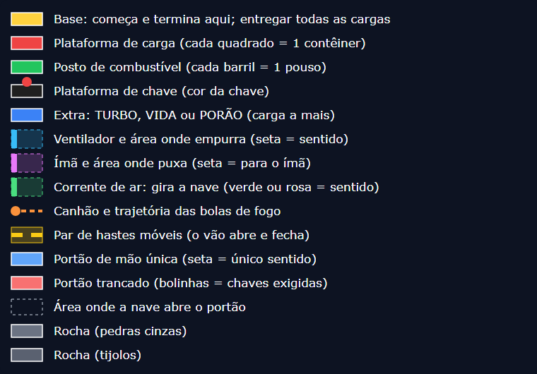

### 3.1 Terreno

| Elemento | Como funciona |
|---|---|
| Campos | A fase é uma grade de campos de 32×32 pixels; o mínimo é 20×20 campos. A maior fase (14) tem 100×51 campos (3.200×1.632 pixels) |
| Pedras cinzas | Peças de 8×8, 6×6 ou 4×4 unidades (cada unidade, 4 pixels), que desenham as paredes irregulares das cavernas |
| Tijolos coloridos | Marrons, amarelos, azuis ou verdes; preenchem campos inteiros |
| Fundo | Um de 5 padrões, com rolagem em paralaxe |

### 3.2 Plataformas e objetos

Cada plataforma tem uma cor que diz a função, sem texto.

| Plataforma | Cor | O que oferece | Limite | Nas 18 fases |
|---|---|---|---|---|
| Base | Amarela e rosa | Ponto de partida e de entrega das cargas; pode ter setas coloridas | Uma por fase | 18 |
| Carga | Vermelha e branca | Contêineres a levar para a base (4 visuais diferentes) | Até 10 por plataforma | 75 cargas |
| Combustível | Verde e branca | Barris; cada pouso puxa um | Até 10 por plataforma | 26 postos, 162 barris |
| Chave | Preta, com a cor da chave | Uma chave vermelha, verde, azul ou amarela, que abre portões | Uma por plataforma | 45 |
| Extra | Azul e branca | **Turbo**, **vida extra** ou **porão** (mais um lugar para carga) | Um extra por plataforma | 20 |

### 3.3 Obstáculos

| Obstáculo | O que faz | O que o editor deixa ajustar | Nas 18 fases |
|---|---|---|---|
| Ventilador | Empura a nave numa direção, dentro de uma faixa; com grade na frente, é mais fraco | Posição, alcance, direção, forte ou fraco | 73 |
| Ímã | Puxa a nave na direção dele | Posição, alcance, direção | 48 |
| Gerador de corrente de ar | Gira a nave (verde no sentido horário, rosa no anti-horário); "muito perigoso e às vezes difícil de passar" | Posição, alcance, direção, sentido do giro | 26 |
| Canhão | Atira bolas de fogo numa direção fixa; encostar mata | Direção, alcance, velocidade da bola e cadência (de 15 a 180 quadros entre tiros nas fases) | 84 |
| Par de hastes | Duas barras que avançam uma contra a outra; o vão pode ser fixo ou abrir e fechar; algumas mudam de velocidade e direção a qualquer momento | Vertical ou horizontal, vão (de 20 a 200 pixels nas fases), velocidade mínima e máxima, "muda de velocidade com frequência" | 51 |
| Portão de mão única | Azul e branco; abre só do lado da seta quando a nave chega perto, e fecha depois que ela passa | Posição, lado, sentido, área que abre o portão | 77 |
| Portão trancado | Vermelho e branco; lâmpadas coloridas mostram as chaves exigidas (piscando = chave que falta) | Posição, lado, chaves exigidas (de 1 a 4), área que abre o portão | 51 |

## 4. A curva de dificuldade das 18 fases

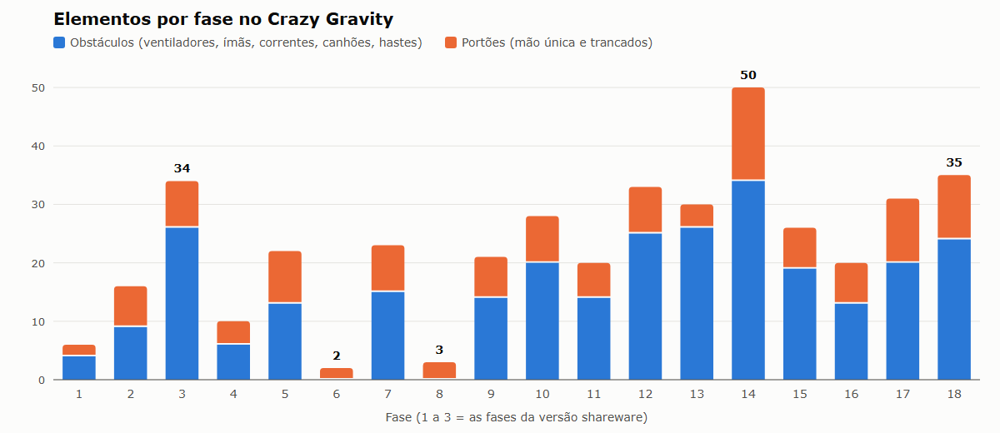

| Fase | Senha | Tamanho (campos) | Cargas | Postos (barris) | Chaves | Vent. | Ímãs | Corr. | Canhões | Hastes | Mão única | Trancados | Extras | Voo estimado* |
|---|---|---|---|---|---|---|---|---|---|---|---|---|---|---|
| 1 | (primeira) | 60×26 | 2 | 1 (5) | 0 | 0 | 0 | 0 | 3 | 1 | 2 | 0 | — | 248 |
| 2 | HYACINTH | 110×20 | 4 | 1 (5) | 2 | 4 | 0 | 0 | 3 | 2 | 4 | 3 | — | 444 |
| 3 | MERIDIAN | 65×55 | 3 | 1 (6) | 2 | 3 | 3 | 2 | 10 | 8 | 6 | 2 | vida, turbo | 466 |
| 4 | KICKBACK | 57×38 | 3 | 2 (6) | 2 | 0 | 0 | 0 | 4 | 2 | 2 | 2 | — | 316 |
| 5 | INTERVAL | 110×20 | 3 | 1 (5) | 3 | 3 | 4 | 0 | 4 | 2 | 6 | 3 | — | 568 |
| 6 | YEARLING | 80×30 | 4 | 1 (10) | 2 | 0 | 0 | 0 | 0 | 0 | 0 | 2 | turbo | 408 |
| 7 | AMBROSIA | 85×31 | 7 | 1 (5) | 1 | 5 | 2 | 0 | 4 | 4 | 6 | 2 | 2 porões | 526 |
| 8 | POSITRON | 100×20 | 2 | 1 (5) | 3 | 0 | 0 | 0 | 0 | 0 | 0 | 3 | — | 350 |
| 9 | CLAVICLE | 100×31 | 5 | 2 (8) | 4 | 7 | 1 | 1 | 3 | 2 | 4 | 3 | — | 644 |
| 10 | DAFFODIL | 100×28 | 6 | 2 (10) | 4 | 4 | 3 | 0 | 11 | 2 | 5 | 3 | turbo | 682 |
| 11 | DICTATOR | 60×40 | 4 | 1 (7) | 2 | 3 | 6 | 2 | 1 | 2 | 4 | 2 | — | 304 |
| 12 | BLACKOUT | 81×39 | 7 | 2 (12) | 4 | 4 | 2 | 4 | 7 | 8 | 5 | 3 | porão, vida | 546 |
| 13 | LABURNUM | 45×70 | 3 | 1 (8) | 1 | 5 | 6 | 4 | 7 | 4 | 3 | 1 | vida | 424 |
| 14 | ZUCCHINI | 100×51 | 8 | 3 (27) | 4 | 10 | 5 | 3 | 8 | 8 | 8 | 8 | 3 vidas, 2 porões, turbo | 1.228 |
| 15 | EYEGLASS | 70×20 | 2 | 1 (3) | 2 | 6 | 4 | 2 | 4 | 3 | 5 | 2 | — | 316 |
| 16 | FRIPPERY | 45×55 | 4 | 2 (13) | 1 | 3 | 0 | 2 | 6 | 2 | 6 | 1 | turbo | 514 |
| 17 | GUARDIAN | 72×37 | 4 | 1 (10) | 4 | 7 | 6 | 2 | 4 | 1 | 4 | 7 | turbo | 694 |
| 18 | NUISANCE | 60×46 | 4 | 2 (17) | 4 | 9 | 6 | 4 | 5 | 0 | 7 | 4 | 3 vidas | 304 |

\* **Voo estimado:** soma, em campos, das idas e voltas entre a base e cada carga, uma carga por viagem, pelo caminho livre mais curto, ignorando portões e obstáculos. Serve só para comparar o tamanho das fases entre si.

**O que a curva mostra:**

- **Serrote, não rampa.** A dificuldade sobe e desce. A fase 3, a última da versão shareware, é um pico (34 elementos); as fases 6 e 8 quase não têm obstáculos (2 e 3); a 14 é a "fase-chefe" (50 elementos, o maior voo); a 18 fecha o jogo.
- **Uma novidade de cada vez.** Chaves entram na fase 2; ímãs e correntes de ar, na 3; o porão extra, na 7; as quatro chaves juntas, na 9; o portão que pede as quatro chaves, na 10.
- **As fases de respiro treinam outra coisa.** A 6 e a 8 tiram os obstáculos, mas pedem voos longos e caça às chaves.
- **Formatos variados:** corredores horizontais (fases 2, 5, 8 e 15, com 20 campos de altura), poços verticais (13 e 16) e cavernas grandes com a base no centro (9, 12, 14 e 18).

## 5. Fase a fase

Cada mapa mostra a fase inteira. A grade fina marca blocos de 5 campos. Na tela do jogo, cabia só uma parte da caverna, e a câmera rolava.

### Fase 1 — sem senha (shareware, "fácil")

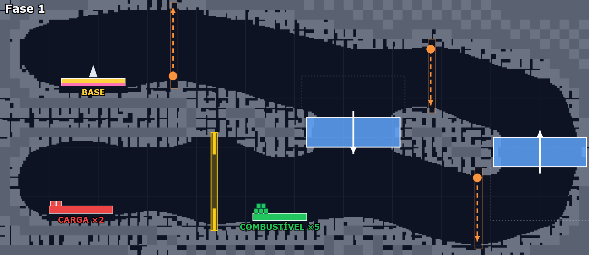

- **Objetivo e rota:** a base fica no alto, à esquerda; a carga (2 contêineres) e o posto (5 barris), embaixo. Dois portões de mão única formam um **circuito**: desce pelo poço do meio e volta subindo pelo poço da direita.
- **Desafio:** aprender a decolar, voar e pousar; com o porão de uma carga, são duas viagens. Três canhões verticais e um par de hastes entre a carga e o posto.
- **Ideia de design:** o circuito de mão única ensina a rota sem nenhum texto.

### Fase 2 — HYACINTH (shareware, "média")

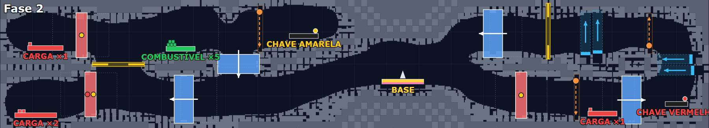

- **Objetivo e rota:** corredor horizontal de 110 campos, com a base no meio. Três cargas à esquerda e uma à direita; a chave amarela fica perto da base e a vermelha, na ponta direita.
- **Desafio:** as cargas da esquerda ficam atrás de portões trancados; a de baixo pede as duas chaves. É preciso cruzar o mapa inteiro, ida e volta, antes de começar a entregar.
- **Ideia de design:** base no meio, chave numa ponta e carga na outra transformam um corredor simples numa viagem longa.

### Fase 3 — MERIDIAN (shareware, "difícil")

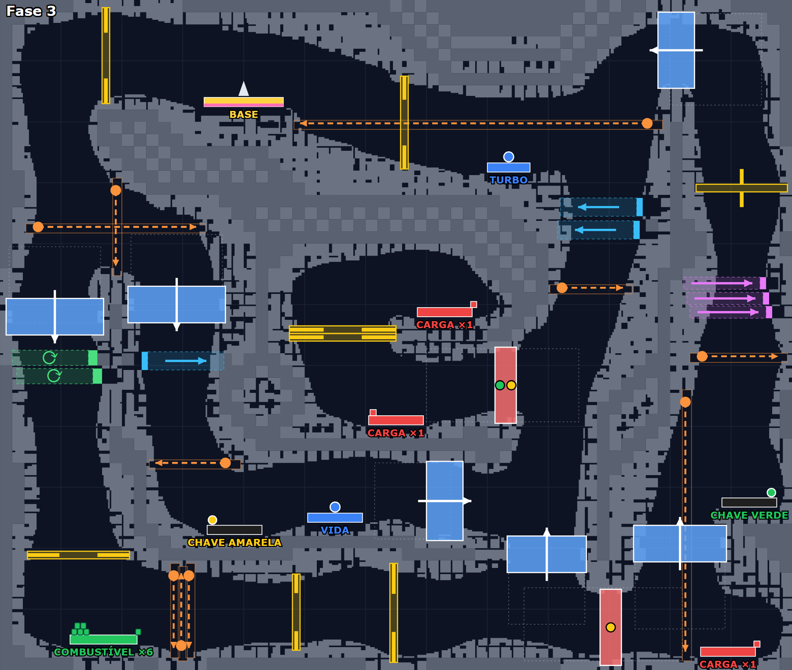

- **Objetivo e rota:** caverna grande (65×55) com três cargas espalhadas, chaves verde e amarela embaixo e o posto no canto inferior esquerdo.
- **Desafio:** a fase mais densa até aqui, com 10 canhões, 8 pares de hastes, ventiladores, ímãs e correntes de ar, e um portão que pede as duas chaves. Primeira aparição de vida e turbo.
- **Ideia de design:** a versão de teste terminava com uma vitrine de tudo o que o jogo completo tinha.

### Fase 4 — KICKBACK

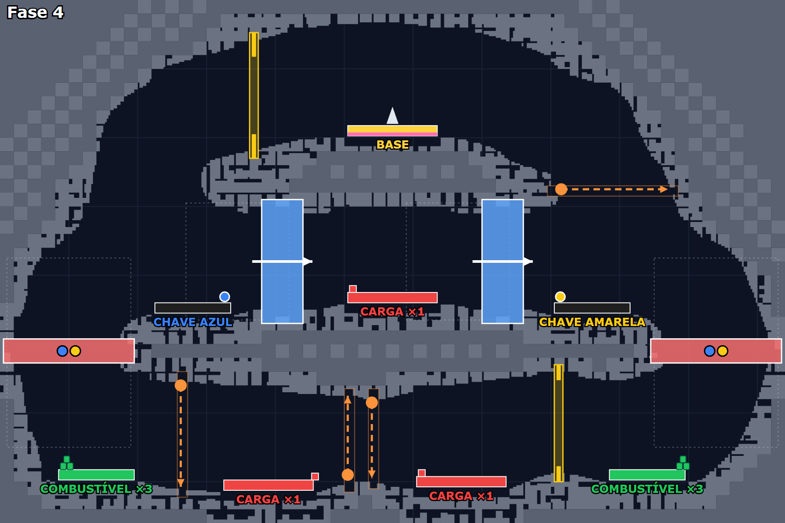

- **Objetivo e rota:** fase **simétrica**, com a base no centro alto; chave azul à esquerda, amarela à direita; uma carga no meio e duas embaixo.
- **Desafio:** os dois postos ficam nos cantos de baixo, atrás de portões que pedem as duas chaves. Sem as chaves, o combustível fica longe.
- **Ideia de design:** depois do pico da fase 3, uma fase curta e legível; a simetria deixa a rota óbvia.

### Fase 5 — INTERVAL

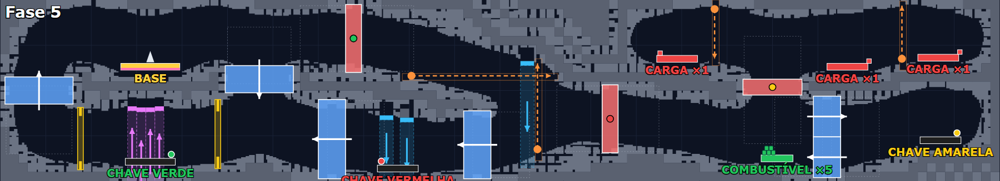

- **Objetivo e rota:** corredor horizontal com a base à esquerda e as três cargas no alto da ponta direita. Três chaves: verde perto da base, vermelha no meio, amarela no fim.
- **Desafio:** a chave verde fica **embaixo de uma fileira de 4 ímãs** que puxam a nave para cima, e a vermelha, entre ventiladores que sopram para baixo. Os portões trancados seguem a ordem do caminho.
- **Ideia de design:** a recompensa dentro da área do perigo; pousar ali é o quebra-cabeça.

### Fase 6 — YEARLING

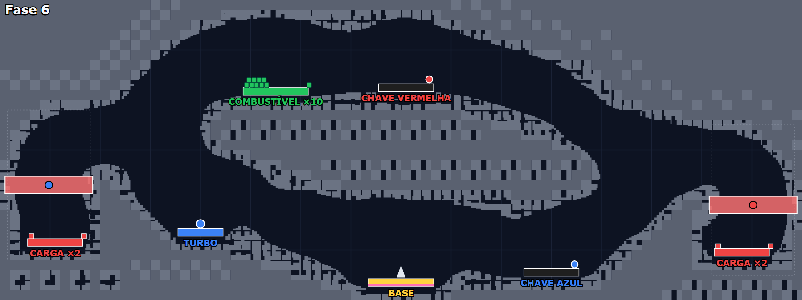

- **Objetivo e rota:** uma caverna aberta em volta de uma ilha central. Base embaixo no meio, 2 cargas em cada ponta, posto de 10 barris no alto.
- **Desafio:** **nenhum obstáculo**. Só dois portões trancados (vermelha e azul) e quatro viagens longas: o teste é pilotar e administrar o combustível.
- **Ideia de design:** fase de respiro no meio da sequência, que muda o tipo de desafio em vez de só baixar a dificuldade.

### Fase 7 — AMBROSIA

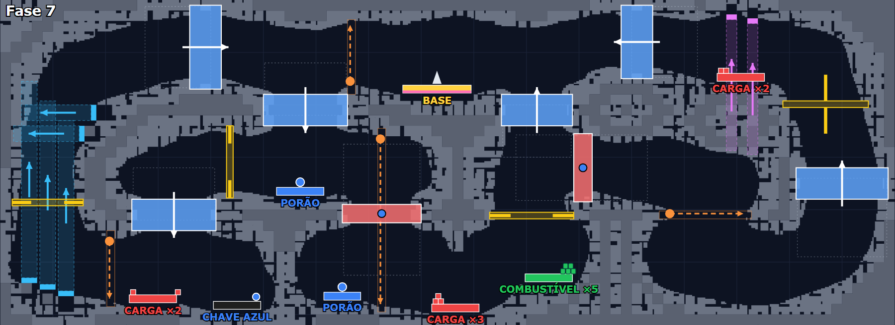

- **Objetivo e rota:** base no alto centro e 7 cargas em plataformas de 2 e 3 contêineres; dois extras de **porão**.
- **Desafio:** pegar os porões muda a estratégia, porque com mais lugar são menos viagens. Coluna de ventiladores à esquerda, ímãs ao lado da carga do alto à direita e 6 portões de mão única fazendo circuitos.
- **Ideia de design:** um upgrade opcional que recompensa quem planeja.

### Fase 8 — POSITRON

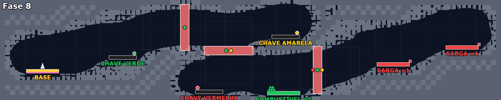

- **Objetivo e rota:** corredor horizontal, base à esquerda e as duas cargas no fim. Três chaves e três portões em sequência: o primeiro pede a verde; o segundo, verde e amarela; o terceiro, vermelha, verde e amarela.
- **Desafio:** sem obstáculos; a fase é uma **caça às chaves em cadeia**, e cada portão aberto dá acesso à próxima chave.
- **Ideia de design:** a ordem certa é ensinada pela própria estrutura.

### Fase 9 — CLAVICLE

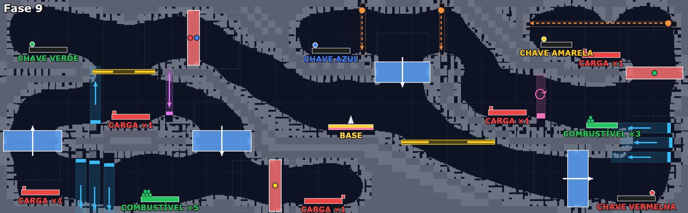

- **Objetivo e rota:** a base no centro e cinco cargas espalhadas pelos cantos. Primeira fase com as **quatro chaves** e com dois postos.
- **Desafio:** escolher a ordem: que chave pegar, que carga buscar, quando abastecer. Ventiladores em colunas, um ímã e uma corrente de ar.
- **Ideia de design:** base no centro como "hub", com braços para todos os lados.

### Fase 10 — DAFFODIL

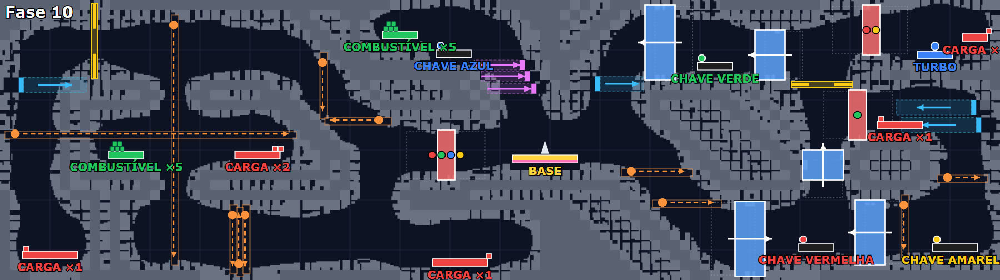

- **Objetivo e rota:** base no centro, seis cargas, quatro chaves e dois postos.
- **Desafio:** 11 canhões, o maior número do jogo, incluindo um cruzamento de tiros à esquerda; o primeiro portão que pede **as quatro chaves** fica colado à base.
- **Ideia de design:** um portão-mestre perto do começo, visível desde o início, que só abre no fim.

### Fase 11 — DICTATOR

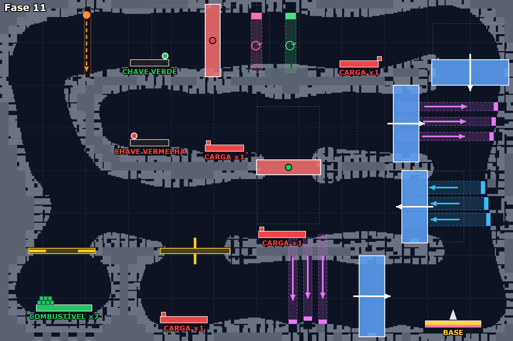

- **Objetivo e rota:** a base fica embaixo, à direita; quatro cargas e o posto no canto inferior esquerdo. É a fase com mais espaço aberto (61%).
- **Desafio:** forças laterais: ímãs puxam para a direita e ventiladores sopram para a esquerda no mesmo poço, ao lado de portões de mão única. Mais três ímãs puxam para baixo perto de uma carga.
- **Ideia de design:** com espaço livre, o desafio vem das forças, e não das paredes.

### Fase 12 — BLACKOUT

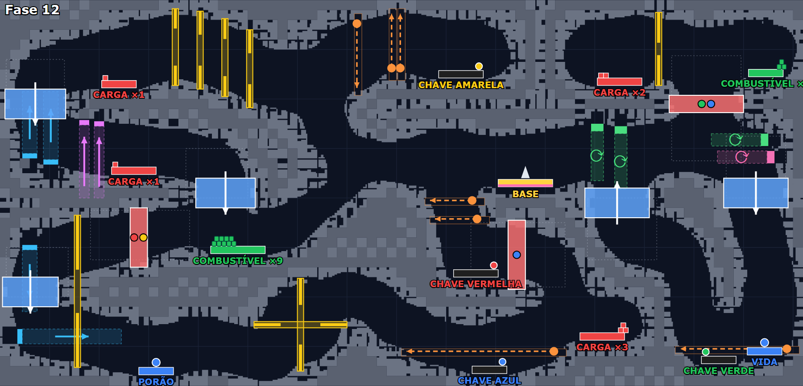

- **Objetivo e rota:** base no centro, sete cargas, quatro chaves, porão e vida.
- **Desafio:** um **corredor de 4 pares de hastes** em sequência no alto, hastes em cruz embaixo, pares de correntes de ar e canhões em dupla.
- **Ideia de design:** repetir o mesmo obstáculo em série cria um "trecho" com identidade própria.

### Fase 13 — LABURNUM

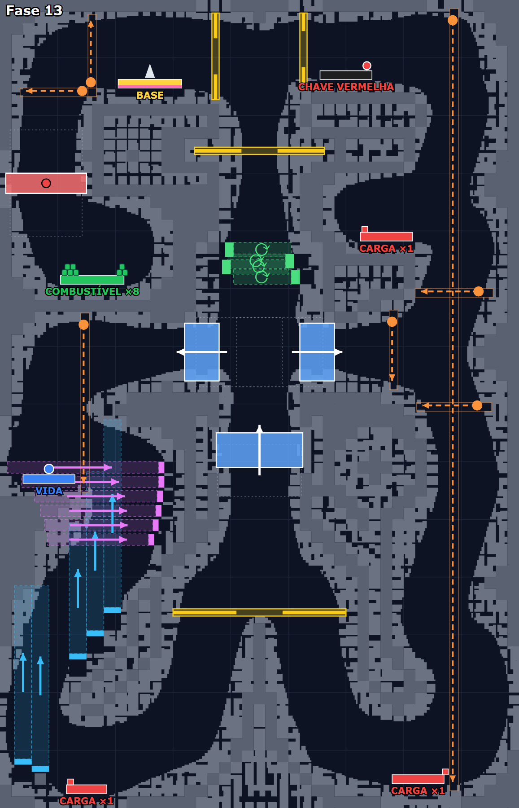

- **Objetivo e rota:** fase **vertical** (45×70). A base fica no alto e as cargas, no fundo dos dois poços.
- **Desafio:** no poço da direita, um canhão atira de cima a baixo pela altura inteira, e é preciso descer no ritmo dos tiros. No da esquerda, colunas de ventiladores sopram para cima e ímãs puxam para o lado, bem em cima da vida extra.
- **Ideia de design:** mudar a orientação da fase muda o jogo, porque descer contra o vento e subir com carga são desafios diferentes.

### Fase 14 — ZUCCHINI

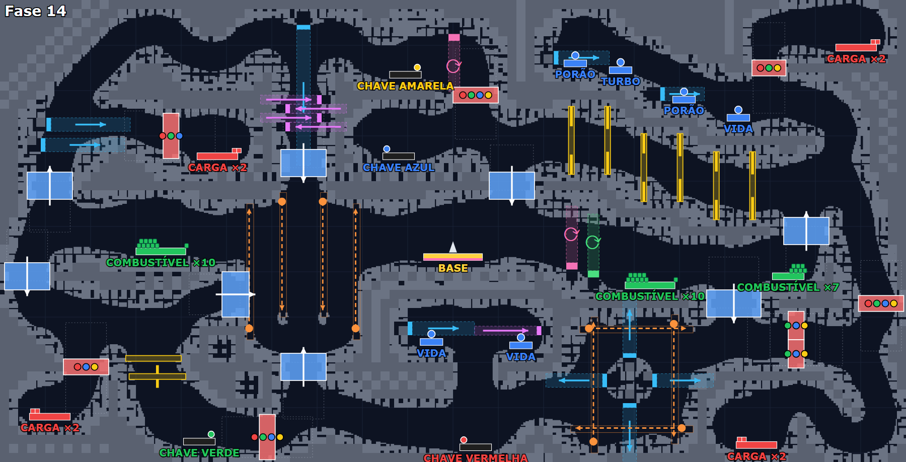

- **Objetivo e rota:** a maior fase (100×51), com a base no centro e oito cargas em quatro pontas, duas em cada uma; três postos com 27 barris e seis extras.
- **Desafio:** oito portões trancados, vários pedindo três ou quatro chaves; um **corredor de 6 pares de hastes**; uma "caixa" de quatro canhões cruzando tiros com ventiladores no meio. O maior voo do jogo.
- **Ideia de design:** a fase-chefe junta tudo o que o jogador aprendeu e dá recursos à altura (porões, vidas e muito combustível).

### Fase 15 — EYEGLASS

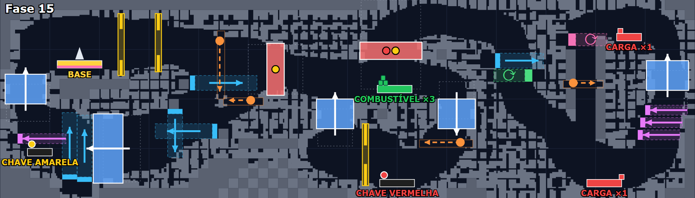

- **Objetivo e rota:** corredor horizontal curto, com as duas cargas na ponta direita e um portão no meio que pede as chaves vermelha e amarela.
- **Desafio:** um único posto com **só 3 barris**, o menor do jogo, no meio de ventiladores, ímãs e correntes de ar.
- **Ideia de design:** depois da fase-chefe, uma fase curta, mas com combustível apertado.

### Fase 16 — FRIPPERY

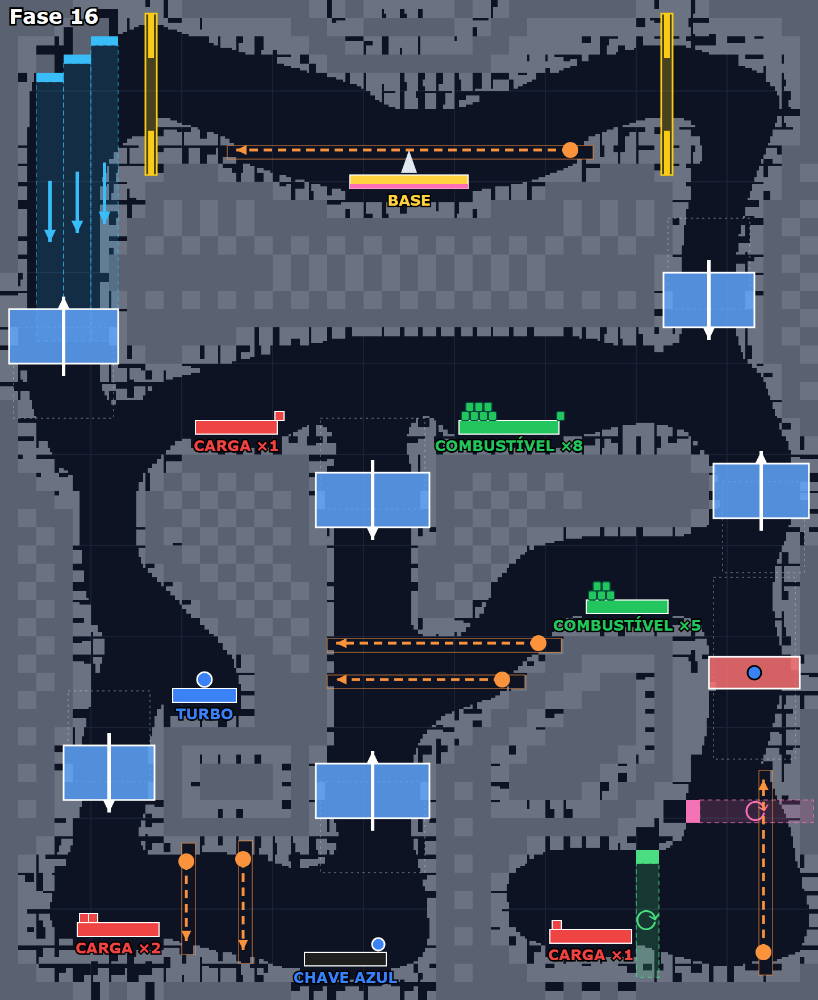

- **Objetivo e rota:** fase vertical, com a base no alto e as cargas embaixo; a chave azul, no fundo, abre o caminho da direita.
- **Desafio:** canhões horizontais varrem os corredores, um deles logo acima da base, e ventiladores sopram para baixo no poço da esquerda.
- **Ideia de design:** o perigo começa já na saída da base.

### Fase 17 — GUARDIAN

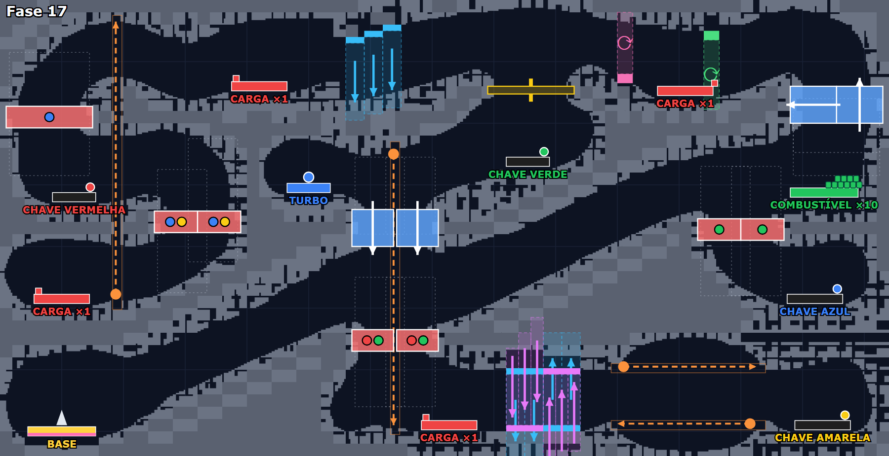

- **Objetivo e rota:** túneis em diagonal. A base fica embaixo, à esquerda; quatro cargas e quatro chaves espalhadas; a carga mais distante fica a 135 campos da base, a maior distância do jogo.
- **Desafio:** sete portões trancados em combinações diferentes (azul e amarela; verde; vermelha e verde) e um "liquidificador" de ventiladores e ímãs alternando cima e baixo.
- **Ideia de design:** túneis diagonais exigem voar inclinado o tempo todo, um jeito novo de usar a mesma física.

### Fase 18 — NUISANCE (a última)

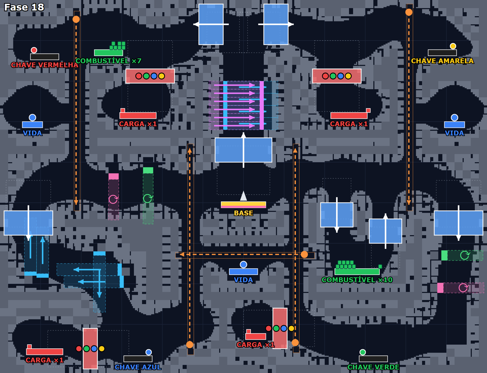

- **Objetivo e rota:** fase **simétrica**, com a base no centro, as quatro chaves nos quatro cantos e as quatro cargas atrás de portões que pedem **todas as chaves**.
- **Desafio:** primeiro todas as chaves, depois todas as cargas. Um misturador de ímãs e ventiladores fica logo acima da base, há canhões longos nas laterais e três vidas extras.
- **Ideia de design:** a prova final tem uma estrutura clara (coletar, abrir e entregar), e a dificuldade está na execução.

## 6. Padrões de design

| # | Padrão | Onde aparece |
|---|---|---|
| 1 | **Uma ideia por fase:** cada fase tem um destaque que dá para descrever numa frase | Todas; por exemplo, a 7 (porão), a 8 (cadeia de chaves) e a 13 (vertical) |
| 2 | **Ensinar sem texto:** a estrutura da fase mostra a regra | Circuito de mão única (fase 1), cadeia de portões (8), demonstração das fases 1 a 3 |
| 3 | **Ritmo em serrote:** pico, respiro e um novo pico | Picos nas fases 3, 14 e 18; respiros na 4, 6 e 8 |
| 4 | **Respiro que muda o desafio:** menos obstáculos, mais voo ou mais planejamento | Fases 6 e 8 |
| 5 | **Cor = função:** cada plataforma e cada portão se reconhecem pela cor | Todas |
| 6 | **Chaves como fechaduras da rota:** obrigam a visitar a fase inteira e criam uma ordem | Da fase 2 em diante |
| 7 | **Mão única para criar circuitos** e impedir atalhos na volta | Fases 1, 7, 12 e 16 |
| 8 | **Recompensa dentro do perigo** | Chave sob ímãs (5), vida sob ímãs (13) |
| 9 | **Repetição em série** de um obstáculo, formando um trecho com identidade | Corredores de hastes (12 e 14), colunas de ventiladores (7, 13 e 16) |
| 10 | **Upgrades opcionais dentro da fase** (porão, turbo, vida) | Fases 3, 7, 12, 14 e 18 |
| 11 | **Base no centro** nas fases grandes ("hub" com braços) | Fases 9, 10, 12, 14 e 18 |
| 12 | **Simetria** para deixar a fase legível | Fases 4 e 18 |
| 13 | **Formato variado:** corredor horizontal, poço vertical, caverna aberta, túneis diagonais | 2, 5, 8 e 15 / 13 e 16 / 6 e 11 / 17 |
| 14 | **Amostra com fácil, média e difícil:** a versão de teste mostrava a curva inteira | Fases 1 a 3 do shareware |

## 7. Onde estava a diversão e onde estava a dificuldade

| Onde estava a diversão | Onde estava a dificuldade |
|---|---|
| **Domínio da nave:** a inércia "bem simulada" (Home of the Underdogs) faz cada melhora de pilotagem aparecer na hora | **Erro fatal:** encostar em qualquer coisa explode a nave, e a carga a bordo volta para a origem |
| **Pouso perfeito:** frear em cima da plataforma e descer devagar dá uma pequena vitória a cada parada | **Limite de pouso:** acima da velocidade máxima, a nave se despedaça; o velocímetro de ponteiros ajuda, mas pede atenção |
| **Planejamento:** ordem das cargas, das chaves e dos postos; "reflexos, raciocínio e planejamento" (Home of the Underdogs) | **Combustível:** barril por barril; quem acelera demais fica sem e cai |
| **Quebra-cabeças físicos:** descobrir como chegar à carga, contra vento, ímã ou corrente | **Forças que mexem na física:** ventiladores, ímãs e correntes de ar mudam o voo justamente perto de plataformas e chaves |
| **Novidade em cada fase:** "cada fase traz novos obstáculos, sempre em novas formações" | **Tempo certo:** canhões com cadência e hastes que abrem e fecham, algumas mudando de velocidade sem aviso |
| **Recorde por fase:** os 3 melhores tempos convidam a jogar de novo | **Fases longas:** até 8 cargas com porão de um lugar, ou seja, muitas viagens; a fase 14 soma uns 1.200 campos de voo |
| **Personalizar a dificuldade:** gravidade, motor e consumo ajustáveis | **Labirinto de chaves:** portões que pedem 3 ou 4 chaves nas fases finais |
| **Criar fases:** o editor estendia o jogo | **Sinais de frustração previstos pelo autor:** senhas para continuar quando "falhar numa fase muito difícil", trapaças de vidas e combustível infinitos e a dica de baixar a gravidade "se tudo isso parecer difícil demais" |

## 8. O que os jogadores diziam

| Fonte | O que diz |
|---|---|
| PC Player (Alemanha, revista) | Nota **80%** (registrada na MobyGames) |
| Home of the Underdogs | Nota **8,43/10 (44 votos)**. A resenha destaca a inércia bem simulada, os reflexos precisos, os quebra-cabeças físicos para chegar à carga, o cuidado com o combustível e a mistura de reflexos, raciocínio e planejamento; recomenda aos fãs de Gravity Force |
| MyAbandonware | Nota **5/5 (6 votos)**. Comentários: um jogador procurou o jogo por 20 anos depois de jogar a demo num CD de revista (2024); outro jogou em 2002 no primeiro computador da família, que veio com alguns jogos, e "sempre quis jogar de novo" (2025); outro lembra que ele foi inspirado no Thrust (2026) |
| Internet Archive | 4 estrelas: "jogo muito bom", com "ambiente muito bom nos anos 90"; reclama que o arquivo preservado está sem a música (2020) |
| Crazy Gravity Portable (PSP, 2009) | Remake de fã (TheUnderminer), 3º lugar no concurso NEO Spring Coding Compo 2009. O **autor original autorizou** o uso dos gráficos e sons. Leitores elogiaram o visual; um achou a jogabilidade "um pouco pobre". A versão 1.1 ajustou a física (menos gravidade e arrasto) para ficar "mais perto do original de PC" |
| YouTube | Três vídeos sobre o jogo: uma análise de 1996, uma retrospectiva e uma gravação de 1997 (links na seção 11) |

**O que gostavam:** a física e a sensação de pilotar, o desafio que mistura habilidade e planejamento, a variedade de obstáculos, o clima e a música dos anos 90 e a nostalgia: o jogo marcou quem jogou a demo.

**O que não gostavam:** quase não há críticas registradas. O que aparece: a música faltando na cópia preservada, a jogabilidade "pobre" no remake de PSP (não no original) e, pelo próprio manual, a dificuldade alta, que o autor compensou com senhas, trapaças e física ajustável. Não achei análises detalhadas da época além da nota da PC Player.

## 9. O que levar para o Resgate Espacial

Tudo aqui é **Proposta** para o Fernando decidir. As ligações com as decisões e pendências estão no [documento 10](../10-benchmark-de-level-design.md), seção 6.

| Ideia do Crazy Gravity | Como poderia entrar no nosso jogo | Ligado a |
|---|---|---|
| Ritmo em serrote, com respiros que mudam o desafio | Em cada mundo de 10 fases, um respiro por volta da fase 5 e uma fase-chefe na 10 | Documento 08, curva de cada mundo |
| Uma ideia por fase | Cada fase do mundo com uma frase de destaque, como já pede o documento 08 | Documento 08 |
| Ventilador, ímã e corrente de ar: forças que mexem na física, sem ser inimigos | Vento solar que empurra, campo gravitacional que puxa e redemoinho que gira a nave; cabem no estilo e na regra "sem inimigos que atiram" | P-011 ([#60](https://github.com/TARNAGS/resgate-espacial/issues/60)) e P-012 ([#61](https://github.com/TARNAGS/resgate-espacial/issues/61)) |
| Hastes com vão que abre e fecha | É a nossa "barreira que sobe e desce" (regras, seção 9, em proposta), com vão fixo ou variável | P-011 |
| Canhões | Contrariam a nossa regra de não ter inimigos que atiram; uma versão ambiental seria um jato de gás ou um meteoro periódico, com tempo certo | P-011 |
| Portões de mão única | Ida por um caminho e volta por outro, sem atalho | P-011 |
| Chaves e portões trancados | Usar com cuidado: alongam a fase, e o nosso jogador joga partidas curtas (D-028). Talvez só em fases especiais | D-028 |
| Recompensa dentro do perigo | Posto ou tripulação dentro da área de uma força | Documento 08 |
| Combustível por barril (um por pouso) | Alternativa ao posto que enche o tanque: uma decisão a mais (quantos barris pegar) | D-026 ([#93](https://github.com/TARNAGS/resgate-espacial/issues/93)) |
| Upgrades dentro da fase (porão, turbo, vida) | Referência de itens justos, ganhos jogando | P-017 ([#78](https://github.com/TARNAGS/resgate-espacial/issues/78)) |
| Demonstração das fases 1 a 3 | O original já fazia o que a D-031 decidiu: a DEMO é fiel ao jogo que inspirou o nosso | D-031 (validação) |
| Recorde por fase, com os 3 melhores tempos | Confirma o ranking por fase | D-024 (validação) |
| Dificuldade feita de parâmetros físicos | Modificadores de mundo ou de modo (gravidade maior, ar mais denso); o modo Nightmare | P-012, P-018 ([#79](https://github.com/TARNAGS/resgate-espacial/issues/79)) |
| Versão de teste com 3 fases (fácil, média e difícil) | Modelo "lite": algumas fases grátis, mostrando a curva inteira, e o resto pago | P-014 ([#98](https://github.com/TARNAGS/resgate-espacial/issues/98)) |
| Editor de fases | Ideia para depois do lançamento: fases da comunidade | Big picture |

**Diferença importante:** o Crazy Gravity é um labirinto longo, de vários minutos por fase. O nosso é um corredor da esquerda para a direita, pensado para partidas curtas no celular (D-028). As ideias de obstáculo e de ritmo valem para nós; a escala das fases não.

## 10. Como este material foi feito

1. **Fonte:** a versão shareware 2.0E preservada no Internet Archive traz os arquivos das 18 fases (`LEVEL01.CGL` a `LEVEL18.CGL`), a ajuda do jogo e a do editor. Só arquivos de dados foram baixados; nenhum programa do jogo foi executado, e os arquivos originais não entram no repositório.
2. **Formato decifrado pelo Claude (CGL1):** cabeçalho com o tamanho em campos (`SIZE`); mapa de campos (`SOIN`, 1 byte por campo: quantos pedaços de pedra há nele e se está cheio); pedaços de pedra (`SOBS`, 4 bytes: posição e tamanho dentro do campo); ventiladores, ímãs e correntes de ar (`VENT`, `MAGN` e `DIST`, 38 bytes: direção, posição e área de efeito); canhões (`CANO`, 51 bytes: direção, cadência, velocidade, trajetória); hastes (`PIPE`, 24 bytes); portões de mão única e trancados (`ONEW` e `BARR`, 65 bytes; nos trancados, os 4 bits altos do primeiro byte são as chaves: vermelha, verde, azul e amarela); plataformas (`LPTS`, 52 bytes: tipo, posição, largura e até 10 itens); informações da fase (`LVIN`: fundo, senha, próxima fase e combustível inicial).
3. **Conferências:** as senhas batem com as listas publicadas (HYACINTH, MERIDIAN, KICKBACK…); o posto da fase 1 tem 5 barris em pirâmide; o tamanho de cada bloco bate com a soma dos registros.
4. **O que é aproximado:** os extras de código 5 e 6 foram lidos como turbo e vida pela ordem do manual (o 7, porão, confere com as fases de muitas cargas); os portões aparecem como a caixa das duas metades; o "voo estimado" ignora portões e obstáculos.
5. **Ferramentas:** [`crazy-gravity/ferramentas/`](crazy-gravity/ferramentas/) (`render.js` desenha os mapas e mede as fases; `chart.js` faz o gráfico). Os mapas foram convertidos em imagem com o navegador Edge.

## 11. Fontes

- Ajuda do jogo (`GRAVITY.HLP`) e do editor (`CGLEDIT.HLP`), versão 2.0E: [Internet Archive, Crazy Gravity v2.0](https://archive.org/details/CrazyGravity_1020)
- [MobyGames: Crazy Gravity (1996)](https://www.mobygames.com/game/41247/crazy-gravity/) e a [coletânea 10 Tons of Games: Mega Collection 1](https://www.mobygames.com/group/9467/10-tons-of-games-mega-collection-1-games-included/)
- [Home of the Underdogs: Crazy Gravity](https://www.homeoftheunderdogs.net/game.php?id=3046)
- [MyAbandonware: Crazy Gravity](https://www.myabandonware.com/game/crazy-gravity-gxb)
- [GameBrew: Crazy Gravity Portable (PSP)](https://www.gamebrew.org/wiki/Crazy_Gravity_Portable_PSP) e [Gamergen](https://gamergen.com/actualites/crazy-gravity-portable-neo-39181-1)
- [XLM Software (site do autor)](https://www.xlmsoft.de/)
- Vídeos: [Crazy Gravity - 1996 PC Game Review](https://www.youtube.com/watch?v=OiyixQzxA9s), [Crazy Gravity (Windows, 1997) Retrospective](https://www.youtube.com/watch?v=V6cVQdGJ3vw), [XLM Software - Crazy Gravity - 1997](https://www.youtube.com/watch?v=FfReSNKQM7o)

## Histórico de versões

| Versão | Data | O que mudou |
|---|---|---|
| 1.0 | 06/10/2026 | Primeira versão: as 18 fases mapeadas a partir dos arquivos do jogo, catálogo de elementos, curva de dificuldade, padrões de design, recepção e ideias para o nosso jogo |
