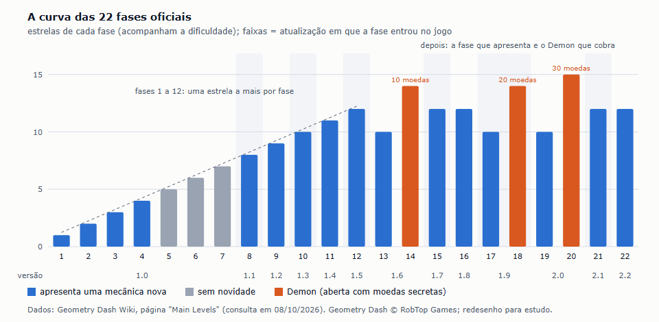
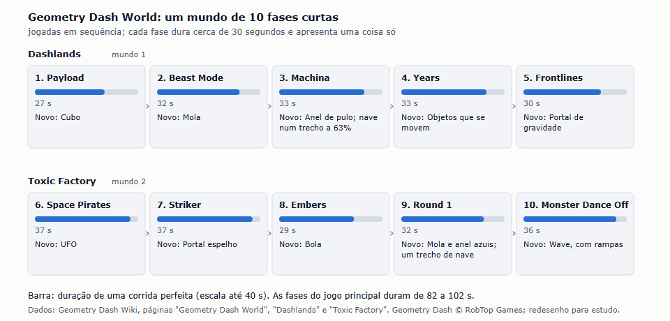
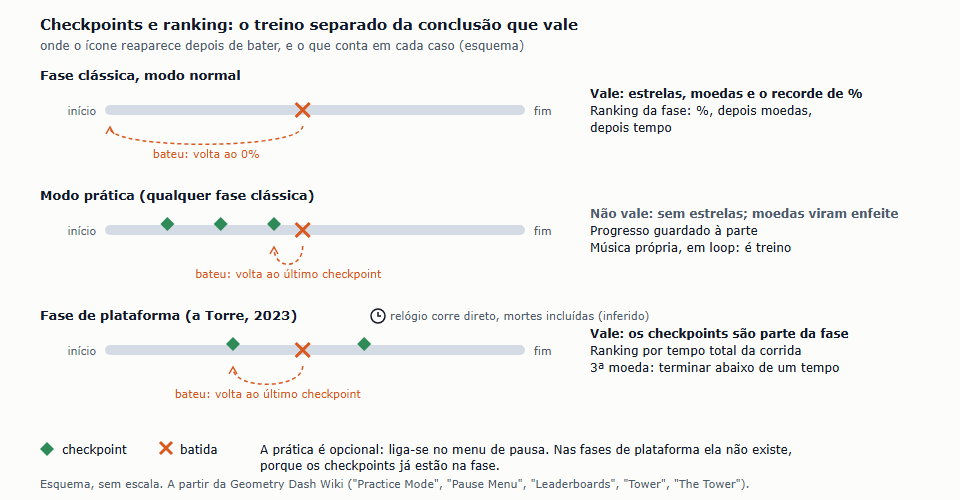
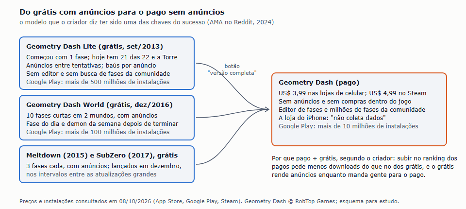
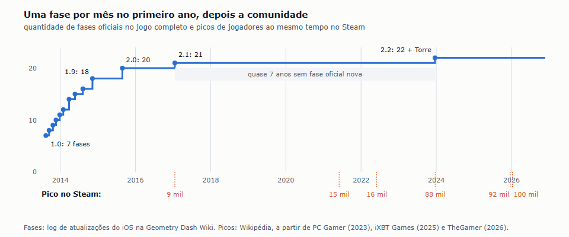

# Benchmark de Dificuldade e Estrutura: Geometry Dash (2013)

| Campo | Valor |
|---|---|
| Documento | Benchmark de dificuldade e estrutura — Geometry Dash |
| Versão | 1.0 |
| Data | 08/10/2026 |
| Status | Referência |
| Responsável | Fernando Nunes (Product Manager) |

O terceiro casual do ICP estudado a fundo, dentro da pesquisa dos casuais ([#99](https://github.com/TARNAGS/resgate-espacial/issues/99); cartão [#127](https://github.com/TARNAGS/resgate-espacial/issues/127)). Ele entrou na lista na revisão do Lean Canvas de 07/10/2026 ([documento 13](../13-modelo-de-negocio.md)), quando o Fernando definiu o problema central do jogador ("passar fases difíceis e criativas e sentir que fiquei bom nisso") e o conceito em uma linha proposto foi "Geometry Dash, só que pilotando uma nave contra a gravidade". As perguntas do cartão: como o jogo deixa a dificuldade divertida, como desenha fases criativas, como faz o jogador morrer e recomeçar sem desistir, como segura um público adolescente, como separa o treino com checkpoints da conclusão que vale (a pergunta aberta da fase grande) e como funciona o modelo Lite grátis + completo pago. Diferente do [Jetpack Joyride](jetpack-joyride.md) e do [Temple Run](temple-run.md), o Geometry Dash tem **fases fixas e numeradas**, como o nosso. Quarto discovery feito com a skill `discovery-de-jogos` (D-033).

> **Página de leitura:** a mesma análise, com os diagramas, publicada em [claude.ai/artifact/Y7Y1rAykSbfkfXuaJdSXRC](https://claude.ai/artifact/Y7Y1rAykSbfkfXuaJdSXRC) (privada) e guardada aqui em [`geometry-dash/pagina-de-leitura.html`](geometry-dash/pagina-de-leitura.html).

> **Sobre as imagens.** Não são capturas de tela. Os gráficos e esquemas foram redesenhados a partir dos números da wiki dos jogadores e das falas do criador, com crédito. Jogo, fases, músicas e arte são da RobTop Games (D-005).

## Sumário

1. [Resumo em uma página](#1-resumo-em-uma-página)
2. [Como o jogo nasceu](#2-como-o-jogo-nasceu)
3. [Como o jogo funciona](#3-como-o-jogo-funciona)
4. [Catálogo do que uma fase pode ter](#4-catálogo-do-que-uma-fase-pode-ter)
5. [A curva de dificuldade](#5-a-curva-de-dificuldade)
6. [Os outros formatos: o World, a Torre e os spin-offs](#6-os-outros-formatos-o-world-a-torre-e-os-spin-offs)
7. [Checkpoints e ranking: o treino separado da conclusão que vale](#7-checkpoints-e-ranking-o-treino-separado-da-conclusão-que-vale)
8. [O laço entre fases e a comunidade](#8-o-laço-entre-fases-e-a-comunidade)
9. [Negócio e operação](#9-negócio-e-operação)
10. [As perguntas do documento 10](#10-as-perguntas-do-documento-10)
11. [Geometry Dash × Jetpack Joyride × Temple Run](#11-geometry-dash--jetpack-joyride--temple-run)
12. [Padrões de design](#12-padrões-de-design)
13. [Onde estava a diversão e onde estava a dificuldade](#13-onde-estava-a-diversão-e-onde-estava-a-dificuldade)
14. [O que os jogadores e a crítica diziam](#14-o-que-os-jogadores-e-a-crítica-diziam)
15. [O que levar para o Resgate Espacial](#15-o-que-levar-para-o-resgate-espacial)
16. [Como este material foi feito](#16-como-este-material-foi-feito)
17. [Fontes](#17-fontes)

## 1. Resumo em uma página

| Item | Geometry Dash |
|---|---|
| Proposta | Um ícone avança sozinho por uma fase cheia de espinhos, sincronizada com uma música. O jogador só toca na tela: pula, voa ou inverte a gravidade, conforme o "modo" do trecho. Encostou num perigo, a fase recomeça do zero, na hora |
| Autor | Robert "RobTop" Topala, sueco, sozinho: programação, design, fases e servidor. Empresa: RobTop Games AB. Na AMA de 2022: "por enquanto, sou só eu" |
| Lançamento | iOS e Android em 13/08/2013; Lite (grátis) em 12/09/2013; Windows Phone em 06/2014; Steam em 22/12/2014. Versão estudada: completo 2.208 e Lite 2.21.7 (jan/2026), consulta em 08/10/2026 |
| Desenvolvimento | Cerca de quatro meses em meio período. Começou "como um modelo com um cubo que podia bater e pular", sem plano detalhado (Cult of Mac, 2014) |
| Modelo de negócio | Completo pago (US$ 1,99 no lançamento; hoje US$ 3,99 no celular e US$ 4,99 no Steam), sem anúncios e sem compras. Lite grátis com anúncios, como porta de entrada. Três spin-offs grátis com anúncios (Meltdown, World e SubZero) |
| Tamanho | 22 fases oficiais (de 82 a 102 segundos cada), uma fase secreta, 4 fases de plataforma na "Torre" e mais de 150 milhões de fases feitas pelos jogadores |
| Onde estava a diversão | A música e a sincronia das fases com ela; um botão só; o "mais uma tentativa" com recomeço instantâneo; passar uma fase difícil; criar e jogar fases da comunidade |
| Onde estava a dificuldade | Precisão e memória: um erro volta ao começo; trechos que só se passam decorando; saltos de dificuldade entre fases (Can't Let Go, Clubstep) |
| Oponentes | Nenhum. O perigo é a fase: espinhos, serras, blocos que somem e enganos. Os "monstros" são decoração |
| Recepção | Steam: 93% positivas em 648.898 avaliações; App Store: 4,6 (274 mil avaliações) no completo e 4,3 (264 mil) no Lite. Crítica: 148Apps 4/5, Softpedia 8,5/10, Common Sense Media 3/5 ("extraordinariamente frustrante", 8+) |
| Tamanho do sucesso | 1º pago no iPhone no Canadá (jun/2014) e na Itália (três semanas em jan/2015); quase 80 milhões de downloads em fev/2015; 242 milhões estimados em 2018 (Sensor Tower); recorde de 100 mil jogadores simultâneos no Steam em jan/2026, doze anos depois do lançamento |

**Somando as 22 fases oficiais:** 33 minutos de corrida perfeita (média de 90 s por fase), 199 estrelas e pelo menos 1.994 pulos; 19 das 22 fases apresentam uma mecânica nova.

## 2. Como o jogo nasceu

Esta seção vem do criador: a entrevista à Cult of Mac (2014), o texto que ele escreveu para o Game Developer (2015) e as respostas dele em duas sessões de perguntas no Reddit (AMA de 16/07/2022 e de 02/02/2024, 231 respostas lidas).

- **Antes do sucesso, fracassos pequenos.** Topala estudava engenharia civil quando fez um jogo em Flash (2010). Largou o curso faltando um semestre (fez 4,5 dos 5 anos). Fez *Forlorn*, que "cresceu demais em escopo", e jogos de quebra-cabeça para celular (*Boomlings*, *Memory Mastermind*) que tiveram centenas de milhares de downloads, mas renderam pouco por "erros de monetização" e não faziam o jogador voltar. Ele ligou todos os jogos com divulgação cruzada, e isso deu uma pequena base de seguidores para o Geometry Dash.
- **Faça o que você conhece.** A ideia era uma homenagem aos jogos de plataforma do Super Mario que ele jogou na infância. Inspirações declaradas: *The Impossible Game* (2009), *Bit.Trip Runner* e *Super Meat Boy*. Ele estudou o The Impossible Game pensando no que faria diferente.
- **Sem plano: iterar até ficar bom.** Um cubo que pulava e batia virou o jogo "por iterações", acrescentando recursos "até o jogo parecer certo". O nome provisório era *Geometry Jump*; a Apple não aceitou, e virou *Geometry Dash*.
- **O lançamento afundou.** Algumas boas resenhas, nenhum orçamento de marketing, e o jogo caiu no ranking logo depois de sair. Voltou "do mundo dos mortos" devagar, por boca a boca, até o 1º lugar dos pagos menos de um ano depois.
- **Uma fase nova por mês.** Começou com 7 fases; em junho de 2014 já eram 15, "cada fase nova acrescentando elementos de jogo e detalhes visuais". Até o fim de 2014, foi praticamente uma atualização por mês (seção 9.4).
- **A comunidade como parceira.** O editor de fases e o compartilhamento dentro do jogo (na versão 1.0, nem precisava de conta) e a gravação de replays (Everyplay, 270 mil vídeos em 2014, "um jeito incrível e grátis de divulgar o jogo") fizeram os jogadores divulgarem o jogo.
- **O que ele diz que deu certo** (AMA de 2024): a combinação de **pago + Lite** (seção 9); o **editor junto com o compartilhamento fácil e a conversa entre jogadores**; **músicas próprias** (do Newgrounds) e **arte personalizável** nas fases da comunidade; ranking dentro do jogo, muita coisa para desbloquear, recompensas por jogar e **nenhuma barreira paga**; e o jogo base ser difícil ("rage"), o que levou criadores de conteúdo a compartilhar partidas. "E uma boa dose de sorte e de momento."

## 3. Como o jogo funciona

### 3.1 Controle e modos

Um toque na tela (ou clique, ou espaço) faz tudo. O que o toque faz depende do **modo** do ícone, que muda quando ele passa por um portal:

| Modo | O toque faz | Fase em que aparece |
|---|---|---|
| Cubo | Pula | 1 |
| Nave | Segurar sobe, soltar desce: a gravidade puxa o tempo todo | 1 |
| Bola | Cada toque inverte a gravidade | 9 |
| UFO | Cada toque dá um pulo no ar | 12 |
| Wave | Segurar sobe em diagonal, soltar desce em diagonal | 17 |
| Robô | Pula mais alto quanto mais tempo segura | 19 |
| Aranha | Teleporta para a superfície do lado oposto | 21 |
| Swing | Inverte a gravidade em pleno voo | 22 |

A **nave** do Geometry Dash é a parente mais próxima da nossa: um botão, segurar para subir contra a gravidade, soltar para cair. A diferença: ela não gira, não gasta combustível, não pousa e a tela anda sozinha.

### 3.2 Regras, morte e recomeço

| Regra | Como funciona |
|---|---|
| A tela anda sozinha | Nas fases clássicas, o ícone avança a uma velocidade fixa (mudada só por portais). A duração da fase é sempre a mesma: 82 a 102 s nas oficiais |
| Encostou, recomeça | Encostar num perigo explode o ícone, e a fase volta ao 0% |
| Recomeço instantâneo | O "Auto-Retry" vem ligado: o ícone reaparece no começo sozinho, sem tela nem botão. O contador de tentativas ("Attempt 37") aparece no começo da fase |
| Progresso parcial à vista | Uma barra e uma porcentagem mostram até onde o jogador chegou; ao bater mais longe do que nunca, aparece "New Best!" com o novo recorde de % |
| Fases abertas | Todas as fases oficiais ficam abertas desde o começo, menos as três Demon, que pedem 10, 20 e 30 moedas secretas |

### 3.3 Modo prática

- Ligado no menu de pausa, por um botão verde. O jogador coloca **checkpoints** (ou deixa o jogo colocar sozinho, o padrão) e, ao bater, volta ao último checkpoint em vez do começo.
- O progresso da prática fica **guardado à parte**. A prática **não dá recompensa**: as moedas secretas viram decoração, e concluir na prática não conclui a fase.
- A **música muda**: no lugar da música da fase, toca uma faixa própria em loop, que não reinicia a cada morte. O jogo deixa claro, pelo som, que aquilo é treino. (Comprando um item com a moeda do jogo, dá para manter a música original.)
- No começo, dava para publicar uma fase da comunidade concluindo-a só na prática. A brecha foi fechada já na atualização 1.02: para publicar, é preciso concluir no modo normal.

### 3.4 Recompensas e metas por fase

| Meta | Como funciona |
|---|---|
| Estrelas | Concluir a fase no modo normal dá de 1 a 15 estrelas, conforme a dificuldade. Somam no perfil e no ranking global |
| Três moedas secretas por fase | Escondidas em caminhos alternativos ou atrás de um trecho mais difícil. Abrem as fases Demon e itens |
| Orbs pelo progresso | A moeda da loja. 80% dos orbs de uma fase são pagos **proporcionalmente ao novo recorde de %**; os outros 20%, na conclusão. Uma Insane com morte a 46% já paga 128 dos 350 orbs |
| Recorde de % e tentativas | O "New Best!" e o contador de tentativas ficam no perfil da fase |
| Conquistas e ícones | Concluir fases, juntar estrelas e moedas destrava cores e formas do ícone. Tudo é cosmético e se ganha jogando |

### 3.5 Como o jogo ensina

- **Sem tutorial.** A fase 1 apresenta o cubo e a nave, e a nave começa "num espaço amplo, para facilitar o controle".
- **Uma dica de uma linha, só depois de errar.** Se o jogador bate duas vezes no primeiro espinho da fase 1, aparece "Tap to jump over the spikes". Na fase 3, depois de duas batidas nos primeiros espinhos, aparece a dica do anel, a novidade da fase. São as únicas instruções na tela.
- **A mecânica aparece antes, de relance.** Portais de gravidade e molas azuis aparecem nas rotas das moedas secretas das fases 2 e 3, antes de serem apresentados de verdade nas fases 4 e 10.
- **Rótulo de dificuldade relativo.** Na atualização 1.9 (11/2014), as fases 2 a 9 tiveram o rótulo rebaixado (Can't Let Go saiu de Insane para Hard): depois das fases difíceis que entraram, as primeiras pareciam "fáceis" perto delas. A Common Sense Media ainda critica a curva íngreme e a falta de tutorial.

## 4. Catálogo do que uma fase pode ter

Cores dos diagramas: azul é a fase que apresenta uma mecânica; cinza, a fase sem novidade; laranja, perigo ou fase Demon; verde, checkpoint (as mesmas da série de benchmarks).

| Grupo | Elementos | Fase em que entra | O que fazem |
|---|---|---|---|
| Perigos | Espinho (normal e pequeno), serra, bloco | 1 e 11 | Encostar explode |
| Ajudas | Mola (amarela, rosa, vermelha, azul) | 2, 10, 12, 21 | Ao passar por cima, joga para cima; a azul inverte a gravidade |
| Ajudas | Anel (amarelo, rosa, vermelho, azul, verde, de queda e de dash) | 3, 10, 12, 20, 21 | Tocar dentro dele dá um pulo no ar, inverte a gravidade ou lança numa direção |
| Portais de modo | Cubo, nave, bola, UFO, wave, robô, aranha, swing | 1 a 22 (seção 3.1) | Trocam o que o toque faz |
| Portais que mudam a regra | Gravidade, espelho, tamanho, velocidade, dual, teleporte | 4, 8, 11, 15, 16, 20 | De cabeça para baixo, sentido invertido, ícone miniatura, mais rápido, dois ícones ao mesmo tempo, salto de lugar |
| Terreno | Blocos que se quebram, rampas, objetos que se movem e que giram | 13, 16, 19 e 21 | Mudam o caminho e o ritmo |
| Enganos | Espinhos falsos, espinhos e blocos que somem, rampas invisíveis | 14 e 18 | Pedem memória: as fases Demon são as que mais usam |
| Orientação | Setas que pulsam, estrelinhas que mostram o caminho | 12, 16 e 19 | Mostram o caminho certo em trechos com saída falsa ou de memória |

**Um padrão do catálogo:** uma ajuda costuma aparecer primeiro como ajuda e depois como armadilha. Na fase 2, a primeira mola lança o cubo por cima de quatro espinhos; mais adiante, molas lançam o cubo para cima de espinhos.

## 5. A curva de dificuldade

| # | Fase | Dificuldade | Estrelas | Duração | Pulos (mín.) | Novidade | Entrou |
|---|---|---|---|---|---|---|---|
| 1 | Stereo Madness | Easy | 1 | 89 s | 77 | Cubo e nave; a nave começa num espaço amplo | 1.0 (08/2013) |
| 2 | Back On Track | Easy | 2 | 84 s | 86 | Mola: primeiro ajuda, depois armadilha | 1.0 |
| 3 | Polargeist | Normal | 3 | 93 s | 118 | Anel de pulo | 1.0 |
| 4 | Dry Out | Normal | 4 | 84 s | 106 | Portal de gravidade, num trecho calmo | 1.0 |
| 5 | Base After Base | Hard | 5 | 86 s | 103 | Nenhuma | 1.0 |
| 6 | Can't Let Go | Hard | 6 | 83 s | 108 | Nenhuma: o primeiro grande salto de dificuldade | 1.0 |
| 7 | Jumper | Harder | 7 | 89 s | 106 | Gravidade invertida também na nave | 1.0 |
| 8 | Time Machine | Harder | 8 | 99 s | 107 | Portal espelho | 1.1 (09/2013) |
| 9 | Cycles | Harder | 9 | 82 s | 88 | Bola | 1.2 (10/2013) |
| 10 | xStep | Insane | 10 | 84 s | 77 | Mola e anel azuis; trocas de modo mais frequentes | 1.3 (11/2013) |
| 11 | Clutterfunk | Insane | 11 | 99 s | 125 | Serra; portal de tamanho | 1.4 (12/2013) |
| 12 | Theory of Everything | Insane | 12 | 86 s | 62 | UFO; caminhos falsos com setas | 1.5 (01/2014) |
| 13 | Electroman Adventures | Insane | 10 | 88 s | 88 | Blocos que se quebram; jogabilidade mais fácil | 1.6 (03/2014) |
| 14 | Clubstep | Demon (10 moedas) | 14 | 90 s | 89 | Espinhos falsos e blocos que somem | 1.6 |
| 15 | Electrodynamix | Insane | 12 | 84 s | 81 | Portal de velocidade | 1.7 (05/2014) |
| 16 | Hexagon Force | Insane | 12 | 92 s | 103 | Rampas; dual | 1.8 (08/2014) |
| 17 | Blast Processing | Harder | 10 | 102 s | 65 | Wave, em trechos espaçosos | 1.9 (11/2014) |
| 18 | Theory of Everything 2 | Demon (20 moedas) | 14 | 92 s | 90 | Serras que somem; rampas invisíveis e falsas | 1.9 |
| 19 | Geometrical Dominator | Harder | 10 | 100 s | 76 | Robô; objetos que se movem | 2.0 (08/2015) |
| 20 | Deadlocked | Demon (30 moedas) | 15 | 99 s | 77 | Teleporte; "luta com chefe" decorativa | 2.0 |
| 21 | Fingerdash | Insane | 12 | 85 s | 79 | Aranha; anéis de queda e de dash | 2.1 (01/2017) |
| 22 | Dash | Insane | 12 | 96 s | 83 | Swing; câmera e direção controladas pela fase | 2.2 (12/2023) |

*Duração:* a de uma corrida perfeita, segundo a wiki (a tela anda sozinha, então ela é fixa). *Pulos:* o mínimo para concluir. As fases 2 a 9 tinham rótulos mais altos até a atualização 1.9 (seção 3.5). Dados completos em [`geometry-dash/fases.json`](geometry-dash/fases.json).

**O que a curva mostra:**

- **Uma rampa perfeita nas 12 primeiras:** cada fase vale uma estrela a mais do que a anterior. É a parte que existia no primeiro ano do jogo.
- **Depois, o serrote em pares:** a partir da fase 13, cada atualização grande traz **uma fase que apresenta** uma mecânica num nível mais baixo (Electroman Adventures, Blast Processing, Geometrical Dominator, todas com 10 estrelas) e **um Demon que cobra** tudo junto (Clubstep, Theory of Everything 2, Deadlocked, com 14 e 15). A novidade nunca estreia no Demon.
- **A novidade entra em trecho calmo:** a nave na fase 1, a gravidade na 4 e a wave na 17 começam em espaços amplos.
- **As fases sem mecânica nova pesam:** Base After Base, a primeira sem nada novo, é chamada de "esquecível" pela comunidade; Can't Let Go e Jumper, as seguintes, são o primeiro grande salto de dificuldade e ainda travam jogadores (seção 14).
- **Duração quase igual:** todas as fases ficam entre 82 e 102 s. A dificuldade sobe pela densidade e pela precisão, não pelo tamanho.
- **O Demon é um portão:** as três fases Demon só abrem com moedas secretas, que se pegam nas fases anteriores.

## 6. Os outros formatos: o World, a Torre e os spin-offs

### 6.1 Geometry Dash World: um mundo de 10 fases curtas

Spin-off grátis com anúncios, de dezembro de 2016. **10 fases curtas, jogadas em sequência, em 2 mundos de 5** (Dashlands e Toxic Factory). Cada fase dura de 27 a 37 segundos (5,4 minutos as dez) e apresenta **uma coisa só**: cubo, mola, anel (com um trecho de nave), objetos que se movem, gravidade; depois UFO, espelho, bola, molas e anéis azuis, wave. Quem termina as 10 ganha acesso à fase do dia e ao demon da semana (seção 8). O World serviu duas vezes de prévia de recursos que depois entraram no jogo completo, e passou de 100 milhões de instalações no Google Play.

É o formato mais próximo do nosso: um mundo de 10 fases (D-020), fases curtas e uma novidade por fase.

### 6.2 A Torre: fases de plataforma com checkpoints e meta de tempo

Na atualização 2.2 (12/2023), o jogo ganhou o modo **plataforma**: o jogador anda para os lados, e a tela não anda sozinha. As 4 fases oficiais ficam na "Torre", jogadas em sequência:

| Fase | Dificuldade | Luas | Checkpoints | 3ª moeda: terminar em até | Novidade |
|---|---|---|---|---|---|
| The Tower | Normal | 5 | 2 | 70 s | Abismos, anéis, plataformas que caem, giram e têm tempo, perigos que se movem |
| The Sewers | Hard | 6 | sem dado | 100 s | Esmagadores, interruptores e jaulas |
| The Cellar | Harder | 7 | sem dado | 110 s | O robô no modo plataforma |
| The Secret Hollow | Harder | 7 | sem dado | 280 s | A bola no modo plataforma; a única luta com chefe, depois do último checkpoint |

As três moedas de cada fase da Torre são três metas diferentes: pegar todas as moedas pequenas, achar as três moedas azuis escondidas e **concluir abaixo de um tempo**. As regras dos checkpoints e do ranking estão na seção 7.

### 6.3 Os spin-offs de três fases

*Meltdown* (12/2015; Easy, Normal e Hard, de 81 a 96 s) e *SubZero* (12/2017; Normal, Hard e Harder, de 89 a 102 s), grátis com anúncios, saíram em dezembro, nos intervalos entre as atualizações grandes do jogo completo. Ao pré-anunciar o Meltdown, Topala disse que as fases eram "bem fáceis, mais ou menos como as fases 1 a 5". O que se desbloqueia neles passa para o jogo completo pela conta do jogador.

## 7. Checkpoints e ranking: o treino separado da conclusão que vale

Esta é a pergunta que ficou aberta para a fase grande ([documento 13](../13-modelo-de-negocio.md), seção 3.2). O Geometry Dash tem **três respostas**, uma para cada tipo de fase:

| | Fase clássica, modo normal | Modo prática | Fase de plataforma (Torre) |
|---|---|---|---|
| Ao bater | Volta ao 0% | Volta ao último checkpoint | Volta ao último checkpoint |
| Checkpoints | Nenhum | Livres: o jogador põe ou o jogo põe sozinho | Fixos, desenhados pelo autor da fase, e valem no modo normal |
| O que vale | Estrelas, moedas, recorde de % | Nada: sem estrelas, moedas viram decoração, progresso à parte | Luas, moedas e o tempo |
| Ranking da fase | Pelo %, depois pelas moedas, depois pelo tempo | Não entra | **Pelo tempo total** (e por pontos, se o autor configurar); uma aba mostra cada conclusão do jogador |
| Sinal de que é treino | — | Música própria, em loop | — |
| Recomeçar do zero | Sempre | Tirando os checkpoints | Botão "recomeçar sem checkpoints" no menu de pausa |

- **Na fase clássica, o treino nunca vale.** A conclusão que conta é a corrida sem morrer, do começo ao fim. A prática existe para o jogador decorar um trecho difícil, e o jogo marca isso pelo som.
- **Na fase de plataforma, o checkpoint é parte da fase.** Não existe modo prática. O relógio, pelo que tudo indica, **corre desde o começo da tentativa, inclusive nas mortes**: a meta de "terminar em até 70 s" de uma fase com dois checkpoints só faz sentido assim, e o botão de recomeçar sem checkpoints existe para quem quer tentar o tempo de novo. A wiki não diz isso com essas palavras; ver a seção 16.
- **O progresso parcial também falta na plataforma.** Topala admitiu, na AMA de 2024, que a fase de plataforma só tem 0% ou 100% e que é preciso algum jeito de ganhar progresso parcial nelas (a ideia dele: baús de recompensa espalhados pela fase).

**O que isso diz para nós:** o nosso jogo já funciona como a fase de plataforma. A base e a plataforma da tripulação são pontos de retorno dentro da corrida, o tempo corre direto, e no playtest quem disputava tempo recomeçava logo depois da primeira morte (mediana de 0,9 s, [documento 09](../09-resultados-dos-playtests.md), achado 4). A fase grande pode seguir esse caminho sem mexer no ranking por tempo puro (D-024). As propostas estão na seção 15.

## 8. O laço entre fases e a comunidade

- **Fases da comunidade:** mais de 150 milhões publicadas. Para publicar, o autor precisa concluir a fase no modo normal. As fases entram "sem avaliação"; o próprio Topala escolhe as que ganham estrelas e um selo de destaque (Featured, Epic, Legendary, Mythic). O guia oficial pede pelo menos 30 s de fase, de preferência 60 s ou mais, e diz que a avaliação depende de quanto ele gosta da fase: jogabilidade clara, visual decente e bom desempenho. Na AMA de 2024, ele citou o que procura: fases que se leem bem na primeira vez (*sight-readability*), sem abuso de câmera nem decoração demais.
- **A dificuldade é votada pela comunidade** antes da avaliação, numa escala de rostos (Auto, Easy, Normal, Hard, Harder, Insane, Demon), e os Demon se dividem em cinco graus, também por voto.
- **Fase do dia e demon da semana:** uma fase escolhida por Topala por dia e um Demon por semana, com recompensa em diamantes. Algumas fases do dia já foram **trocadas por serem difíceis demais** ou por travarem os aparelhos.
- **Missões e baús:** três níveis de missões ("junte 5 estrelas", "junte 200 orbs"), renovadas a cada 8 horas; um baú pequeno a cada 3 h 45 e um grande a cada 24 h, com recompensas sorteadas (de graça).
- **Caminhos (Paths):** escolher um caminho temático e ganhar um prêmio a cada 100 estrelas ou luas.
- **Ranking global:** pela quantidade de estrelas, ou seja, pelo progresso, não pela velocidade. O Top 100 só mostra jogadores **aprovados um a um por moderadores**, para barrar trapaceiros, e ficou congelado de 2017 a 2021. Algumas fases muito difíceis também têm ranking só com jogadores aprovados.
- **A lista dos Demons mais difíceis** (Demonlist) é mantida pela comunidade, fora do jogo, e cada recorde só entra depois de moderadores conferirem o vídeo da conclusão.
- **YouTube e streamers:** o próprio Topala diz que a dificuldade (a "raiva") levou criadores de conteúdo a mostrar o jogo, e que isso foi um grande impulso. O Everyplay, que gravava replays, foi a primeira versão disso.

## 9. Negócio e operação

### 9.1 Pago + Lite

| Versão | Preço | Anúncios | O que tem | Instalações no Google Play |
|---|---|---|---|---|
| Geometry Dash | US$ 3,99 no celular (US$ 1,99 no lançamento); US$ 4,99 no Steam (R$ 16,99) | Não | Tudo: 22 fases, Torre, editor, fases da comunidade. Sem compras dentro do jogo. Na App Store, "não coleta dados" | 10 milhões ou mais |
| Geometry Dash Lite | Grátis | Sim | Começou com 1 fase e ganhou as outras aos poucos, ao longo de 12 anos; hoje tem 21 das 22 fases e a Torre, fase do dia e demon da semana. Sem editor e sem busca de fases da comunidade. Botão "versão completa" e baús por anúncio | 500 milhões ou mais |
| Geometry Dash World | Grátis | Sim | 10 fases curtas exclusivas | 100 milhões ou mais |
| Meltdown e SubZero | Grátis | Sim | 3 fases exclusivas cada | (não consultado) |

**Por que dois aplicativos, e não um grátis com desbloqueio pago,** nas palavras resumidas de Topala (AMA de 2024): chegar ao topo do ranking dos **pagos** exige muito menos downloads do que furar o ranking dos grátis, que é dominado por downloads comprados com publicidade. O Lite rende anúncios e manda jogadores para o pago, onde é mais fácil subir. Ele "com certeza" escolheria esse modelo de novo, mas reconhece que hoje é "um pouco mais difícil", porque as lojas destacam conteúdo escolhido por editores antes dos rankings.

No texto de 2015, ele resumiu a filosofia: agradar o jogador, não monetizá-lo. Os jogos anteriores tinham compras dentro do jogo, que tiravam tempo do desenvolvimento e limitavam a experiência; no Geometry Dash, o jogador tem tudo desde o começo, e o dinheiro vem da versão paga e dos anúncios na grátis. A versão paga é "pague uma vez, nunca mais pague". As redes de anúncio citadas: AppLovin (a que mais rendeu), AdMob e Chartboost (banners e divulgação cruzada entre o grátis e o pago).

### 9.2 Os anúncios do Lite

- Segundo resenhas (TechRadar, 2025), os anúncios aparecem **a cada algumas mortes**, e o botão de pular demora a aparecer. Outra resenha (blog de estudantes da Universidade de Tampere) fala em anúncios longos, sem pular, no fim da fase ou ao morrer. As duas não são datadas da mesma forma; a experiência pode ter mudado entre versões.
- Depois de um anúncio, o Lite mostra um menu de pausa especial com o número de tentativas, o botão "Full version" e um **baú grátis em troca de outro anúncio**.
- Na App Store, o Lite declara "dados usados para rastrear você" (localização, identificadores, uso e diagnóstico) para publicidade de terceiros; o completo declara não coletar nenhum dado.

### 9.3 Números

| Dado | Valor | Fonte |
|---|---|---|
| Downloads | 20 milhões (jun/2014); quase 80 milhões (fev/2015); 242 milhões estimados (set/2018) | Cult of Mac; Game Developer; Sensor Tower |
| Receita nas lojas | US$ 21 milhões brutos até set/2018, só vendas (sem anúncios); 49% nos EUA | Sensor Tower |
| Lucro da empresa | 75,2 milhões de coroas suecas em 2018 e 313 milhões em quatro anos | Breakit (2019), citado pela Wikipédia; a manchete da Breakit fala em 60 milhões, sem dizer de que ano |
| Steam | 648.898 avaliações, 93% positivas; picos de 88 mil jogadores (dez/2023), 92 mil (dez/2025) e 100 mil (jan/2026); 45 mil jogando na hora da consulta | Steam; Wikipédia |

### 9.4 Cadência de conteúdo e operação

- **No primeiro ano, uma atualização por mês,** cada uma com uma fase e uma mecânica: de 7 fases (08/2013) a 18 (11/2014).
- **Depois, as atualizações cresceram e espaçaram:** 2.0 (2015), 2.1 (2017) e a 2.2, prometida desde 2017 e lançada só em 12/2023. Topala chamou o atraso de "feature creep deluxe": programar a parte divertida de cada recurso e deixar o acabamento para depois, até acumular "100 recursos inacabados". A meta depois disso: atualizações de uns 6 meses.
- **Mesmo sem fase oficial nova por quase 7 anos, o jogo cresceu:** os picos no Steam foram de 9 mil (2017) para 16 mil (2022). A comunidade (fases, listas, vídeos) segurou o jogo. Com a 2.2, o pico quintuplicou.
- **Os spin-offs grátis saíram em dezembro,** nos intervalos entre as atualizações grandes; o World serviu de prévia de recursos do jogo completo.
- **Um desenvolvedor só,** com moderadores voluntários e a avaliação de fases feita por ele mesmo, um gargalo que ele reconhece.

## 10. As perguntas do documento 10

| Pergunta de level design | No Geometry Dash |
|---|---|
| Como a fase é organizada | Fases fixas e numeradas, abertas desde o começo (menos as 3 Demon, que pedem moedas), cada uma com uma música. No World, 10 fases curtas em sequência, em 2 mundos de 5; na Torre, 4 fases de plataforma em sequência |
| Como a dificuldade sobe | Rampa de uma estrela por fase nas 12 primeiras; depois, em pares: uma fase que apresenta uma mecânica num nível mais baixo e um Demon que cobra tudo. Dentro da fase: velocidade, densidade e trocas de modo |
| Como um elemento novo é apresentado | Num trecho amplo e calmo; às vezes primeiro como ajuda e depois como armadilha; de relance, antes, nas rotas das moedas secretas; uma dica de uma linha só depois de duas batidas no primeiro obstáculo |
| Metas por fase | Concluir (estrelas), recorde de % ("New Best!"), três moedas secretas, orbs pagos pelo progresso; na Torre, uma moeda por terminar abaixo de um tempo |
| Duração de uma fase | 27 a 37 s (World), 82 a 102 s (principais), metas de 70 a 280 s (Torre); fases da comunidade de 30 s a mais de 10 minutos |
| O que faz voltar | Fases da comunidade (editor), fase do dia e demon da semana, missões a cada 8 h, baús, caminhos, conquistas e ícones, ranking por estrelas, vídeos de outros jogadores |

## 11. Geometry Dash × Jetpack Joyride × Temple Run

Os três são casuais de celular da mesma época, com o mesmo público jovem. Ao lado dos dois estudados antes, as escolhas do Geometry Dash ficam claras:

| Tema | Geometry Dash | Jetpack Joyride | Temple Run |
|---|---|---|---|
| Fases | **Fixas e numeradas**, iguais para todos | Corrida sem fim, montada na hora | Corrida sem fim, montada na hora |
| Controle | Um toque; o que ele faz muda com o modo | Um botão | Quatro gestos e inclinação |
| Erro | Encostou, volta ao 0% | Um golpe mata; o veículo é uma vida a mais | O tropeço avisa; o segundo mata |
| Treino | **Modo prática com checkpoints, que não vale** | Não tem | Não tem |
| Como se mede | Concluiu ou não; recorde de %; estrelas | Só a distância | Distância e moedas × multiplicador |
| Por que voltar | Fases novas da comunidade, todo dia | Missões que se renovam | Objetivos e melhorias |
| Negócio | **Pago sem anúncios + grátis com anúncios** | Grátis com anúncios e compras | Grátis com compras |
| Quem fez | 1 pessoa, 4 meses em meio período | Um time da Halfbrick, 10 meses | 3 pessoas, cerca de 5 meses |
| Como cresceu | Afundou no lançamento; voltou por boca a boca e vídeos | Virou grátis e cresceu | Virou grátis "por um fim de semana" e explodiu |

**Leitura:** dos três, o Geometry Dash é o único que vende **dificuldade com fases fixas**, como o nosso. Os outros dois são corridas sem fim, em que a dificuldade cresce com a distância. É também o único que separa treino de conclusão, o único pago e o único em que o jogo cresceu pela comunidade, e não pelas missões.

## 12. Padrões de design

| # | Padrão | Como aparece |
|---|---|---|
| 1 | **Um botão, vários sentidos** | O mesmo toque pula, voa, inverte a gravidade; o modo muda o significado |
| 2 | **Uma novidade por fase** | 19 das 22 fases apresentam uma mecânica; no World, cada uma das 10 apresenta uma coisa só |
| 3 | **O par "apresenta e cobra"** | A mecânica estreia numa fase mais baixa; o Demon da mesma atualização combina tudo |
| 4 | **A novidade entra em trecho calmo** | Nave em espaço amplo, gravidade num trecho tranquilo, wave em trechos espaçosos |
| 5 | **Ajuda que vira armadilha** | A mola salva na primeira vez e joga contra os espinhos depois |
| 6 | **Morte barata** | Recomeço automático e instantâneo, sem tela; contador de tentativas à vista |
| 7 | **Progresso parcial que conta** | Barra e porcentagem, "New Best!", orbs pagos pelo recorde de % |
| 8 | **Treino que não vale** | Prática com checkpoints, sem recompensa, com música própria |
| 9 | **Checkpoint como parte da fase** | Na Torre, os checkpoints são desenhados na fase, e o ranking é o tempo total |
| 10 | **Metas opcionais por fase** | Três moedas: caminho escondido, trecho mais difícil, terminar abaixo de um tempo |
| 11 | **Dica só depois do erro** | Uma linha de texto depois de duas batidas no primeiro obstáculo |
| 12 | **Portão de habilidade** | As fases Demon só abrem com moedas das fases anteriores |
| 13 | **A música como estrutura** | Cada fase é desenhada sobre uma música; o ritmo diz quando pular |
| 14 | **Conteúdo pela comunidade** | Editor, avaliação pelo criador, fase do dia e demon da semana |
| 15 | **Grátis que leva ao pago** | Lite e spin-offs com anúncios; o completo sem anúncios e sem compras |

## 13. Onde estava a diversão e onde estava a dificuldade

| Onde estava a diversão | Onde estava a dificuldade |
|---|---|
| **Passar:** a satisfação de concluir depois de dezenas ou centenas de tentativas, que a crítica diz compensar a frustração | **Um erro volta ao começo:** morrer a 98% de uma fase é uma queixa clássica, que aparece nas avaliações |
| **A música:** a fase pulsa com a faixa, e o ritmo ajuda a acertar | **Memória:** trechos com enganos e saídas falsas só se passam decorando (o modo prática existe para isso) |
| **Ver o progresso:** a porcentagem, o "New Best!" e as tentativas mostram que está melhorando | **Saltos de dificuldade:** Can't Let Go e Jumper travam jogadores por semanas (avaliações do Steam) |
| **Um botão:** qualquer um entende em segundos | **Luzes e decoração:** fases muito enfeitadas atrapalham a leitura e incomodam quem é sensível a luz piscando |
| **Criar e jogar fases dos outros:** o jogo não acaba | **Demons da comunidade:** fases feitas para ser quase impossíveis, longe do jogador casual |

**Sinais de frustração previstos pelo próprio autor:** o modo prática; a dica de uma linha nas fases 1 e 3; o rebaixamento dos rótulos na 1.9; a troca de fases do dia difíceis demais; a fala dele de que não quer fazer fases oficiais "difíceis demais" e que as recentes, como Fingerdash, são "bem inclusivas em dificuldade" (AMA de 2022). Ele também disse que fases Easy e Normal são "chatas de fazer", e por isso deixa as fáceis para a comunidade.

## 14. O que os jogadores e a crítica diziam

| Fonte | O que diz |
|---|---|
| Crítica (2013 a 2019) | Elogios à música e às cores. A dificuldade dividiu: a 148Apps (4/5) achou frustrante, mas a satisfação de concluir compensa; a Softpedia (8,5/10) achou difícil demais às vezes, mas "nunca injusto"; a Jeuxvideo (18/20) e a Common Sense Media acharam que pode ser difícil demais para parte dos jogadores. O editor foi elogiado por ser simples |
| Common Sense Media | 3/5, para 8 anos ou mais: "extraordinariamente frustrante", curva íngreme e sem tutorial. Sugere conversar em família sobre lidar com a frustração e saber a hora de parar. Pais e crianças citam diversão, vício, raiva e preocupação com a comunidade online |
| Steam, último ano (400 avaliações baixadas, 100 positivas e 100 negativas em inglês e em português; cerca de 120 lidas) | O padrão das positivas é o ciclo "morro, fico com raiva, volto e passo"; um jogador brasileiro diz que o jogo melhorou a paciência dele. Muitas negativas são ironia de quem joga há centenas de horas. As negativas sérias falam de **perder o progresso** (conta e salvamento que falham), de **fases que travam** (Jumper e Can't Let Go, citadas por jogadores brasileiros presos nelas, um deles há um mês), de **luzes piscando** e, em 2025 e 2026, de **segurança de crianças e moderação na comunidade online**, com acusações graves que não foram verificadas aqui e não apareceram na imprensa consultada |
| Lojas hoje | App Store: completo 4,6 (274 mil), 1º em Casual entre os pagos; Lite 4,3 (264 mil). Google Play: classificação "Everyone 10+" (EUA) nos três aplicativos |
| Público | Não achei dado publicado de idade. Os sinais apontam crianças e adolescentes: a faixa de 8+ da Common Sense, os pais nas AMAs ("meu filho é obcecado pelo jogo"), as avaliações sobre escola e a classificação 10+ do Google Play |

**O que gostavam:** a música, passar uma fase difícil, a sensação de melhorar, o editor e a quantidade infinita de fases.

**O que não gostavam:** a dificuldade para quem chega (a curva e a falta de tutorial), perder progresso salvo, fases com luzes demais, os anúncios do Lite e, mais recentemente, o ambiente da comunidade online.

## 15. O que levar para o Resgate Espacial

Tudo aqui é **Proposta** para o Fernando decidir. Inspirar, nunca copiar (D-005, D-033): as ideias são de estrutura, de custo do erro e de produto. Fases, músicas, nomes e arte do Geometry Dash são a identidade dele.

| Ideia do Geometry Dash | Como poderia entrar no nosso jogo | Ligado a |
|---|---|---|
| **Checkpoint como parte da fase, com o relógio correndo** (a Torre) | Resposta para a fase grande: checkpoints fixos, desenhados na fase, valem na corrida; o tempo corre direto, então morrer custa o tempo de voltar; o ranking continua sendo o tempo total; um botão "recomeçar do zero" para quem disputa tempo. É o que a fase já faz hoje com a base e a plataforma da tripulação | Protótipo de fase grande ([documento 13](../13-modelo-de-negocio.md), seção 3.2); D-024; P-006 ([#53](https://github.com/TARNAGS/resgate-espacial/issues/53)); regras, seção 7.1 |
| **Treino que não vale** (modo prática) | O TRAINING vira "praticar esta fase": o jogador põe pontos de retorno onde quiser, sem ranking, sem elogios e com um sinal claro de treino (outra música ou outra cor). Atende o segundo público do playtest, quem ainda aprende a pousar, sem mexer em quem disputa tempo | Documento 09, achado 4; D-031; P-009 ([#48](https://github.com/TARNAGS/resgate-espacial/issues/48)); P-018 ([#79](https://github.com/TARNAGS/resgate-espacial/issues/79)) |
| **Progresso parcial à vista** (porcentagem e "New Best!") | Mostrar, na morte, até onde o jogador chegou (por exemplo, a barra do caminho até a tripulação e de volta) e guardar a melhor marca de cada fase. Transforma a derrota em progresso, principalmente para quem está travado | P-006 ([#53](https://github.com/TARNAGS/resgate-espacial/issues/53)); documento 13, seção 3.4 (ativação); D-027 |
| **Dica de uma linha só depois de errar** | Testar, no nível 1, uma frase curta sobre o propulsor depois de duas mortes no mesmo ponto. Contradiz em parte a D-031 ("sem oferta de ajuda"); o jogador travado no nível 1 teve 30 dos 54 fins de jogo | D-031; D-027; P-009 ([#48](https://github.com/TARNAGS/resgate-espacial/issues/48)) |
| **Um mundo de 10 fases curtas, uma novidade por fase** (o World) | Confirma o desenho do Mundo 1: 10 fases de 30 a 40 s, cada uma com uma coisa só, e a primeira só com o básico | D-020; documento 08; [mundo 1](../mundos/mundo-01.md) |
| **O par "apresenta e cobra"** | Em cada mundo, cada obstáculo novo estreia numa fase mais fácil, em espaço amplo, e a fase-chefe (fase 10) combina os obstáculos do mundo. Nunca estrear um obstáculo na fase-chefe | Documento 08; P-011 ([#60](https://github.com/TARNAGS/resgate-espacial/issues/60)); documento 10, lição 2 |
| **Ajuda que vira armadilha** | Usar o mesmo objeto duas vezes: primeiro para ajudar (uma corrente de ar que leva ao posto), depois contra (a mesma corrente empurrando para a parede) | P-011 ([#60](https://github.com/TARNAGS/resgate-espacial/issues/60)); P-012 ([#61](https://github.com/TARNAGS/resgate-espacial/issues/61)) |
| **Metas opcionais por fase** (as três moedas) | Três metas que não entram no ranking: um caminho escondido, terminar sem abastecer, terminar abaixo de um tempo. Os elogios que já existem (PERFECT RUN e outros) são candidatos | P-006 ([#53](https://github.com/TARNAGS/resgate-espacial/issues/53)); [#81](https://github.com/TARNAGS/resgate-espacial/issues/81) |
| **Uma fase nova por semana** (fase do dia e demon da semana) | A North Star é "concluir pelo menos uma fase nova na semana". Uma fase da semana com semente fixa, igual para todos e com ranking próprio, é o motor mais direto dela | Documento 13, seção 3.4; P-019 ([#101](https://github.com/TARNAGS/resgate-espacial/issues/101)); D-021 |
| **Anúncios: nunca entre uma morte e outra** | O Lite mostra anúncio a cada algumas mortes, no pior momento de um jogo em que se morre muito. Pela regra do anúncio respeitoso: anúncio só em pausas naturais (fim de fase, menu) ou por escolha (anúncio recompensado), nunca entre mortes | Documento 13, seção 5.2; P-014 ([#98](https://github.com/TARNAGS/resgate-espacial/issues/98)) |
| **Pago + grátis em dois aplicativos** | Referência para a #98, com ressalvas: o argumento de Topala (subir no ranking dos pagos) é de 2013 a 2015, e ele mesmo diz que hoje é mais difícil. O Lite cresceu de 1 fase para quase todas; o pago ficou com o editor e sem anúncios | P-014 ([#98](https://github.com/TARNAGS/resgate-espacial/issues/98)); P-015 ([#64](https://github.com/TARNAGS/resgate-espacial/issues/64)) |
| **Cosméticos que só se ganham jogando** | Cores e formas da nave destravadas por fases, metas e conquistas, sem compra e sem sorteio pago. Encaixa na D-034 e na D-035 (aparência não mexe no ranking) e no ECA Digital (nada sorteado à venda) | P-017 ([#78](https://github.com/TARNAGS/resgate-espacial/issues/78)); D-034; D-035; documento 13, seção 5.2 |
| **Ranking que precisa de guarda** | O Top 100 do Geometry Dash só mostra jogadores aprovados por moderadores e ficou congelado 4 anos por causa de trapaça; a Demonlist só aceita recorde com vídeo. Reforça proteger o ranking antes do lançamento e a conferência por replay | P-023; D-036; P-019 ([#101](https://github.com/TARNAGS/resgate-espacial/issues/101)); [documento 11](../11-anticheat-e-ranking-justo.md) |
| **A dificuldade vira vídeo** | A "raiva" fez criadores de conteúdo mostrarem o jogo, e o replay gravado foi divulgação grátis. Um replay ou "fantasma" fácil de compartilhar é a nossa versão; serve ao canal de vídeo curto | Documento 13, seção 4.3 (canais); documento 11 (replay) |
| **Opção de reduzir luzes e um salvamento que não se perde** | As duas reclamações mais sérias e evitáveis: luz piscando e progresso perdido. Uma opção de menos efeitos de luz e o perfil online que já existe | D-029; [#102](https://github.com/TARNAGS/resgate-espacial/issues/102); regras, seção 12 |
| **Conceito em uma linha: "Geometry Dash, só que pilotando uma nave"** | Vale como frase interna e para conversa: o modo nave dele é um botão contra a gravidade, e o público é o nosso. Mas a diretriz 2.3.7 da App Store proíbe citar outros apps no subtítulo e encher os textos da loja com nomes de apps famosos. Na loja, só os textos próprios (o subtítulo proposto, *Easy to fly. Hard to master.*) | Documento 13, seção 3.3; P-003 ([#54](https://github.com/TARNAGS/resgate-espacial/issues/54)) |

**Validações (o que já decidimos e o Geometry Dash confirma):**

- fases fixas e iguais para todos, para comparar e decorar (D-021);
- recomeço quase instantâneo: os nossos jogadores já recomeçavam em 0,9 s (documento 09);
- uma novidade por fase, com a primeira só com o básico (regras, seção 10; documento 10, lição 2);
- mundos de 10 fases (D-020), com o World como prova de formato;
- sem tutorial, ensinando pela fase (D-031), com o alerta de que o Geometry Dash é criticado pela curva e acrescenta uma dica mínima depois do erro;
- aparência separada das regras e do ranking (D-034, D-035): ícones são só cosméticos;
- conteúdo como dado (D-011): o editor do Geometry Dash é o extremo disso;
- um desenvolvedor só fez o jogo inteiro (guia dos benchmarks, insight 4.9);
- duração da fase sem meta fixa (documento 13): convivem fases de 30 s, de 90 s e de vários minutos com checkpoints.

**Diferença importante:** no Geometry Dash clássico, a tela anda sozinha, então todo mundo leva o mesmo tempo para concluir uma fase, e o tempo não serve de placar; o que se mede é concluir e até onde se chegou. No nosso, o jogador controla a velocidade, e por isso o tempo é a medida natural de habilidade (D-024). A dificuldade dele é ritmo e memória, sobre uma música; a nossa é física, inércia e combustível, com ida e volta e pouso. E a vida longa do jogo vem do editor e da comunidade, um investimento enorme (servidor, moderação, avaliação de fases e segurança de menores) que, para nós, fica para depois do lançamento.

## 16. Como este material foi feito

1. **Fontes primárias:** o criador, em quatro lugares: a entrevista à Cult of Mac (2014, lida numa cópia do Internet Archive); o texto dele no Game Developer (2015); as duas AMAs no Reddit (2022 e 2024), com as 231 respostas dele baixadas pelo Arctic Shift, um arquivo público do Reddit, porque o Reddit recusa scripts; e o guia oficial de avaliação de fases ("Geometry Dash Rating System", PDF de 8 páginas no site da RobTop Games, lido como texto). Também as páginas oficiais das lojas e a API pública de avaliações do Steam.
2. **Dados das fases:** a Geometry Dash Wiki, pela interface de dados da wiki (mais de 40 páginas): fases principais, World, Torre, spin-offs, Lite, modo prática, menu de pausa, ranking, recompensas, fase do dia, demon da semana, missões, caminhos e o log de atualizações do iOS. Os números de cada fase (dificuldade, estrelas, duração, pulos, modos, novidade, atualização) estão em [`geometry-dash/fases.json`](geometry-dash/fases.json); a coluna "novidade" é um resumo traduzido do texto da wiki.
3. **Conferências:** as 15 fases citadas por Topala em junho de 2014 batem com o log de atualizações (7 na 1.0 e mais 8 até a 1.7); a data de lançamento bate entre a Wikipédia, o log e a Cult of Mac; o Lite com 1 fase no lançamento bate entre a página da wiki e o log do Lite.
4. **O que é inferido ou aproximado:**
   - **o relógio das fases de plataforma** correr desde o começo, inclusive nas mortes (confiança média): deduzido da meta de tempo das fases com checkpoints, do botão "recomeçar sem checkpoints" e do ranking que guarda cada conclusão; a wiki não diz isso explicitamente, e a busca em comentários do Reddit não respondeu;
   - os checkpoints de The Sewers, The Cellar e The Secret Hollow não foram contados;
   - o momento exato dos anúncios do Lite vem de duas resenhas que não batem entre si;
   - os números de lucro vêm da imprensa sueca, não do balanço da empresa; a receita da Sensor Tower é uma estimativa e não inclui anúncios;
   - a idade do público vem de sinais indiretos (seção 14).
5. **Nenhum arquivo do jogo foi baixado ou aberto.** O único arquivo baixado foi o PDF público do guia de avaliação, no site oficial.
6. **Diagramas:** em [`geometry-dash/ferramentas/`](geometry-dash/ferramentas/README.md), gerados por script a partir do `fases.json`.

### Onde a busca procurou

| Fonte | O que foi feito | Resultado |
|---|---|---|
| Buscas na web | Entrevistas do criador, números de negócio, anúncios do Lite, ranking das fases de plataforma | Cult of Mac, Game Developer, Sensor Tower, Breakit (pela Wikipédia), TechRadar, Tampere |
| Wikipédia | Artigo do jogo pela interface de dados, com as referências | Datas, recepção, números e a lista de fontes |
| Internet Archive | Entrevista da Cult of Mac (2014) | Texto completo |
| Reddit | Leitura direta das AMAs | Recusado (erro 403); lido pelo Arctic Shift |
| Arctic Shift | As 231 respostas de Topala nas duas AMAs, com as perguntas | Completo; a busca por texto em comentários deu tempo esgotado |
| Geometry Dash Wiki | Mais de 40 páginas pela interface de dados | Fases, regras, prática, ranking, Lite, World, Torre |
| Site da RobTop Games | Guia de avaliação de fases (PDF) | Lido como texto |
| Steam | API de avaliações (resumo e 400 avaliações do último ano, em inglês e português) e dados da loja | Notas, preço, jogadores agora |
| App Store e Google Play | Páginas do completo, do Lite e do World | Preço, notas, instalações, classificação e privacidade |
| Common Sense Media | Resenha e opiniões de pais e crianças | Idade recomendada e preocupações |
| Diretrizes da App Store | Regra sobre citar outros apps nos textos da loja | Diretriz 2.3.7 |
| Breakit, Allabolag | Lucro e receita da empresa | Breakit: só a manchete; Allabolag: recusou o acesso (erro 403) |
| TechRadar | Resenha do Lite (2025) | Página cortada pela assinatura; o resumo veio da busca |
| Revista *Sound Stage Screen* (2023) | Artigo citado pela Wikipédia sobre sincronia com música | O estudo de caso é outro jogo (Line Rider); descartado |
| Imprensa sobre segurança de crianças na comunidade | Busca pelas acusações das avaliações recentes do Steam | Nada encontrado em veículos de imprensa |

## 17. Fontes

- Luke Dormehl, [Smart strategies fuel Geometry Dash's slow jog to success](https://www.cultofmac.com/285251/geometry-dash-robert-topala/) (Cult of Mac, 27/06/2014; lida na [cópia do Internet Archive](https://web.archive.org/web/20250719143527/https://www.cultofmac.com/news/geometry-dash-robert-topala))
- Robert Topala, [Prioritize players and their experience to succeed in gaming](https://www.gamedeveloper.com/business/prioritize-players-and-their-experience-to-succeed-in-gaming) (Game Developer, 11/02/2015)
- Robert Topala no Reddit: [I am the developer of Geometry Dash. AMA](https://www.reddit.com/r/geometrydash/comments/w0bwoi/) (16/07/2022) e [Back for another AMA!](https://www.reddit.com/r/geometrydash/comments/1ah10jz/) (02/02/2024), lidas pelo [Arctic Shift](https://arctic-shift.photon-reddit.com/)
- RobTop Games, [Geometry Dash Rating System](https://robtopgames.com/files/GDRating.pdf) (guia oficial de avaliação de fases)
- [Geometry Dash Wiki](https://geometry-dash.fandom.com/): Main Levels, Practice Mode, Pause Menu, Leaderboards, Collectibles, Geometry Dash Lite, Geometry Dash World, Dashlands, Toxic Factory, Geometry Dash Meltdown, Geometry Dash SubZero, Tower, The Tower, The Sewers, The Cellar, The Secret Hollow, Daily Level, Weekly Demon, Quests, Daily Rewards, Paths, Update 1.9, Update 2.2, Update 2.21, Robert Topala e o artigo do jogo (log de atualizações do iOS)
- Wikipédia, [Geometry Dash](https://en.wikipedia.org/wiki/Geometry_Dash)
- Sensor Tower, [After Five Years, Geometry Dash Revenue Races to $21 Million](https://sensortower.com/blog/geometry-dash-revenue) (09/2018)
- Breakit, [Nytt miljonregn över Robtop Games – vinst på 60 miljoner kronor](https://www.breakit.se/artikel/20156/nytt-miljonregn-over-robtop-games-vinst-pa-60-miljoner-kronor) (21/05/2019; números pela Wikipédia)
- [Geometry Dash no Steam](https://store.steampowered.com/app/322170/) e a [API pública de avaliações](https://store.steampowered.com/appreviews/322170?json=1&language=all&filter=all&num_per_page=0&purchase_type=all), consultadas em 08/10/2026
- App Store: [Geometry Dash](https://apps.apple.com/us/app/geometry-dash/id625334537) e [Geometry Dash Lite](https://apps.apple.com/us/app/geometry-dash-lite/id698255242); Google Play: [Lite](https://play.google.com/store/apps/details?id=com.robtopx.geometryjumplite), [completo](https://play.google.com/store/apps/details?id=com.robtopx.geometryjump) e [World](https://play.google.com/store/apps/details?id=com.robtopx.geometrydashworld), consultadas em 08/10/2026
- Common Sense Media, [Geometry Dash](https://www.commonsensemedia.org/app-reviews/geometry-dash)
- Resenhas: [148Apps](https://www.148apps.com/geometry-dash/geometry-dash-review/) (14/08/2013), [Softpedia](http://www.softpedia.com/reviews/games/pc/Geometry-Dash-Review-469496.shtml) (09/01/2015), [Jeuxvideo](https://www.jeuxvideo.com/articles/0001/00019972-geometry-dash-test.htm) (29/09/2014), [TechRadar](https://www.techradar.com/computing/websites-apps/geometry-dash-lite) (26/01/2025), [Universidade de Tampere, PlayLab](https://blogs.tuni.fi/playlab/game-reviews/dashing-through-geometrical-levels-is-not-faultless-but-can-be-challenging-and-easy-at-the-same-time/)
- Apple, [App Review Guidelines](https://developer.apple.com/app-store/review/guidelines/), diretriz 2.3.7

## Histórico de versões

| Versão | Data | O que mudou |
|---|---|---|
| 1.0 | 08/10/2026 | Primeira versão: como o jogo nasceu, as regras, o catálogo, a curva das 22 fases, o World, a Torre, checkpoints e ranking, o laço da comunidade, o modelo pago + Lite, a comparação com o Jetpack Joyride e o Temple Run e propostas |
