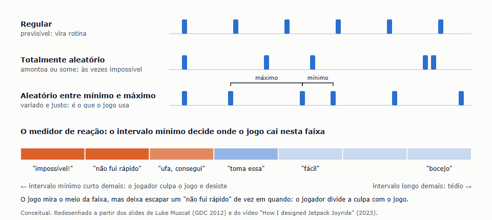
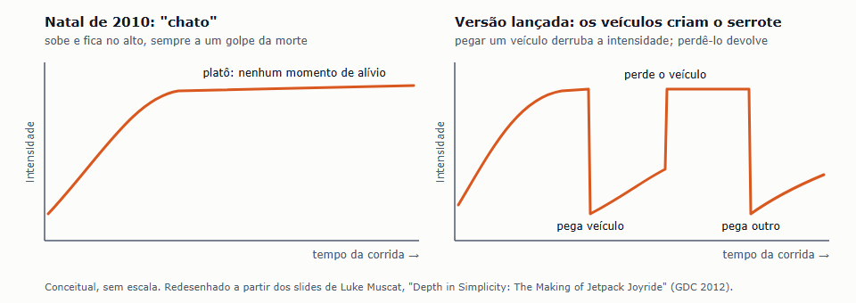
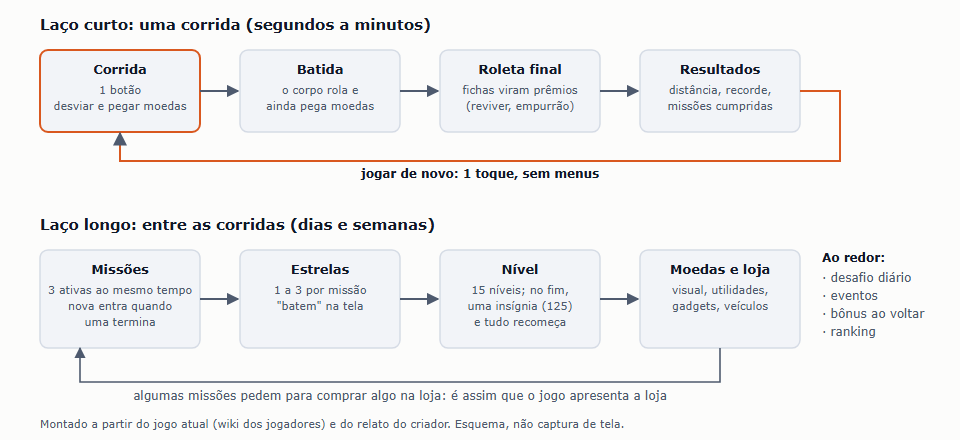
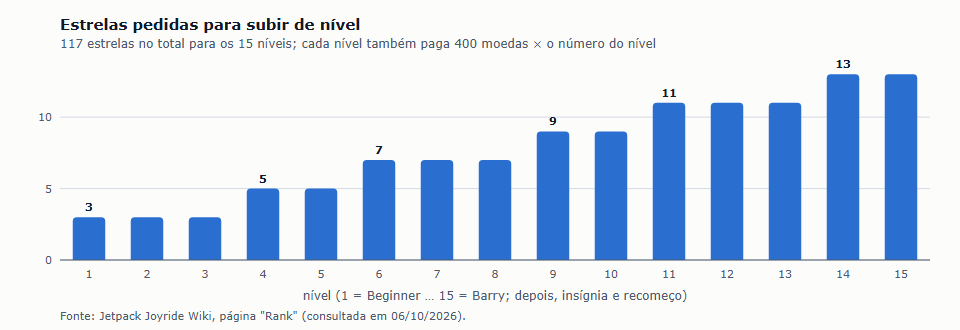

# Benchmark de Gameplay e Estrutura: Jetpack Joyride (2011)

| Campo | Valor |
|---|---|
| Documento | Benchmark de gameplay e estrutura — Jetpack Joyride |
| Versão | 1.0 |
| Data | 06/10/2026 |
| Status | Referência |
| Responsável | Fernando Nunes (Product Manager) |

O primeiro dos casuais do ICP (D-028) estudado a fundo, dentro da pesquisa dos casuais ([#99](https://github.com/TARNAGS/resgate-espacial/issues/99); cartão [#107](https://github.com/TARNAGS/resgate-espacial/issues/107)). O Fernando, em 06/10/2026: os jogos de nave com gravidade são muito parecidos com o que ele pensa em level design; os modernos são inspiração menos direta, mas ajudam a entender **como jogos "infinitos" funcionam**. Por isso este documento olha menos para obstáculos e mais para a estrutura: como a corrida é montada, como o ritmo funciona, o que acontece quando o jogador perde e o que o faz voltar. É o segundo discovery feito com a skill `discovery-de-jogos` (D-033).

> **Página de leitura:** a mesma análise, com os diagramas, publicada em [claude.ai/artifact/TjsQe83tBnQbYzsddenUcb](https://claude.ai/artifact/TjsQe83tBnQbYzsddenUcb) (privada) e guardada aqui em [`jetpack-joyride/pagina-de-leitura.html`](jetpack-joyride/pagina-de-leitura.html).

> **Sobre as imagens.** Num jogo infinito não há mapa de fase. Os diagramas mostram conceitos e foram redesenhados a partir dos slides do criador e da wiki dos jogadores, com crédito. Jogo, personagens e arte são da Halfbrick Studios (D-005).

## Sumário

1. [Resumo em uma página](#1-resumo-em-uma-página)
2. [Como o jogo funciona](#2-como-o-jogo-funciona)
3. [Como a corrida é montada](#3-como-a-corrida-é-montada)
4. [O ritmo: o problema da intensidade e os veículos](#4-o-ritmo-o-problema-da-intensidade-e-os-veículos)
5. [O custo de perder](#5-o-custo-de-perder)
6. [O laço entre corridas](#6-o-laço-entre-corridas)
7. [Negócio e operação](#7-negócio-e-operação)
8. [As perguntas do documento 10](#8-as-perguntas-do-documento-10)
9. [Padrões de design](#9-padrões-de-design)
10. [Onde estava a diversão e onde estava a dificuldade](#10-onde-estava-a-diversão-e-onde-estava-a-dificuldade)
11. [O que os jogadores e a crítica diziam](#11-o-que-os-jogadores-e-a-crítica-diziam)
12. [O que levar para o Resgate Espacial](#12-o-que-levar-para-o-resgate-espacial)
13. [Como este material foi feito](#13-como-este-material-foi-feito)
14. [Fontes](#14-fontes)

## 1. Resumo em uma página

| Item | Jetpack Joyride |
|---|---|
| Proposta | Um personagem com uma mochila a jato atravessa um laboratório sem fim. O jogador só controla a altura: segura para subir, solta para cair. A meta é ir o mais longe possível, desviando de obstáculos e pegando moedas |
| Autor | Halfbrick Studios (Austrália). Criação e design de Luke Muscat, que também fez o Fruit Ninja, com o programador Adam Wood e o artista Sierra Asher; música de Cedar Jones |
| Lançamento | iOS em 01/09/2011; Android em 28/09/2012; depois PlayStation, Windows, web e outros. Uma continuação, o Jetpack Joyride 2, saiu em 2022 no Apple Arcade |
| Desenvolvimento | Começou como um projeto de 4 semanas, para dar de presente aos fãs, e levou 10 meses. Três meses foram só para o sistema de missões |
| Negócio | Lançado pago; virou **grátis com compras dentro do jogo** no fim de dezembro de 2011. Hoje também tem anúncios |
| Tamanho do sucesso | Mais de 1 milhão de downloads pagos antes de ficar grátis; 770 mil no primeiro dia grátis; mais de 13 milhões em fevereiro de 2012; hoje, mais de 100 milhões só na Google Play |
| Onde estava a diversão | Um botão, física bem ajustada, veículos absurdos que mudam tudo por alguns segundos, morrer com graça, e sempre ter uma missão por perto |
| Onde estava a dificuldade | Encostar em qualquer obstáculo acaba a corrida; com a distância, os campos de choque ficam mais densos e os mísseis, mais rápidos |
| Oponentes | Não há inimigos que perseguem: três tipos de obstáculo (campos elétricos, mísseis e lasers) |
| Recepção | Metacritic 90 (iOS); IGN 9/10; Apple Design Award 2012; jogo do ano da Pocket Gamer em 2012. Na App Store, 4,7 com 103 mil avaliações |

## 2. Como o jogo funciona

### 2.1 Controle e física

| Regra | Como é |
|---|---|
| Controle | **Um botão.** Segurar dispara a mochila e o personagem sobe; soltar faz cair. A velocidade para a frente é do jogo, nunca do jogador |
| Física | O criador fez o primeiro protótipo em um dia, só para achar o equilíbrio entre "flutuante" e "responsivo". Flutuante demais, o jogador não sai da frente dos obstáculos a tempo; responsivo demais, ele passa o tempo todo batendo na tela e não consegue manter uma altura, o que cansa |
| Batida | Encostar em qualquer obstáculo encerra a corrida, a não ser que o personagem esteja num veículo ou com escudo |
| Teto e chão | Dá para correr no chão e raspar no teto; várias missões usam isso |

### 2.2 Os obstáculos

| Obstáculo | O que faz | Como muda com a distância |
|---|---|---|
| Campo elétrico ("zapper") | O mais comum: barras elétricas paradas (na vertical, horizontal ou diagonal) ou girando, de tamanhos variados, em grupos | Os campos ficam mais densos e mais longos |
| Míssil | Um aviso aparece na borda direita da tela por 1 a 2 segundos, com som, e o míssil vem na altura do personagem. Às vezes vem uma rajada de 5 a 10 em menos de 2 segundos | O aviso fica mais curto e o míssil, mais rápido |
| Laser | Pares de emissores nas bordas carregam por cerca de 1,5 segundo e disparam um feixe horizontal na tela inteira por cerca de 1 segundo; os padrões podem se mover | Mais lasers e mais rápidos; depois de uns 6.000 metros, deixam de aparecer |

**Regras de convivência:** campos e mísseis aparecem juntos; os lasers vêm sozinhos (sem campos, mísseis, moedas ou pessoas na tela); não há lasers durante os veículos; pegar ou perder um veículo apaga os obstáculos por perto.

### 2.3 O que se pega na corrida

| Item | O que faz |
|---|---|
| Moedas | Em grupos com desenhos; são a moeda da loja |
| Fichas da roleta | Viram giros na roleta do fim da corrida |
| Caixa de veículo | Dá um dos veículos (só aparece na metade de cima da tela) |
| Poderes (desde 2016) | Escudo, ímã de moedas, turbo e outros, comprados antes na loja |
| Fichas do S.A.M. | Três por dia liberam um robô especial uma vez por dia |

### 2.4 Os veículos

Seis veículos padrão (uma moto, um robô que pula, um pássaro que solta dinheiro, um dragão mecânico, um teletransportador e um traje que inverte a gravidade), mais outros vindos de atualizações e parcerias. Cada um:

- **muda o controle**, ainda com um toque só (o robô pula e plana; o traje troca o chão pelo teto);
- **vale uma vida a mais:** a batida destrói o veículo, e a corrida continua;
- **muda o jogo em volta:** ao pegar, o jogo desacelera, explode os obstáculos próximos e volta a acelerar aos poucos; os campos elétricos se ajustam a cada veículo (com a moto, ficam mais baixos);
- é mais rápido que o personagem a pé.

### 2.5 A morte e o fim da corrida

1. O corpo **rola e quica** pelo chão, e ainda pega moedas no caminho.
2. **Roleta final:** cada ficha pega vale um giro. Prêmios: uma segunda chance, começar 750 metros adiante na próxima corrida, moedas em dobro, bombas que arremessam o corpo mais 160, 280 ou 400 metros, ou moedas. As fichas também podem virar 100 moedas cada.
3. **Resultados:** a distância, o recorde, estatísticas da corrida, uma captura automática de um momento da corrida e as missões cumpridas.
4. **Jogar de novo:** um toque.

## 3. Como a corrida é montada

É a parte mais útil para nós. Tudo aqui vem dos slides e do vídeo do criador.

### 3.1 O sistema de intervalos

- **Tudo é colocado pelo mesmo sistema.** A corrida é uma sequência de "espaços". Cada tipo de objeto (campos, campos que giram, moedas, sequências de moedas, lasers, mísseis, sequências de mísseis, fichas, veículos) tem uma **probabilidade de ocupar o próximo espaço**.
- **O espaço até o próximo objeto é sorteado entre um mínimo e um máximo.** Intervalo regular vira rotina; intervalo totalmente aleatório às vezes amontoa objetos e cria trechos impossíveis. Entre um mínimo e um máximo, a corrida varia e continua justa.
- **O mínimo decide a justiça.** O criador mostra um "medidor de reação" que vai do "isso é impossível!" ao "fácil demais". Um mínimo curto demais joga o jogador no lado vermelho, e ele culpa o jogo e desiste.
- **Uma injustiça pequena e proposital.** Nos jogos dele (Fruit Ninja, Monster Dash e Jetpack Joyride), de vez em quando aparece uma situação mais difícil do que o normal, nunca impossível. É de propósito: o jogador pode **dividir a culpa** com o jogo, em vez de sentir que errou sozinho. No Jetpack Joyride, isso vem da combinação de tamanho, densidade e espaçamento dos obstáculos.
- **Pouco trabalho de design manual.** O criador era o único designer de dois jogos ao mesmo tempo; a geração procedural foi também uma saída para quem tinha pouco tempo.

### 3.2 O que fica mais difícil com a distância

O jogo não tem fases nem mundos; a dificuldade sobe com a distância percorrida. Os campos elétricos ficam mais densos e longos, os mísseis avisam menos e vão mais rápido, os lasers ficam mais rápidos (até sumirem, depois de uns 6.000 metros). Os cenários do laboratório (corredores, laboratórios, depósito, cavernas, aquário, floresta…) se revezam ao longo da corrida, para dar sensação de viagem. O recorde verificado passa de 517 mil metros.

### 3.3 Como um elemento novo é ensinado

- **Avisos antes do perigo:** o sinal do míssil e a carga do laser dão tempo de reação.
- **Transição dos veículos:** câmera lenta, explosão que limpa a tela e **trilhas de moedas em forma de seta**, que funcionam como um tutorial dentro do jogo, mostrando como o veículo se move. Foram acrescentadas porque, no primeiro grande teste, as pessoas morriam logo depois de trocar de controle.
- **Missões que apresentam funções:** algumas pedem para usar um veículo, um item ou até comprar algo na loja.

## 4. O ritmo: o problema da intensidade e os veículos

- **O teste do Natal de 2010.** A primeira versão foi dada a toda a empresa para jogar nas férias. Tinha o voo, os obstáculos e a pontuação, sem veículos, missões nem pessoas no cenário. O veredito: **"chato"**.
- **O diagnóstico errado primeiro.** O criador achou que faltava variedade e passou semanas acrescentando poderes (câmera lenta, escudo…). Não resolveu.
- **O diagnóstico certo.** O problema era a **intensidade sempre igual**: a corrida esquentava e ficava no alto, sempre a um golpe da morte, sem nenhum ponto baixo. Os jogadores se cansavam rápido.
- **O que eles tentaram:** três corações, como no Monster Dash (a intensidade sobe a cada golpe); depois, a tela ficando vermelha ao ser atingido, como nos jogos de tiro. Nenhum dos dois serviu.
- **A solução: os veículos.** Pegar um veículo derruba a intensidade (o jogo desacelera, explode tudo e dá uma vida a mais); perdê-lo devolve a tensão. A corrida virou um serrote: trechos intensos voando, quebrados por sequências em que **mudam o controle, o visual, a velocidade e as consequências**. O criador considera essa a decisão mais importante para o sucesso do jogo.
- **Quantos veículos?** Poucos, e o jogador sempre pega o mesmo, que deixa de ser especial; muitos, e o favorito quase nunca vem. Ficaram seis no lançamento.

## 5. O custo de perder

Um jogo infinito é, nas palavras do criador, uma marcha inevitável para a morte: não há como vencer, só ir mais longe. Por isso **perder tem que ser divertido**. Os slides da GDC dividem o custo de perder em três:

| Custo | O que é | Como o Jetpack Joyride reduz |
|---|---|---|
| **Tempo perdido** | Quanto da sua jogada a derrota joga fora | Corridas curtas; a "jogada do intervalo comercial" era um pilar desde o começo |
| **Custo emocional** | A sensação de fracasso | A morte "se dissolve": o corpo rola, ainda pega moedas, vem a roleta com prêmios e uma tela de resultados que mostra o que você conseguiu, não o que errou |
| **Atrito para recomeçar** | O esforço para tentar de novo | Um toque, sem menus, da tela de resultados direto para a próxima corrida |

Um resumo da palestra do criador na FailCon de 2012 junta isso em três regras: **recompense a derrota**, **tenha sempre um próximo passo** (logo depois de explodir, o jogo mostra as missões atuais) e **diminua a barreira para tentar de novo**.

## 6. O laço entre corridas

### 6.1 Missões

- **Três ativas ao mesmo tempo**, sorteadas, cada uma valendo de 1 a 3 estrelas. Quando uma termina, **outra entra na hora**. Só as três da tela contam, para não confundir.
- **Durações diferentes:** missões de 30 segundos a 2 minutos, de 2 a 10 minutos e de 10 a mais de 30 minutos. Quem tem pouco tempo sempre acha uma que dá para fazer.
- **44 tipos**, que fazem o jogador experimentar o jogo inteiro: passar raspando em mísseis, voar sem tocar no chão, correr a pé, cumprimentar cientistas, não pegar moedas por uma distância, pegar um veículo, terminar entre duas distâncias, comprar algo na loja…
- **Como chegaram nisso (três testes na empresa):** primeiro, **três missões por dia** (fácil, média e difícil), inspiradas no Tiny Wings, que travava o jogador numa missão difícil; o problema é que quem começava depois dos amigos nunca os alcançava. Depois, **duas missões, cumprir uma ou outra** (uma de habilidade, uma de insistência): virou trabalho repetitivo. Por fim, **três missões que se renovam**: o jogador quase nunca fica travado e pode cumprir mais de uma na mesma corrida.
- **A recompensa:** o criador recusou o multiplicador de pontos do Tiny Wings, porque queria que o placar fosse **só a distância**, para comparar com os amigos. Testou "o dinheiro ou a caixa" (a caixa tinha colecionáveis inúteis, e todo mundo escolhia a caixa), testou barra de experiência, e ficou com **estrelas que "batem" na tela**, com faíscas e som.
- **Pular missões:** com moedas (500 por estrela) ou vendo um anúncio.

### 6.2 Níveis e prestígio

Quinze níveis, de 3 a 13 estrelas cada (117 no total), cada um pagando 400 moedas × o número do nível. No fim do nível 15, o jogador ganha uma **insígnia** e recomeça as missões, como o "prestígio" dos jogos de tiro. As insígnias combinam 5 cores, 5 formas de fora e 5 de dentro: 125 no total, cada uma numerada e com nome, para a comunidade montar a coleção junta.

### 6.3 A loja

- **Por que existe:** dar ao jogador um motivo além de "bater os amigos", deixá-lo se expressar (roupas, mochilas) e **facilitar as atualizações**: tudo foi feito para receber conteúdo novo sem dor.
- **O que vende:** roupas e mochilas, que só mudam o visual; **gadgets** (dois equipados por vez; a terceira vaga custa US$ 4,99), que mudam o jogo; utilidades de uso único (começar 750 ou 1.500 metros adiante, reviver, bombas finais, completar missão); melhorias dos veículos; poderes; e moedas por dinheiro de verdade.
- **Reviver:** até 9 vezes por corrida, cada vez mais caro, mais o reviver por anúncio e até 3 segundas chances da roleta: até 13 por corrida.

## 7. Negócio e operação

| Tema | O que aconteceu |
|---|---|
| Pago → grátis | Lançado pago em setembro de 2011; mais de 1 milhão de downloads. No fim de dezembro, ficou grátis com compras: 770 mil downloads no primeiro dia e mais de 13 milhões até fevereiro de 2012. O diretor de marketing, Phil Larsen, disse que o jogo passou a ganhar mais dinheiro grátis do que pago |
| Compras de destaque | O "dobrador de moedas" (US$ 4,99, todas as moedas valem o dobro) e a terceira vaga de gadget (US$ 4,99) |
| Anúncios | Hoje há anúncios com recompensa (reviver, pular missão, giros extras) e anúncios entre corridas. É a crítica mais comum nas avaliações recentes |
| Atualizações | 13 atualizações nos dois primeiros anos, com o time original; os gadgets vieram na 1.3 (abril de 2012). Depois, eventos sazonais e parcerias (De Volta para o Futuro, Caça-Fantasmas, Star Trek) |
| Retenção | Desafio diário (o S.A.M., com prêmio por cinco dias seguidos), eventos com prazo, recompensa de 3.000 moedas para quem volta depois de um tempo, presentes diários na loja |
| Processo | O protótipo foi enviado a toda a empresa, com uma barra de chocolate para o maior placar do dia. Durante o desenvolvimento, o jogo ficava nos celulares dos colegas e era atualizado a cada duas semanas com base nas respostas |
| Continuação | O Jetpack Joyride 2 foi testado na Austrália, Nova Zelândia e Canadá em 2021, saiu das lojas em 2022 e foi lançado só no Apple Arcade, por assinatura |

## 8. As perguntas do documento 10

| Pergunta de level design | No Jetpack Joyride |
|---|---|
| Como a fase é organizada | Não há fases: uma corrida sem fim, montada na hora por intervalos com probabilidades, com cenários que se revezam |
| Como a dificuldade sobe | Com a distância: obstáculos mais densos, avisos mais curtos, mísseis mais rápidos. Os veículos quebram a intensidade em serrote |
| Como um elemento novo é apresentado | Avisos antes do perigo; câmera lenta, tela limpa e trilhas de moedas em seta para cada veículo; missões que pedem para experimentar cada função |
| Metas por fase | Três missões ao mesmo tempo (1 a 3 estrelas cada), o recorde de distância e o ranking dos amigos |
| Duração de uma fase | A "jogada do intervalo comercial": corridas curtas; missões de 30 segundos a mais de 30 minutos |
| O que faz voltar | Missões que se renovam, níveis e insígnias, a loja, a roleta, o desafio diário, eventos, recompensa por voltar e notificações |

## 9. Padrões de design

| # | Padrão | Como aparece |
|---|---|---|
| 1 | **Um botão, física afinada antes de tudo** | Protótipo de um dia só para o equilíbrio entre flutuar e responder |
| 2 | **Geração por intervalos entre um mínimo e um máximo** | Tudo, de obstáculos a moedas e veículos, sai do mesmo sistema |
| 3 | **Injustiça pequena e proposital** | Trechos às vezes mais difíceis, nunca impossíveis, para o jogador dividir a culpa |
| 4 | **Serrote de intensidade** | Os veículos derrubam a tensão e a devolvem quando se perdem |
| 5 | **Toda troca de controle tem transição** | Câmera lenta, tela limpa, trilha de moedas que ensina |
| 6 | **Perder é divertido** | O corpo que rola, a roleta, a tela de resultados com o que deu certo |
| 7 | **Sempre um próximo passo** | As missões aparecem logo depois da morte |
| 8 | **Recomeço sem atrito** | Um toque, sem menus |
| 9 | **Metas paralelas que se renovam** | Três missões de durações diferentes, sem nunca travar |
| 10 | **O placar fica puro** | A pontuação é só a distância; as recompensas ficam fora dela |
| 11 | **Recompensa que se sente** | Estrelas que "batem" na tela, com faísca e som |
| 12 | **Prestígio** | Quinze níveis, uma insígnia, e recomeça |
| 13 | **Missões que ensinam o produto** | Inclusive a loja |
| 14 | **Feito para ser atualizado** | Loja e conteúdo pensados para receber novidades sem dor |

## 10. Onde estava a diversão e onde estava a dificuldade

| Onde estava a diversão | Onde estava a dificuldade |
|---|---|
| **Um botão:** qualquer pessoa joga na hora | **Morte com um toque:** um encostão acaba a corrida |
| **Os veículos:** absurdos, cada um muda tudo por alguns segundos e salva uma vez | **Densidade crescente:** campos mais cheios, mísseis mais rápidos, avisos mais curtos |
| **Passar raspando:** as missões premiam o risco (passar perto de mísseis e campos) | **Os lasers:** padrões que ocupam a tela e pedem altura certa no tempo certo |
| **Morrer com graça:** o corpo quica, a roleta pode dar outra chance | **Escolhas de risco:** subir para pegar a caixa de veículo ou a ficha, ou ficar seguro |
| **Sempre ter algo a fazer:** três missões, níveis, loja, eventos | **Missões difíceis:** as de 3 estrelas pedem corridas inteiras de habilidade |
| **A música e o humor:** cientistas fugindo, o personagem atravessando a parede no começo | **Cansaço, nas palavras do criador:** sem o serrote, a tensão constante esgotava os jogadores |

## 11. O que os jogadores e a crítica diziam

| Fonte | O que diz |
|---|---|
| Crítica de 2011 | Metacritic 90 (iOS, 27 resenhas). A IGN deu 9 e elogiou a dose certa de aleatoriedade e o sistema de três missões, que cria o "só mais uma". Destructoid (9) e TouchArcade (5 de 5) destacaram as missões e os controles |
| Prêmios | Apple Design Award 2012; jogo do ano da Pocket Gamer em 2012; melhor app de 2011 do 148Apps |
| Críticas da época | Na versão de PlayStation, a IGN baixou a nota (7,4) pela falta de ranking online: "um jogo de recorde sem competição de verdade" |
| App Store hoje | 4,7 com 103 mil avaliações nos EUA, com selo de escolha dos editores. Quem elogia fala das missões, das moedas fáceis de juntar, dos eventos e da música; quem critica fala dos **anúncios**, que viraram obrigatórios a cada poucas corridas |
| Google Play hoje | Mais de 100 milhões de downloads; contém anúncios e compras |
| O próprio criador | Considera a versão 1.0 o jogo de que mais se orgulha; diz que a decisão dos veículos foi a mais importante, e que o sistema de missões levou três vezes o tempo previsto para o jogo inteiro |

## 12. O que levar para o Resgate Espacial

Tudo aqui é **Proposta** para o Fernando decidir. Inspirar, nunca copiar (D-005, D-033): o Jetpack Joyride é um corredor sem fim, sem fases; o nosso tem fases fixas e curtas. As ideias que viajam bem são de **estrutura**, não de conteúdo.

| Ideia do Jetpack Joyride | Como poderia entrar no nosso jogo | Ligado a |
|---|---|---|
| **O placar fica puro** (só a distância; nada de multiplicador) | Manter o ranking de cada fase como **tempo puro**. Estrelas, missões e moedas, se vierem, ficam fora dele | D-024; P-006 ([#53](https://github.com/TARNAGS/resgate-espacial/issues/53)) |
| **O custo de perder em três partes** (tempo, emoção, atrito) | Revisar o fim de corrida com essas lentes: o que o jogador conseguiu (não o que errou), um próximo passo à vista e tentar de novo com um toque. O primeiro playtest mostrou jogadores recomeçando a cada morte | Documento 09; D-031 |
| **Três missões que se renovam**, de durações diferentes, com estrelas | Metas paralelas que fazem voltar sem mexer no ranking. Os elogios que já existem (CLOSE CALL, GREAT SAVE, PERFECT LANDING, PERFECT RUN) viram missões naturais: "faça 3 pousos perfeitos" | P-006; [#81](https://github.com/TARNAGS/resgate-espacial/issues/81); replay alto (Visão) |
| **Missões que apresentam funções** | Quando houver loja ou modificadores, uma missão pode apresentá-los, sem tutorial | P-017 ([#78](https://github.com/TARNAGS/resgate-espacial/issues/78)); D-031 |
| **Serrote de intensidade** | O nosso desenho já tem um serrote natural: voo tenso, pouso no posto ou na tripulação (alívio), voo de novo. Os pousos são os nossos "veículos". Cuidado ao encher uma fase de obstáculos sem um ponto de alívio | Documento 08; P-011 ([#60](https://github.com/TARNAGS/resgate-espacial/issues/60)); D-023 |
| **Intervalos entre um mínimo e um máximo** | Para a fase BONUS e para fases geradas: espaçar os obstáculos sorteados entre um mínimo e um máximo. O piloto automático já garante que dá para passar (D-018); o mínimo regula se é **justo** | D-021; D-018; P-011 |
| **Injustiça pequena e proposital** | Contraponto à nossa regra do caminho provado. Proposta: continuar provando que todo trecho é possível, mas aceitar sustos, e usar os mapas de calor para achar os trechos onde muita gente morre do mesmo jeito | D-018; [#91](https://github.com/TARNAGS/resgate-espacial/issues/91) |
| **Troca de controle com transição** (câmera lenta, tela limpa, trilha que ensina) | Se um dia um item ou modificador mudar o controle, a troca precisa dessa transição | P-012 ([#61](https://github.com/TARNAGS/resgate-espacial/issues/61)); P-017 |
| **Moedas que desenham o caminho** | Sem moedas, uma trilha visual que sugere a rota nas primeiras fases ensina sem texto | D-031; documento 08 |
| **Um modo sem fim**, gerado por intervalos | Para depois: resgates em sequência numa corrida contínua, com o tanque como relógio, para quem quer jogar mais do que as fases | Visão (replay alto); D-020; P-012 |
| **Loja que mexe no desempenho** (gadgets, reviver pago) | Mostra o risco que a P-017 quer evitar: o recorde passa a depender do que se comprou. Loja só visual mantém o ranking justo | P-017; D-024 |
| **Anúncios viraram a maior reclamação** | Valida o "sem anúncios" da D-003 | D-003; P-014 ([#98](https://github.com/TARNAGS/resgate-espacial/issues/98)) |
| **Grátis rendeu mais do que pago** (2011), com atualizações grandes e grátis | Mais um caso para a pesquisa de lojas e dinheiro | P-014 ([#98](https://github.com/TARNAGS/resgate-espacial/issues/98)) |

**Validações** (o que já fazemos e o Jetpack Joyride confirma):

- **Física e controle primeiro:** o protótipo de um dia para achar o equilíbrio entre flutuar e responder é o que fizemos no M1 (D-006, D-022).
- **Testar com gente cedo e sempre:** a empresa inteira jogando, com atualização a cada duas semanas, é o nosso playtest com amigos (documentos 07 e 09).
- **Diagnosticar o feedback:** "chato" não queria dizer "falta conteúdo", e sim "intensidade sempre igual". Vale para ler os nossos próximos playtests.
- **Partidas curtas:** a "jogada do intervalo comercial" é o nosso ICP (D-028).

**Diferença importante:** o Jetpack Joyride não tem fases, mundos nem fim; o nosso tem fases fixas, ranking por fase e um objetivo (resgatar e voltar). Também tem mísseis que vêm na direção do personagem, o que fica perto da nossa regra de não ter inimigos que atiram. As ideias de estrutura (custo de perder, missões, placar puro, serrote, intervalos) valem para nós; o conteúdo e a identidade do jogo (o laboratório, os campos elétricos, os veículos) são dele.

## 13. Como este material foi feito

1. **Fontes primárias:** o vídeo "How I designed Jetpack Joyride", do próprio criador (2023, 41 minutos), lido pela transcrição automática no navegador do app; os slides da palestra "Depth in Simplicity: The Making of Jetpack Joyride" (GDC 2012), publicados pela GDC, com o texto extraído por um script e as imagens dos slides lidas uma a uma; o resumo da palestra do criador na FailCon 2012.
2. **Dados do jogo:** a wiki dos jogadores (Jetpack Joyride Wiki, no Fandom), lida pela interface de dados da própria wiki: obstáculos, veículos, missões, níveis, roleta, moedas, gadgets, utilidades, reviver, cenários e recordes.
3. **Produto e negócio:** Wikipédia, Game Informer (2012), Pocket Gamer.biz, Engadget, a página da App Store e a da Google Play.
4. **O que não foi possível:** a transcrição da palestra da GDC não carregou no navegador; os capítulos e os slides cobriram o conteúdo. Uma segunda palestra da GDC sobre como a Halfbrick atualizava o jogo ficou só indicada. Nenhum arquivo do jogo foi baixado ou aberto: num jogo comercial e atual, os dados vêm do que os criadores e os jogadores publicaram.
5. **O que é aproximado:** os números da wiki valem para a versão atual do jogo, que mudou muito desde 2011 (poderes, anúncios, eventos); o lançamento original tinha menos coisas. O preço de lançamento não foi confirmado numa fonte da época.
6. **Diagramas:** em [`jetpack-joyride/ferramentas/`](jetpack-joyride/ferramentas/diagramas.js), gerados por script (`node diagramas.js` e `fotografar.ps1`).

### Onde a busca procurou

| Fonte | O que foi feito | Resultado |
|---|---|---|
| Buscas na web | Palestras, entrevistas e análises de design | GDC 2012, FailCon, análise de Adrian Crook, Pocket Gamer.biz, Game Informer |
| GDC Vault | Página da palestra | Descrição; o vídeo é para assinantes |
| YouTube, no navegador do app | Vídeo do criador e postmortem da GDC | Transcrição completa do vídeo do criador; a da GDC não carregou, mas os capítulos sim |
| Slides da GDC (PDF público) | Texto extraído por script; imagens dos slides lidas | Sistema de intervalos, medidor de reação, curvas de intensidade, custos de perder |
| Jetpack Joyride Wiki | 40 páginas lidas pela interface de dados da wiki | Regras, números e listas |
| App Store e Google Play | Páginas atuais | Notas, downloads, anúncios e avaliações recentes |
| Engadget, AOL | Matérias de 2012 | Engadget: a evolução da loja; a matéria da AOL não existe mais |

## 14. Fontes

- Luke Muscat, [How I designed Jetpack Joyride](https://www.youtube.com/watch?v=mxHkXADm3gU) (YouTube, 16/11/2023)
- Luke Muscat, [Depth in Simplicity: The Making of Jetpack Joyride](https://gdcvault.com/play/1015316/Depth-in-Simplicity-The-Making) (GDC 2012): [slides](https://media.gdcvault.com/gdc2012/slides/Design%20Track/Muscat_Luke_DepthInSimplicity.pdf) e [vídeo no YouTube](https://www.youtube.com/watch?v=0pdFvJ4mT8M); matéria da [Game Developer](https://www.gamedeveloper.com/design/video-depth-in-simplicity-the-making-of-i-jetpack-joyride-i-)
- [Iterating Design and Fighting Fires: Updating Fruit Ninja and Jetpack Joyride](https://www.youtube.com/watch?v=w8bhVy_lY-0) (GDC 2012; indicada, não lida)
- Scott Berkun, [Lessons on Failure From the Jetpack Joyride game](https://scottberkun.com/2012/lessons-from-jetpack-joyride/) (resumo da FailCon 2012)
- Adrian Crook, [Design breakdown: Jetpack Joyride](https://adriancrook.com/?p=4709)
- [Wikipédia: Jetpack Joyride](https://en.wikipedia.org/wiki/Jetpack_Joyride)
- [Jetpack Joyride Wiki](https://jetpackjoyride.fandom.com/): Obstacles, Zapper, Missile, Laser, Jetpack Joyride/Vehicles, Jetpack Joyride/Missions, Rank, Final Spin, Currency, Jetpack Joyride/Gadgets, Utilities, Quick Revive, Backgrounds, Jetpack Joyride/High scores
- Game Informer, [13 Million People Downloaded Jetpack Joyride](https://www.gameinformer.com/b/news/archive/2012/02/08/13-million-people-downloaded-jetpack-joyride.aspx) (08/02/2012)
- Pocket Gamer.biz, [Mobile Masterworks: Jetpack Joyride](https://www.pocketgamer.biz/mobile-masterworks-jetpack-joyride/)
- Engadget, [The evolution of Jetpack Joyride's store, in pictorial form](https://www.engadget.com/2012-03-08-the-evolution-of-jetpack-joyrides-store-in-pictorial-form.html)
- [App Store](https://apps.apple.com/us/app/jetpack-joyride/id457446957) e [Google Play](https://play.google.com/store/apps/details?id=com.halfbrick.jetpackjoyride) (consultadas em 06/10/2026)

## Histórico de versões

| Versão | Data | O que mudou |
|---|---|---|
| 1.0 | 06/10/2026 | Primeira versão: como a corrida é montada, o ritmo, o custo de perder, o laço entre corridas, negócio, as perguntas do documento 10 e propostas |
