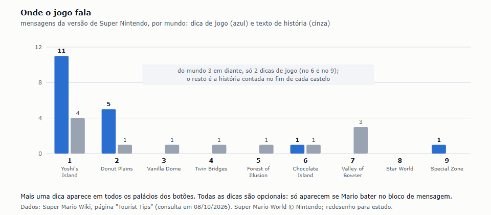
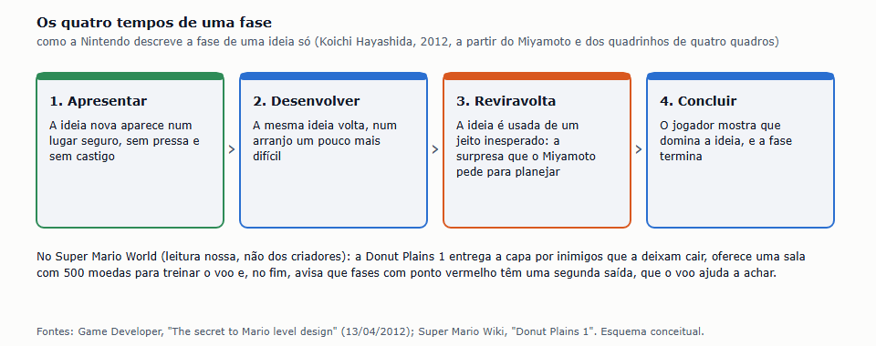
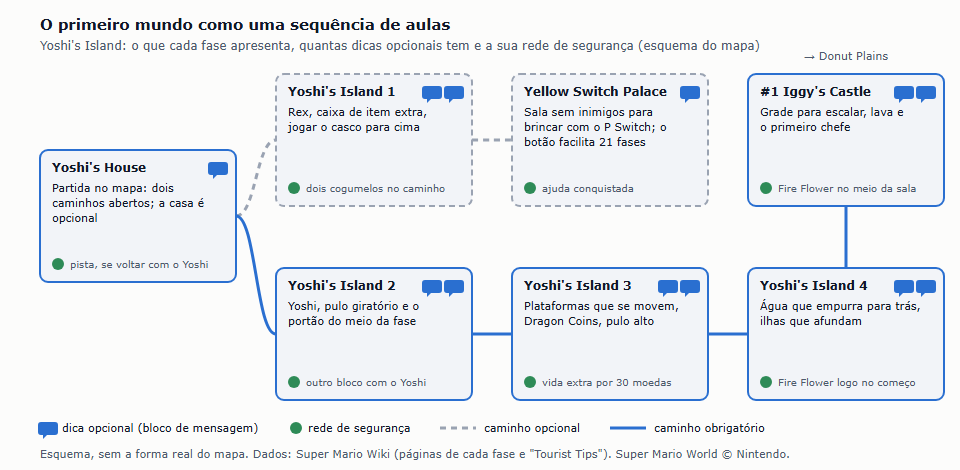
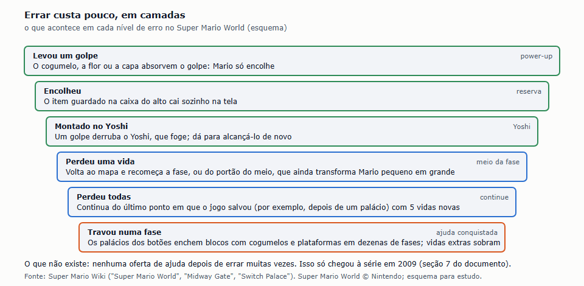
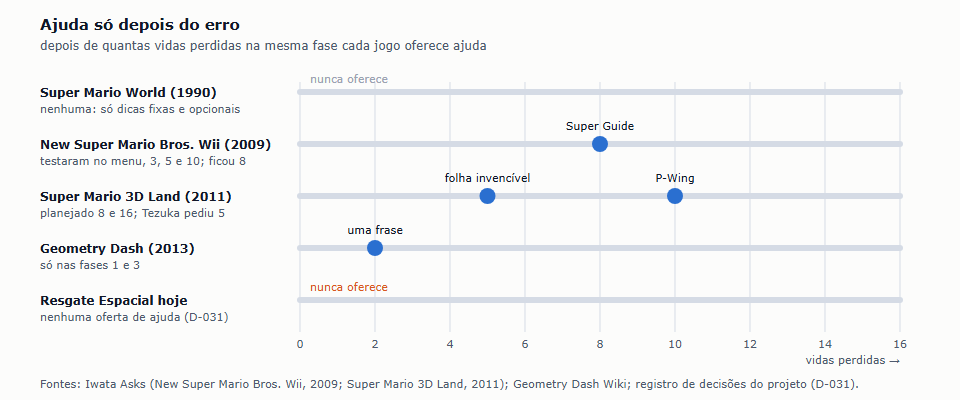

# Benchmark de Ensino pelas Fases: Super Mario World (1990)

| Campo | Valor |
|---|---|
| Documento | Benchmark de ensino pelas fases — Super Mario World |
| Versão | 1.0 |
| Data | 08/10/2026 |
| Status | Referência |
| Responsável | Fernando Nunes (Product Manager) |

Pedido do Fernando, em 08/10/2026, depois do estudo do Geometry Dash: entender o que o Super Mario é mais famoso por fazer. "Não tem onboarding, não tem apresentação, ele já te joga no mundo e você descobre jogando e testando. E isso é incrível. Quero conseguir entender melhor como isso funciona e como foi construído. Não é sobre o level, os elementos, e sim sobre a dinâmica das fases." Cartão [#128](https://github.com/TARNAGS/resgate-espacial/issues/128). Por isso este estudo não cataloga inimigos nem blocos: olha **como uma fase ensina, como o primeiro mundo ensina, o que acontece quando o jogador erra e como a Nintendo construiu isso**. Liga-se à forma como o nosso jogo ensina: sem tutorial, com DEMO (D-031), e com a dinâmica do propulsor que faltou no playtest (D-027). Quinto discovery feito com a skill `discovery-de-jogos` (D-033).

> **Página de leitura:** a mesma análise, com os diagramas, publicada em [claude.ai/artifact/7LSubtYDh5iEywjTtB8hP3](https://claude.ai/artifact/7LSubtYDh5iEywjTtB8hP3) (privada) e guardada aqui em [`super-mario-world/pagina-de-leitura.html`](super-mario-world/pagina-de-leitura.html).

> **Sobre as imagens.** Não são capturas de tela. Os gráficos e esquemas foram redesenhados a partir da Super Mario Wiki e das entrevistas oficiais da Nintendo, com crédito. Jogo, personagens, fases e textos são da Nintendo (D-005).

## Sumário

1. [Resumo em uma página](#1-resumo-em-uma-página)
2. [A premissa, conferida: o jogo fala pouco, e só quando você pede](#2-a-premissa-conferida-o-jogo-fala-pouco-e-só-quando-você-pede)
3. [Como foi construído](#3-como-foi-construído)
4. [O primeiro mundo, aula por aula](#4-o-primeiro-mundo-aula-por-aula)
5. [Errar custa pouco, em camadas](#5-errar-custa-pouco-em-camadas)
6. [A curiosidade como motor](#6-a-curiosidade-como-motor)
7. [O que a Nintendo mudou depois](#7-o-que-a-nintendo-mudou-depois)
8. [Os princípios que a própria Nintendo publicou](#8-os-princípios-que-a-própria-nintendo-publicou)
9. [As perguntas do documento 10](#9-as-perguntas-do-documento-10)
10. [Padrões de design](#10-padrões-de-design)
11. [Onde estava a diversão e onde estava a dificuldade](#11-onde-estava-a-diversão-e-onde-estava-a-dificuldade)
12. [O que a crítica e os criadores diziam](#12-o-que-a-crítica-e-os-criadores-diziam)
13. [O que levar para o Resgate Espacial](#13-o-que-levar-para-o-resgate-espacial)
14. [Como este material foi feito](#14-como-este-material-foi-feito)
15. [Fontes](#15-fontes)

## 1. Resumo em uma página

| Item | Super Mario World |
|---|---|
| Proposta | Mario atravessa Dinosaur Land, um mapa de ilhas conectadas, para salvar a princesa. Cada fase vai da esquerda para a direita até o portão de chegada; muitas têm uma segunda saída escondida |
| Autor | Nintendo. Direção de Takashi Tezuka, produção de Shigeru Miyamoto, mapa de Hideki Konno, direção de fases de Katsuya Eguchi, arte de Shigefumi Hino, música de Koji Kondo. Cerca de 16 pessoas e uns 3 anos (Miyamoto, 1991) |
| Lançamento | Japão em 21/11/1990, junto com o Super Famicom; América do Norte em 08/1991; Europa em 04/1992. Versão estudada: a original de Super Nintendo |
| Tamanho | 9 mundos, 73 fases, 24 com saída secreta: 96 saídas contadas pelo jogo |
| Como ensina, em uma frase | Joga o jogador direto no mapa, apresenta uma ou duas ideias por fase num lugar seguro, deixa dicas opcionais exatamente onde elas servem e faz o erro custar pouco |
| Onde estava a diversão | Descobrir: o mapa que se abre, a saída escondida, o Yoshi, a capa; sentir que ficou melhor ao repetir |
| Onde estava a dificuldade | Nas fases opcionais e nos mundos secretos; o caminho principal é generoso |
| Recepção | Média de 94,44% no GameRankings; cerca de 20 milhões de cópias, o mais vendido do Super Nintendo; o Mario favorito de Miyamoto |

**Os números do ensino:** a versão original tem 31 textos. Só 19 são dicas de jogo, todas opcionais (aparecem se Mario bater num bloco de mensagem), e 11 delas ficam no primeiro mundo. Do mundo 3 em diante, o jogo dá só mais 2 dicas de jogo.

## 2. A premissa, conferida: o jogo fala pouco, e só quando você pede

A frase "não tem onboarding, não tem apresentação" é quase toda verdadeira, e o detalhe que a desmente é a parte mais interessante:

- **Não há tutorial nem tela de instruções.** O jogo abre com uma única tela de texto ("bem-vindo a Dinosaur Land; a princesa sumiu; o Bowser voltou") e larga o jogador no mapa, em cima da casa do Yoshi, com dois caminhos abertos.
- **Há texto, mas opcional e no lugar certo.** Os blocos de mensagem (o jogo os chama de "Point of Advice") só mostram a dica se Mario bater neles. E ficam **exatamente antes do lugar em que a dica serve**: a de jogar o casco para cima, na Yoshi's Island 1, fica logo antes de um casco e de um bloco que só se quebra assim; a do pulo giratório fica do lado do bloco de onde sai o Yoshi; a do portão do meio, na frente do primeiro portão.
- **O texto se concentra no começo e some.** Das 19 dicas de jogo, 11 estão no primeiro mundo e 5 no segundo. Do mundo 3 em diante, só 2. A partir daí, os textos só contam a história no fim de cada castelo.

| Mundo | Dicas de jogo | Exemplos (resumidos) |
|---|---|---|
| 1. Yoshi's Island | 11 | Caixa de item extra; jogar o casco para cima; pulo giratório; o portão do meio da fase; Dragon Coins; pulo alto; voltar ao mapa; estrelas de bônus; escalar a grade; como vencer o primeiro chefe; uma pista de onde fica o primeiro palácio |
| 2. Donut Plains | 5 | Voar com a capa (numa sala feita para treinar); "fases com ponto vermelho no mapa têm duas saídas"; "consegue achar a saída?" (primeira casa assombrada); olhar à frente com L e R; "existem cinco entradas para o Star World" |
| 3 a 8 | 2 | Chocolate Island 2 (o caminho muda com as moedas ou o tempo); a entrada da Special Zone |

**A reedição de 2001 falou mais.** Na versão de Game Boy Advance, a Nintendo acrescentou blocos de mensagem e trocou o primeiro texto da Yoshi's Island 1: em vez da caixa de item, ele passou a explicar o botão de pulo e o pulo giratório. Onze anos depois, para um público novo, o começo ficou mais explicado.

**Leitura:** o Super Mario World não ensina com silêncio total. Ensina com **pouco texto, opcional, no lugar e na hora em que a dúvida aparece**, e com fases desenhadas para que a dúvida apareça num lugar seguro.

## 3. Como foi construído

Quase tudo o que os criadores dizem sobre ensinar vem do Super Mario Bros. (1985) e dos jogos seguintes, contado nas entrevistas Iwata Asks (2009 a 2011) pela mesma equipe que fez o Super Mario World: Miyamoto, Tezuka, Nakago, Konno e Eguchi. A entrevista oficial de 2017 sobre o Super Mario World fala mais da criação do Yoshi do que das fases.

### 3.1 A fase que ensina foi a última a ser feita

- **As fases divertidas vêm primeiro.** Toshihiko Nakago (programador desde o Super Mario Bros.) conta que a equipe não começa pela primeira tela: faz primeiro as fases mais divertidas, como as do mundo 3 ou 5. Quando iniciantes testam, elas se mostram "incrivelmente difíceis", e o princípio passa a ser **puxar as partes mais fáceis para o começo**.
- **A 1-1 do Super Mario Bros. foi a última fase feita** e a que foi ajustada até o último minuto. Na época não havia guias, quase ninguém lia o manual, e todos eram iniciantes; a equipe tinha isso em mente, "principalmente na 1-1" (Iwata Asks, 2009).
- **Uma fase de cerca de um minuto.** O pedido de Miyamoto para a primeira fase de todas era que durasse cerca de um minuto.

### 3.2 Desenhar pensando no jogador, inclusive no que erra

- **No papel, simulando a jogada.** As fases eram desenhadas em papel quadriculado. Tezuka desenhava; Miyamoto olhava e dizia por onde o jogador viria, para onde correria quando um inimigo aparecesse e onde ele não devia bater a cabeça. Konno, que fez o mapa do Super Mario World, conta que desenhava as fases com Eguchi sobre papel vegetal em cima do quadriculado, todo dia.
- **Pensar nas saídas alternativas.** Na 1-1, o cogumelo sai de um bloco, anda para a direita e volta ao bater no primeiro cano: o jogo foi montado para que o jogador pegue o cogumelo **qualquer que seja o caminho**, e só então perceba que ele é bom (Miyamoto, 2009). Nakago: "se ele não pegar, faremos que pegue deste outro jeito".
- **O mesmo cuidado no Super Mario World:** na Yoshi's Island 2, se o jogador perder o primeiro Yoshi, um bloco mais à frente dá outra chance; na Yoshi's Island 1, um cogumelo salta de um arbusto quando Mario passa.

### 3.3 O contrato de confiança

- **Moedas no ar dizem "pode pular".** No Super Mario Bros., a equipe não sabia como fazer o jogador descer das nuvens, porque ninguém pula no vazio com medo de morrer. A solução foi pôr moedas no ar: o jogador confia que, onde há moedas, é seguro. Iwata resume: um jogo feito por gente maldosa usaria isso para enganar; no Mario, há essa confiança. A equipe repetia que **não se pode trair a expectativa do jogador** (Nakago e Tezuka, 2009).
- **Nada de maldade.** No Super Mario 3D Land, Tezuka mandou tirar inimigos colocados logo depois de um pulo ou de uma moeda. A equipe concluiu que curvas e desafios traiçoeiros são o jeito de pensar de quem já joga muito e, para o iniciante, parecem mesquinhos.
- **Ir para a direita alivia.** Eguchi, diretor das fases do Super Mario World: "ir para a direita" é um elemento fundamental que dá alívio ao jogador, para ele começar sem pensar demais no que tem de fazer (Iwata Asks, 2010).

### 3.4 Uma ideia por fase, em quatro tempos

Koichi Hayashida, diretor do Super Mario 3D Land, formalizou em 2012 o que a equipe fazia: cada fase nasce de **uma ideia central** e a desenvolve em quatro tempos, como uma tirinha de quatro quadros (o *kishōtenketsu* japonês). A ideia é apresentada, desenvolvida num arranjo mais difícil, usada de um jeito inesperado e, por fim, dominada. A surpresa do terceiro tempo é o que Miyamoto, que desenhava quadrinhos quando criança, pedia para planejar.

No Super Mario World, o padrão aparece sem esse nome. Uma leitura nossa da Donut Plains 1: inimigos com capa entregam o poder novo; uma sala com 500 moedas serve para treinar o voo sem risco; no fim, uma dica avisa que fases com ponto vermelho no mapa têm uma segunda saída, que o voo ajuda a achar.

### 3.5 Testar com quem não joga

- **Testar com iniciantes** é o que derruba as fases difíceis para o meio do jogo (seção 3.1).
- **Relatórios de quem não está acostumado a jogar:** no 3D Land, funcionários de outras áreas jogavam e escreviam relatórios; Miyamoto diz que eles dão confiança à equipe.
- **Ouvir o que a pessoa quis dizer:** no 3D Land, um testador travado num trecho recusou a sugestão de voar por cima. Disse que não queria pular o trecho, queria jogá-lo. Daí nasceu a folha de invencibilidade, que deixa o jogador continuar jogando o trecho (seção 7).

## 4. O primeiro mundo, aula por aula

O primeiro mundo, Yoshi's Island, não tem saída secreta (é um dos dois únicos assim). Ele funciona como uma sequência de aulas curtas, cada uma com uma ou duas ideias, uma ou duas dicas opcionais e uma rede de segurança.

| Fase | O que apresenta | Como ensina | Rede de segurança |
|---|---|---|---|
| Yoshi's House (opcional) | O mapa | O jogo começa no mapa, com dois caminhos abertos; a casa só tem um bilhete | Voltando com o Yoshi, o bilhete vira uma pista de onde fica o primeiro palácio |
| Yoshi's Island 1 (opcional) | Rex, a caixa de item extra, carregar e jogar casco | Cada dica fica logo antes do lugar em que serve; o casco aparece logo depois da dica, perto de um bloco que só se quebra jogando o casco para cima | Um cogumelo num bloco voador e outro que salta de um arbusto |
| Yellow Switch Palace (opcional) | O P Switch e os blocos pontilhados | Uma sala aberta, sem inimigos, onde um P Switch faz aparecer 470 moedas por uns 12 segundos: lugar para brincar sem risco | Apertar o botão enche os blocos amarelos de 21 fases, muitos com cogumelo |
| Yoshi's Island 2 | Yoshi, pulo giratório, o portão do meio | O Yoshi sai de um bloco; a dica do pulo giratório fica do lado; outra dica fica antes do primeiro portão do meio | Um segundo bloco dá outra chance de pegar o Yoshi (ou uma vida, se já estiver com ele) |
| Yoshi's Island 3 | Plataformas que balançam e se movem, Dragon Coins, pulo alto | A dica das Dragon Coins abre a fase; a do pulo alto fica no portão do meio, onde a fase sobe de nível | Uma vida extra para quem juntar 30 moedas |
| Yoshi's Island 4 | Água, Cheep Cheeps, Pokeys, ilhas que afundam | As ilhas afundam se o jogador ficar parado: a fase obriga a continuar andando; cair na água não mata, só leva para trás | Fire Flower logo no começo |
| #1 Iggy's Castle | Grade para escalar, lava, o primeiro chefe | A dica da grade fica na entrada; a do chefe, na porta dele | Fire Flower no meio da sala da grade |

Depois do castelo, a **Donut Plains 1** apresenta a capa (seção 3.4) e é a **primeira fase com duas saídas**. A dica que fecha a fase anuncia que outras fases também têm duas, e o mapa as marca com um ponto vermelho.

**O que o primeiro mundo mostra:**

- **Escolha desde a primeira tela.** O jogador não é conduzido: começa no mapa e escolhe por onde ir. O caminho opcional (Yoshi's Island 1 e o palácio amarelo) dá uma ajuda para o resto do jogo.
- **Pouca coisa por fase.** Cada aula tem uma ou duas ideias. A primeira fase obrigatória (a 2) apresenta o Yoshi, a maior novidade do jogo.
- **A dica chega um passo antes da necessidade.** Nenhuma dica fala de algo que o jogador ainda vai demorar a usar.
- **Sempre uma segunda chance de viver a novidade.** Perdeu o primeiro Yoshi? Há outro bloco. Perdeu o cogumelo do bloco? Há o do arbusto.
- **Um lugar para brincar.** O palácio amarelo e a sala de 500 moedas da Donut Plains 1 são espaços sem perigo, feitos para experimentar.

## 5. Errar custa pouco, em camadas

| Nível de erro | O que acontece |
|---|---|
| Levou um golpe | O cogumelo, a flor ou a capa absorvem o golpe: Mario só encolhe |
| Encolheu | O item guardado na caixa do alto da tela cai sozinho |
| Montado no Yoshi | Um golpe derruba o Yoshi, que foge; dá para alcançá-lo de novo |
| Perdeu uma vida | Volta ao mapa e recomeça a fase, ou do portão do meio, que ainda transforma Mario pequeno em grande |
| Perdeu todas | Continua do último ponto em que o jogo salvou, com 5 vidas novas |
| Travou numa fase | Os palácios dos botões enchem blocos com cogumelos e plataformas pelo jogo todo; vidas extras sobram (Dragon Coins, blocos de bônus, salas de vidas) |

**Um portão do meio, e só um.** O Super Mario World tem um portão do meio na maioria das fases (não nas que rolam sozinhas, nas aquáticas, no Star World nem na Special Zone). Miyamoto explicou por que não põe mais pontos de retorno: repetir os trechos fáceis dá prazer e faz o jogador melhorar, enquanto jogar sempre no limite da própria habilidade "pode ser excitante, mas não é gostoso" (Iwata Asks, 2009). O portão do meio do Super Mario World ainda dá um presente: passar por ele pequeno transforma Mario em grande. No 3D Land, quando a equipe perguntou a Tezuka por que o ponto de retorno devia dar esse bônus, ele respondeu só que era um bônus; Iwata resumiu o jeito dele numa frase: "é divertido, então está certo".

**O que não existe no Super Mario World:** nenhuma oferta de ajuda depois de o jogador errar muitas vezes. Isso só chegou à série em 2009 (seção 7).

## 6. A curiosidade como motor

- **96 saídas em 73 fases.** 24 fases têm uma segunda saída, quase sempre uma chave e uma fechadura escondidas. O mapa marca essas fases com um ponto vermelho, e achar a saída abre caminhos novos, atalhos e o Star World.
- **O jogo diz que o segredo existe, não onde está.** "Fases com ponto vermelho têm duas saídas"; "existem cinco entradas para o Star World"; "consegue achar a saída?". O jogador recebe a pergunta e procura a resposta jogando.
- **O difícil é opcional.** A Special Zone, com as fases mais difíceis, não tem portões do meio e só se abre a quem acha os segredos do Star World. O prêmio por terminá-la é mudar a estação do mapa (de primavera para outono) e o visual de alguns inimigos.
- **A ajuda se conquista.** Os quatro palácios dos botões são fases opcionais que deixam o resto do jogo mais fácil. Três deles só se abrem por saídas secretas.

## 7. O que a Nintendo mudou depois

Os jogos seguintes da mesma equipe acrescentaram ajuda, sempre **depois do erro** e nunca no começo:

| Jogo | Ajuda | Quando aparece |
|---|---|---|
| Super Mario Bros. 3 (1988) | P-Wing, um item que deixa voar a fase inteira, chamado por Nakago de "precursor do Super Guide" | Quando o jogador quiser usar |
| Super Mario World (1990) | Nenhuma ajuda depois do erro; só as dicas fixas e opcionais | — |
| New Super Mario Bros. Wii (2009) | O **Super Guide**: Luigi joga a fase; o jogador assiste, pode assumir depois do trecho difícil ou pular a fase | Um bloco aparece **depois de 8 vidas perdidas na mesma fase** |
| Super Mario 3D Land (2011) | Uma folha de invencibilidade (o jogador continua jogando o trecho) e, depois, uma P-Wing que leva para perto do fim; após um fim de jogo, uma sala de dicas | Depois de **5** e de **10** vidas perdidas |

**Como chegaram ao número de erros** (Iwata Asks, 2009 e 2011):

- **No menu, não.** A primeira versão do Super Guide ficava no menu inicial. Miyamoto não aceitou: como jogador, se sentiria irritado de ser perguntado se quer ver a solução antes de jogar uma vez.
- **Depois de 3 erros, ainda é cedo.** Testaram o bloco depois de 3 vidas perdidas. O próprio Miyamoto se irritou: "está me fazendo de bobo?". Iwata: ajuda que aparece enquanto a pessoa ainda está determinada a passar ofende; ajuda que aparece quando ela está quase chorando é bem-vinda.
- **Ficou 8.** Discutiram 5 e 10 e ficaram com 8, pensando em quem tenta a fase em duas sessões.
- **No 3D Land, 5.** O plano era 8 e 16; Tezuka, "confiando no instinto de jogador", pediu 5.
- **Orgulho como contrapeso.** Quem termina sem nunca fazer o bloco aparecer ganha medalhas na tela de título. A equipe passou a apagar o progresso e recomeçar só para não ver o bloco.
- **A demonstração tem de ser modesta.** Os vídeos do Super Guide foram gravados por cerca de 20 funcionários, que se avaliaram uns aos outros. Regra: nada de corrida, pulo na parede ou movimento desnecessário, para quem assiste pensar "eu também consigo". Um colega resumiu: "jogue com consideração". Quem jogava bem demais era corrigido.
- **Por que tudo isso:** jogadores do New Super Mario Bros. de DS paravam de jogar quando travavam no chefe do mundo 3, ou pediam a alguém mais habilidoso que passasse por eles e continuavam dali. Miyamoto: há dois motivos para não passar de uma fase, ou ela é difícil, ou o jogador não entendeu algo, e ver alguém fazer resolve o segundo.

**Leitura:** o Super Mario World é o ponto de partida desta história, não o fim. A mesma equipe, vinte anos depois, manteve o "sem tutorial" e acrescentou ajuda **depois do erro, com hora calibrada, opcional e com orgulho em não usar**.

## 8. Os princípios que a própria Nintendo publicou

No Super Mario Maker 2 (2019), a Nintendo ensina os jogadores a criar fases no "Yamamura's Dojo". As lições são o método da casa escrito para o público. As que tratam de ensinar e de errar:

| Princípio | O que a lição diz (resumido) | Onde aparece no Super Mario World |
|---|---|---|
| Testar desde o começo, com olhos novos | Jogue a fase inteira do começo; o jogador acha caminhos que você não previu | A 1-1 ajustada até o último minuto; a fase difícil puxada para depois |
| Mostrar o próximo passo | O jogador não sabe que existe uma plataforma fora da tela; mostre sempre para onde ir | "Ir para a direita"; moedas em arco indicando o pulo |
| Moedas guiam | O jogador vai naturalmente atrás das moedas; use isso para levá-lo onde você quer, sem exagerar | Arcos de moedas com Dragon Coins na Yoshi's Island 2 |
| Dar uma segunda chance | Quem erra precisa de uma saída sem ter de pausar e recomeçar | O segundo bloco do Yoshi; o cogumelo do arbusto |
| Não prender o jogador | Não crie lugares de onde não se sai depois de perder um poder | Fases que voltam ao mapa, nunca um beco sem saída |
| Ponto de retorno no lugar certo | Logo depois de um trecho difícil, ou logo antes de um que vai pedir muitas tentativas; nunca com um inimigo colado | O portão do meio |
| Surpresa com tempo de reagir | Surpreender é bom se o jogador tem tempo de reagir; dê pistas do que vem | As ilhas da Yoshi's Island 4 só afundam se o jogador ficar parado |
| Tratar o jogador com justiça | Golpe barato e armadilha invisível não divertem; "difícil, mas justo" é a lição mais importante | O "nada de maldade" de Tezuka (seção 3.3) |
| Ritmo com respiro | Nem todo espaço precisa de inimigo; trechos vazios dão contraste | O mapa entre as fases; salas de bônus |
| Assistir outra pessoa jogar | Pergunte onde ela ficou confusa e observe o rosto; não mude algo só porque alguém teve dificuldade | O teste com iniciantes (seção 3.5) |
| Satisfação acima de dificuldade | Para o professor da lição, sentir-se bem importa mais do que superar a dificuldade | A rampa suave do primeiro mundo |

## 9. As perguntas do documento 10

| Pergunta de level design | No Super Mario World |
|---|---|
| Como a fase é organizada | Fases fixas num mapa contínuo, com caminhos que se abrem e uma segunda saída escondida em 24 delas; um portão do meio na maioria |
| Como a dificuldade sobe | Rampa suave no primeiro mundo, com uma ou duas ideias por fase; o difícil fica nas fases opcionais, no Star World e na Special Zone |
| Como um elemento novo é apresentado | Num lugar seguro, com segunda chance; às vezes com uma dica opcional colocada um passo antes; às vezes numa sala feita para experimentar |
| Metas por fase | Chegar ao portão; achar a segunda saída; juntar as cinco Dragon Coins |
| Duração de uma fase | Não medida neste estudo; a primeira fase do Super Mario Bros. foi pedida com cerca de um minuto |
| O que faz voltar | Os segredos do mapa (96 saídas), o Star World, a Special Zone e o prêmio de mudar a estação |

## 10. Padrões de design

| # | Padrão | Como aparece |
|---|---|---|
| 1 | **A fase que ensina é feita por último** | As fases divertidas primeiro; o fácil puxado para o começo depois do teste com iniciantes |
| 2 | **Uma ideia por fase, em quatro tempos** | Apresentar, desenvolver, surpreender, concluir |
| 3 | **Dica opcional, um passo antes da necessidade** | Blocos de mensagem colados ao lugar onde a dica serve |
| 4 | **O texto some quando o jogador já sabe** | 11 das 19 dicas no primeiro mundo; quase nenhuma depois do segundo |
| 5 | **Segunda chance de viver a novidade** | O cogumelo que volta do cano; o segundo bloco do Yoshi |
| 6 | **Lugar seguro para brincar** | O palácio amarelo; a sala de 500 moedas para treinar a capa |
| 7 | **Contrato de confiança** | Moedas no ar significam "é seguro"; nada de inimigo logo depois de uma moeda |
| 8 | **Errar custa pouco, em camadas** | Poder que absorve golpe, reserva que cai sozinha, Yoshi, portão do meio, vidas fartas |
| 9 | **Repetir o fácil dá prazer** | Um portão do meio, não vários; recomeçar a fase é parte de ficar bom |
| 10 | **O jogo diz que o segredo existe, não onde está** | "Fases com ponto vermelho têm duas saídas" |
| 11 | **O difícil é opcional** | Star World e Special Zone fora do caminho principal |
| 12 | **Ajuda que se conquista** | Palácios dos botões que facilitam o resto do jogo |
| 13 | **Escolha desde a primeira tela** | Dois caminhos abertos no mapa inicial |
| 14 | **(Depois, na série) ajuda só depois do erro, com hora calibrada** | Super Guide depois de 8 vidas; folha depois de 5 |
| 15 | **(Depois, na série) demonstração modesta** | "Jogue com consideração": quem vê pensa que também consegue |

## 11. Onde estava a diversão e onde estava a dificuldade

| Onde estava a diversão | Onde estava a dificuldade |
|---|---|
| **Descobrir sozinho:** a novidade de cada fase, o Yoshi, a capa | **Opcional:** as segundas saídas, o Star World, a Special Zone |
| **O mapa que se abre:** atalhos, caminhos e mundos escondidos | **Achar os segredos:** sem dica de onde estão |
| **Ficar melhor repetindo:** recomeçar do começo ou do meio da fase | **A capa:** voar bem exige prática (o jogo dá uma sala para treinar) |
| **Confiar no jogo:** o que parece seguro é seguro | **As fases finais e as especiais:** sem portão do meio |

## 12. O que a crítica e os criadores diziam

| Fonte | O que diz |
|---|---|
| Crítica da época e retrospectivas | Elogios à variedade (cada fase traz algo novo, mesmo sendo a terceira continuação), aos segredos e à possibilidade de salvar. Algumas críticas de 1991 queriam mais efeitos que mostrassem o novo console |
| Nintendo Life (10/10) e Eurogamer (10/10), relançamentos | A Eurogamer conta que perdeu uma tarde inteira redescobrindo o "design impecável" |
| GameSpot (8,5/10, Virtual Console) | Nada parece supérfluo; os segredos passam despercebidos na primeira vez |
| Miyamoto | É o seu Mario favorito (Engadget, 2010) |
| Tezuka e Hino (2017) | Tezuka: o jogo começou a ser feito em 1988. Hino: depois dele, a equipe sentia ter feito "tudo" o que dava com o pulo lateral, e por isso o jogo seguinte pôs o Yoshi como protagonista |

## 13. O que levar para o Resgate Espacial

Tudo aqui é **Proposta** para o Fernando decidir. Inspirar, nunca copiar (D-005, D-033): as ideias são de método e de dinâmica, não de fases, personagens ou textos.

| Ideia do Super Mario World e da equipe | Como poderia entrar no nosso jogo | Ligado a |
|---|---|---|
| **A fase que ensina é feita por último** | Quando o Mundo 1 tiver as fases 4 a 10, refazer o nível 1 por último, a partir delas e do que os iniciantes mostrarem no playtest, puxando para o começo o que for mais fácil | [Mundo 1](../mundos/mundo-01.md); documento 08; documento 07 |
| **Segunda chance de viver a novidade** | No nível 1, desenhar o começo para que o jogador viva "segurar sobe, soltar desce" de qualquer jeito, como o cogumelo que volta do cano: por exemplo, um primeiro trecho largo e alto em que só dá para avançar flutuando, sem como bater | D-027; P-009 ([#48](https://github.com/TARNAGS/resgate-espacial/issues/48)); [mundo 1](../mundos/mundo-01.md) |
| **Dica opcional, um passo antes da necessidade** | Trocar as dicas fixas do nível 1 por dicas presas ao lugar: a do pouso aparece perto da plataforma da tripulação, a do combustível perto do posto, e somem nas fases seguintes. Medir quem lê e quem ignora | D-031; [#97](https://github.com/TARNAGS/resgate-espacial/issues/97); [mundo 1](../mundos/mundo-01.md) (nível 1 "com dicas na tela") |
| **Ajuda só depois do erro, com hora calibrada** | Revisitar o "sem oferta de ajuda" da D-031: oferecer o TRAINING ou a DEMO daquela fase depois de N mortes no mesmo ponto, com N medido no playtest (a Nintendo testou 3, 5, 8 e 10; o Geometry Dash usa 2 para uma frase). E uma marca de orgulho para quem termina sem a ajuda | D-031; P-009 ([#48](https://github.com/TARNAGS/resgate-espacial/issues/48)); [#127](https://github.com/TARNAGS/resgate-espacial/issues/127), recomendação 2 |
| **Ajuda que deixa continuar jogando** | Se vier ajuda, que ela ajude a passar o trecho, não a pulá-lo (a folha de invencibilidade nasceu de um testador que queria jogar o trecho). Para nós: um tanque extra ou um escudo de um toque naquele trecho, fora do ranking | P-012 ([#61](https://github.com/TARNAGS/resgate-espacial/issues/61)); D-024 |
| **Demonstração modesta** ("jogue com consideração") | A DEMO de hoje usa o piloto que voa como um bom jogador. A Nintendo fez o contrário de propósito: um ritmo calmo, sem truques, para quem vê pensar que também consegue. Testar uma DEMO mais lenta e mais "humana" | D-031; [#104](https://github.com/TARNAGS/resgate-espacial/issues/104); [#92](https://github.com/TARNAGS/resgate-espacial/issues/92) |
| **Um lugar seguro para brincar** | No começo de um mundo com obstáculo novo, um trecho sem risco para experimentar a novidade (como a sala de treinar a capa), ou o TRAINING virando esse lugar | P-011 ([#60](https://github.com/TARNAGS/resgate-espacial/issues/60)); P-012 ([#61](https://github.com/TARNAGS/resgate-espacial/issues/61)); D-031 |
| **Contrato de confiança** | Um sinal visual que sempre quer dizer "seguro por aqui" (luzes de pista, por exemplo) e nunca engana; e nenhuma pedra logo depois de um ponto de alívio. Escrever isso nas "regras do mundo" | Documento 08; [#108](https://github.com/TARNAGS/resgate-espacial/issues/108), recomendação 3; D-018 |
| **Um ponto de retorno, logo antes do trecho difícil** | Para a fase grande: um checkpoint, não vários, posto antes do trecho que vai pedir mais tentativas, e que dá um pequeno presente ao passar (por exemplo, completa um pouco o tanque). Conversa com a recomendação 1 da #127 | Documento 13, seção 3.2; [#127](https://github.com/TARNAGS/resgate-espacial/issues/127) |
| **O jogo diz que o segredo existe, não onde está** | Nas fases maiores, uma segunda rota ou saída opcional, marcada no mapa do mundo quando existe, sem dizer onde fica | Documento 08; D-020; [#127](https://github.com/TARNAGS/resgate-espacial/issues/127) (metas opcionais) |
| **Ajuda que se conquista** | Uma fase opcional por mundo que deixa as outras mais fáceis (por exemplo, abre um posto extra), em vez de ajuda comprada | P-012; P-017 ([#78](https://github.com/TARNAGS/resgate-espacial/issues/78)); documento 13 (ECA Digital) |
| **Escolha desde a primeira tela** | Depois do MVP, um mapa de mundo com dois caminhos abertos desde o começo, em vez de uma fila única | D-015; D-020; documento 08 |
| **Testar com quem não joga, olhando o rosto** | No próximo playtest, observar em silêncio quem nunca viu o jogo no nível 1, anotar onde hesita e perguntar onde ficou confuso | Documento 07; [#44](https://github.com/TARNAGS/resgate-espacial/issues/44); [#108](https://github.com/TARNAGS/resgate-espacial/issues/108), recomendação 2 |

**Validações (o que já decidimos e o Super Mario World confirma):**

- sem tutorial nem tela de instruções (D-031);
- uma novidade por fase, com a primeira só com o básico (regras, seção 10; documento 10, lição 2);
- caminho que sempre tem solução e é justo (D-018) e a ideia de achar trechos injustos com os mapas de calor ([#91](https://github.com/TARNAGS/resgate-espacial/issues/91));
- mundos que se abrem em sequência (D-020);
- fases fixas, que o jogador aprende repetindo (D-021);
- testar com pessoas (documentos 07 e 09).

**Onde o estudo contradiz uma decisão nossa:** a D-031 diz "sem oferta de ajuda depois de fins de jogo seguidos". O Super Mario World concorda, mas a própria equipe mudou de ideia em 2009, com números testados (seção 7). Junto com o Geometry Dash, são três jogos que oferecem ajuda só depois do erro.

**Diferença importante:** o Super Mario World ensinou um gesto que o público já conhecia (correr e pular, desde 1985) com um controle de cruz e botões; o nosso ensina uma física menos intuitiva (propulsor, inércia e combustível) numa tela de toque, e foi justamente o propulsor que travou um jogador no playtest (D-027). Por isso, o nosso jogo talvez precise de mais ajuda do que o Mario, não de menos. E o Super Mario World foi feito por umas 16 pessoas em cerca de três anos, com 73 fases: levar o método, não a escala.

## 14. Como este material foi feito

1. **Fontes primárias:** sete entrevistas Iwata Asks da Nintendo (25 anos do Super Mario, 2010; New Super Mario Bros. Wii, 2009; Super Mario 3D Land, 2011; Super Mario 3D World; Super Mario Galaxy 2; Super Mario All-Stars; New Super Mario Bros. U), lidas por inteiro pelo texto que o site oficial traz em cada página; a entrevista oficial de 2017 sobre o Super Mario World (Tezuka, Hino e Nogami); a entrevista de Koichi Hayashida (Game Developer, 2012); as lições de design de fase do Super Mario Maker 2 (Yamamura's Dojo), pela transcrição na Super Mario Wiki.
2. **Dados do jogo:** a Super Mario Wiki, pela interface de dados (cerca de 20 páginas): a lista completa de textos do jogo ("Tourist Tips"), as fases do primeiro mundo, a Donut Plains 1, o portão do meio, os palácios dos botões, a Special Zone e o artigo do jogo. Os dados estão em [`super-mario-world/fases.json`](super-mario-world/fases.json); os resumos em português das dicas são do Claude.
3. **Conferências:** as 31 mensagens foram classificadas uma a uma em dica de jogo (19) ou história (12) e por mundo; a contagem das fases (73) e das saídas (96) vem do mesmo artigo da wiki; as afirmações dos criadores foram conferidas no texto completo das entrevistas.
4. **O que é leitura nossa:** a aplicação dos quatro tempos à Donut Plains 1 (os criadores não dizem isso do Super Mario World); a ideia de que o primeiro mundo funciona como "aulas"; a tradução das ideias para o nosso jogo.
5. **O que não foi possível:** a transcrição do vídeo da Eurogamer (2015) em que Miyamoto e Tezuka comentam a 1-1 não carregou em duas tentativas; o resumo veio da Game Developer. O manual original não foi lido (seria um download de arquivo do jogo); a wiki cita as páginas dele quando precisa. Nenhum arquivo do jogo foi baixado ou aberto.
6. **Diagramas:** em [`super-mario-world/ferramentas/`](super-mario-world/ferramentas/README.md), gerados por script a partir do `fases.json`.

### Onde a busca procurou

| Fonte | O que foi feito | Resultado |
|---|---|---|
| Iwata Asks (site oficial) | Sete entrevistas sobre Mario, texto completo | A fonte principal do "como foi construído" |
| Nintendo UK, entrevista de 2017 | Super Mario World e Yoshi's Island | Mais sobre o Yoshi do que sobre as fases |
| Game Developer | Hayashida (2012) e o resumo do vídeo da Eurogamer (2015) | Os quatro tempos; a 1-1 como fase que ensina |
| YouTube, no navegador do app | Vídeo da Eurogamer com Miyamoto e Tezuka sobre a 1-1 | A transcrição não carregou em duas tentativas |
| Super Mario Wiki | Cerca de 20 páginas pela interface de dados | Textos do jogo, primeiro mundo, regras e as lições do Yamamura's Dojo |
| Buscas na web | Entrevistas, manual, análises | O manual oficial existe em PDF, não baixado |

## 15. Fontes

- Iwata Asks: [New Super Mario Bros. Wii](https://iwataasks.nintendo.com/interviews/wii/nsmb/0/0/) (2009), [Super Mario Bros. 25th Anniversary](https://iwataasks.nintendo.com/interviews/wii/mario25th/0/0/) (2010), [Super Mario 3D Land](https://iwataasks.nintendo.com/interviews/3ds/super-mario-3d-land/0/0/) (2011), [Super Mario 3D World](https://iwataasks.nintendo.com/interviews/wiiu/super-mario-3d-world/0/0/), [Super Mario Galaxy 2](https://iwataasks.nintendo.com/interviews/wii/supermariogalaxy2/0/0/), [Super Mario All-Stars](https://iwataasks.nintendo.com/interviews/wii/super-mario-all-stars/0/0/), [New Super Mario Bros. U](https://iwataasks.nintendo.com/interviews/wiiu/nsmbu/0/0/)
- Nintendo, [Nintendo Classic Mini: SNES developer interview, Volume 5: Super Mario World and Super Mario World 2: Yoshi's Island](https://www.nintendo.com/en-gb/News/2017/October/Nintendo-Classic-Mini-SNES-developer-interview-Volume-5-Super-Mario-World-and-Super-Mario-World-2-Yoshi-s-Island-1290850.html) (2017)
- Christian Nutt, [The secret to Mario level design](https://www.gamedeveloper.com/design/the-secret-to-i-mario-i-level-design) (Game Developer, 13/04/2012)
- Chris Kerr, [How Miyamoto built Super Mario Bros.' legendary World 1-1](https://www.gamedeveloper.com/design/how-miyamoto-built-i-super-mario-bros-i-legendary-world-1-1) (Game Developer, 08/09/2015), sobre o vídeo da Eurogamer [Miyamoto on World 1-1: How Nintendo made Mario's most iconic level](https://www.youtube.com/watch?v=zRGRJRUWafY)
- [Super Mario Wiki](https://www.mariowiki.com/): Super Mario World, Tourist Tips, Message Block, Yoshi's House, Yoshi's Island 1 a 4, #1 Iggy's Castle, Yellow Switch Palace, Switch Palace, Midway Gate, Donut Plains 1, Special Zone, Yamamura's Dojo (consulta em 08/10/2026)

## Histórico de versões

| Versão | Data | O que mudou |
|---|---|---|
| 1.0 | 08/10/2026 | Primeira versão: a premissa conferida (onde o jogo fala), como foi construído, o primeiro mundo aula por aula, as camadas de erro, a curiosidade, a ajuda depois do erro na série, os princípios do Yamamura's Dojo e propostas |
