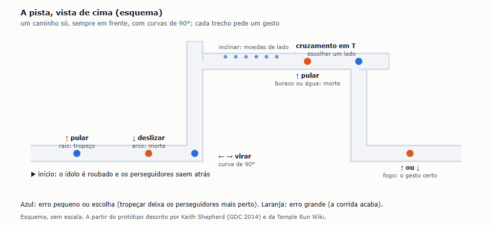
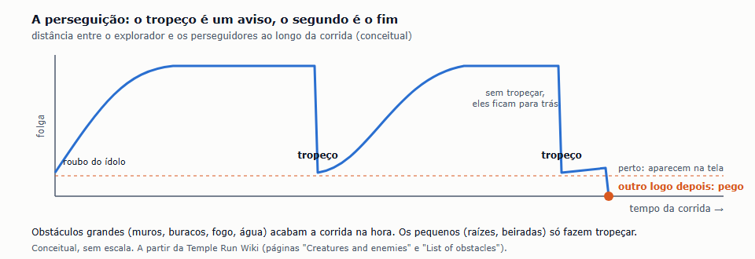
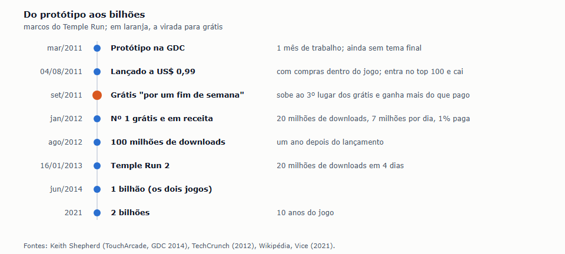

# Benchmark de Gameplay e Estrutura: Temple Run (2011)

| Campo | Valor |
|---|---|
| Documento | Benchmark de gameplay e estrutura — Temple Run |
| Versão | 1.0 |
| Data | 06/10/2026 |
| Status | Referência |
| Responsável | Fernando Nunes (Product Manager) |

O segundo casual do ICP (D-028) estudado a fundo, dentro da pesquisa dos casuais ([#99](https://github.com/TARNAGS/resgate-espacial/issues/99); cartão [#108](https://github.com/TARNAGS/resgate-espacial/issues/108)). Como no [Jetpack Joyride](jetpack-joyride.md), o foco é entender **como um jogo infinito funciona**: o controle, a pressão para seguir em frente, a pista, o que acontece quando o jogador erra e o que o faz voltar. O Temple Run é o jogo que levou a corrida infinita para o 3D, e a seção 9 o compara lado a lado com o Jetpack Joyride. Terceiro discovery feito com a skill `discovery-de-jogos` (D-033).

> **Página de leitura:** a mesma análise, com os diagramas, publicada em [claude.ai/artifact/DatT92pPFFCnnDwG3vLoBZ](https://claude.ai/artifact/DatT92pPFFCnnDwG3vLoBZ) (privada) e guardada aqui em [`temple-run/pagina-de-leitura.html`](temple-run/pagina-de-leitura.html).

> **Sobre as imagens.** Os diagramas mostram conceitos e foram redesenhados a partir das falas dos criadores e da wiki dos jogadores, com crédito. Jogo, personagens e arte são da Imangi Studios (D-005).

## Sumário

1. [Resumo em uma página](#1-resumo-em-uma-página)
2. [Como o jogo nasceu](#2-como-o-jogo-nasceu)
3. [Como o jogo funciona](#3-como-o-jogo-funciona)
4. [A pista e a pressão](#4-a-pista-e-a-pressão)
5. [O custo de errar: dois tipos de erro](#5-o-custo-de-errar-dois-tipos-de-erro)
6. [O laço entre corridas](#6-o-laço-entre-corridas)
7. [O Temple Run 2: o que mudou](#7-o-temple-run-2-o-que-mudou)
8. [Negócio e operação](#8-negócio-e-operação)
9. [Temple Run × Jetpack Joyride](#9-temple-run--jetpack-joyride)
10. [As perguntas do documento 10](#10-as-perguntas-do-documento-10)
11. [Padrões de design](#11-padrões-de-design)
12. [Onde estava a diversão e onde estava a dificuldade](#12-onde-estava-a-diversão-e-onde-estava-a-dificuldade)
13. [O que os jogadores e a crítica diziam](#13-o-que-os-jogadores-e-a-crítica-diziam)
14. [O que levar para o Resgate Espacial](#14-o-que-levar-para-o-resgate-espacial)
15. [Como este material foi feito](#15-como-este-material-foi-feito)
16. [Fontes](#16-fontes)

## 1. Resumo em uma página

| Item | Temple Run |
|---|---|
| Proposta | Um explorador rouba um ídolo de ouro de um templo e foge, sem parar, de criaturas que o perseguem. A pista é um caminho único, visto de trás, com curvas de 90°, buracos e obstáculos |
| Autor | Imangi Studios: o casal Keith Shepherd e Natalia Luckyanova (design, programação e produção) e o artista Kiril Tchangov. Três pessoas |
| Lançamento | iOS em 04/08/2011; Android em 27/03/2012; Windows Phone em 2013. O Temple Run 2 saiu em 16/01/2013 |
| Desenvolvimento | Protótipo em um dia, labirinto jogável em uma semana, demonstração na GDC em um mês e mais três meses e meio de acabamento: cerca de cinco meses no total |
| Negócio | Lançado a US$ 0,99, já com compras dentro do jogo; ficou grátis em setembro de 2011, "por um fim de semana", e nunca mais voltou a ser pago |
| Tamanho do sucesso | Nº 1 grátis e nº 1 em receita na App Store em janeiro de 2012, com 20 milhões de downloads, 7 milhões de jogadores por dia e só 1% pagando; 100 milhões de downloads em um ano; os dois jogos passaram de 1 bilhão em 2014 e de 2 bilhões em 2021 |
| Onde estava a diversão | Gestos simples feitos para a tela (virar, pular, deslizar, inclinar), a sensação de fuga com os perseguidores atrás, a velocidade que sobe |
| Onde estava a dificuldade | A velocidade; curvas e buracos que não perdoam; tropeços que trazem os perseguidores para perto |
| Oponentes | Os "macacos demoníacos": não atacam com armas, só perseguem |
| Recepção | Metacritic 80 (iOS); menção honrosa no IGF 2012; app favorito do Kids' Choice Awards 2013. Hoje, na Google Play, mais de 500 milhões de instalações do primeiro e mais de 1 bilhão do segundo |

## 2. Como o jogo nasceu

Tudo nesta seção vem dos criadores: a entrevista de Keith Shepherd à TouchArcade na GDC 2014, em que ele mostra os três protótipos, e as entrevistas dos 10 anos do jogo (Vice, 2021).

- **O fracasso anterior.** O jogo anterior da Imangi, o Max Adventure, levou um ano, usava dois controles virtuais (um para andar, outro para atirar) e foi um fracasso financeiro: a maioria das pessoas não entendia como jogar. A pergunta seguinte foi como controlar um personagem 3D **sem controle virtual**.
- **Protótipo de um dia.** O personagem do Max Adventure andando sem parar numa cidade, virando com gestos de deslizar o dedo; bater em algo era morrer. Já era gostoso de controlar.
- **Uma semana: o labirinto infinito.** Um labirinto gerado na hora em todas as direções, feito de caixas, sem tema, sem moedas, sem inclinação. Curvas só de 90° e câmera atrás do personagem: uma primeira versão com câmera de cima, girando o cenário, deixava as pessoas tontas. O jogo **acelerava com o tempo**, e isso bastava para ficar difícil, terminar em morte e dar vontade de jogar de novo.
- **O tema nasceu da mecânica.** As paredes de caixas pareciam a Muralha da China ou um templo; daí veio o templo, a selva e a aventura. O artista se inspirou no filme *Aguirre, a Cólera dos Deuses*, de Werner Herzog.
- **Por que correr?** Nos jogos de corrida infinita da época, ninguém explicava por que o personagem não parava. Primeiro, os alienígenas do Max Adventure entraram como perseguidores provisórios; depois vieram os **macacos demoníacos**, com máscaras de caveira. Natalia achou os macacos assustadores demais e foi contra; os outros dois a convenceram, e ela admitiu depois que eles davam urgência e adrenalina.
- **Um mês: a demonstração da GDC 2011.** Já tinha pontuação, um personagem provisório e gemas coloridas que formavam "mãos de pôquer" para dar bônus. As gemas eram difíceis demais de entender e viraram moedas simples.
- **Testar com gente sem explicar.** Natalia: entregar o jogo para alguém sem nenhuma explicação e ver o que a pessoa faz. Com o Temple Run, as pessoas entendiam na hora e não queriam devolver o celular.
- **As regras do mundo.** A Imangi tem "dez mandamentos" do mundo do Temple Run; o primeiro: tudo precisa poder existir na Terra, sem armas nem tecnologia moderna.

## 3. Como o jogo funciona

### 3.1 Controle

| Gesto | O que faz |
|---|---|
| Deslizar para a esquerda ou direita | Vira 90° nas curvas e cruzamentos |
| Deslizar para cima | Pula |
| Deslizar para baixo | Desliza por baixo de obstáculos |
| Inclinar o aparelho | Move o personagem para um lado da pista, para pegar moedas ou desviar |

Joga-se com uma mão. A corrida dura de 30 segundos a alguns minutos.

### 3.2 O que se pega

| Item | O que faz |
|---|---|
| Moedas | Douradas valem 1, vermelhas 2, azuis 3. Enchem um medidor e são a moeda da loja |
| Poderes | Aparecem quando o medidor enche: moedas extras, ímã de moedas, invencibilidade (a pista ganha chão "imaginário" sobre os buracos) e um impulso para a frente. Cada poder só aparece depois de comprado na loja e pode ser melhorado até o nível 5 |
| Valor das moedas | Melhoria passiva: depois de certa distância, as moedas passam a valer o dobro ou o triplo |

### 3.3 Pontuação, loja e objetivos

- **Pontuação:** combina a distância e as moedas, e é multiplicada por um **multiplicador** que cresce com os objetivos cumpridos.
- **Objetivos:** 56, ligados às conquistas do Game Center; cada um cumprido soma +1 ao multiplicador.
- **Loja:** poderes (comprar e melhorar), personagens (11 no primeiro jogo), itens de uso único (asas que ressuscitam uma vez; começar 1.000 ou 2.500 metros adiante), papéis de parede e moedas por dinheiro de verdade.
- **Recordes:** a melhor pontuação, a corrida mais longa e o maior número de moedas ficam numa tela de estatísticas; há ranking e conquistas no Game Center.

## 4. A pista e a pressão

- **Um caminho só.** Não há labirinto no jogo final: a pista é um caminho único, gerado enquanto se corre, com curvas de 90°, cruzamentos em T e trechos de tipos diferentes (o caminho do templo, pontes de madeira, pedras estreitas, beiras de rio).
- **Cada obstáculo pede um gesto:** raiz baixa (pular), arco de raízes (deslizar), estátuas com fogo (pular ou deslizar), muro de tronco (pular), buraco ou água (pular), curva (virar).
- **A pressão vem de duas fontes:** a **velocidade**, que sobe com a distância, e os **perseguidores**, sempre atrás. Eles quase não aparecem quando tudo vai bem, mas dão o motivo para correr.
- **O tema muda pouco.** O primeiro jogo tem um único ambiente, o templo; a crítica de 2011 reclamou de cenários repetidos. O Temple Run 2 resolveu isso com mapas (seção 7).

## 5. O custo de errar: dois tipos de erro

| Tipo de erro | O que acontece |
|---|---|
| **Pequeno** (raiz baixa, beirada, tocar de raspão) | O personagem **tropeça**, e os perseguidores aparecem logo atrás. É um aviso: se ele não tropeçar de novo logo em seguida, eles voltam a ficar para trás |
| **Pequeno, duas vezes seguidas** | Os perseguidores alcançam o personagem: fim da corrida |
| **Grande** (muro, arco, fogo, buraco, água, curva perdida) | Fim da corrida na hora |

Esse desenho dá ao jogo uma **segunda chance curta e tensa**, sem barra de vida: o erro pequeno vira susto (os perseguidores na tela) em vez de derrota. Depois da morte, as asas de ressurreição (ou, no Temple Run 2, as gemas) permitem continuar.

## 6. O laço entre corridas

- **Objetivos que aumentam o multiplicador:** cada objetivo cumprido deixa todas as corridas seguintes valendo mais pontos. O progresso entre corridas entra na pontuação.
- **Moedas, poderes e personagens:** as moedas compram e melhoram os poderes, que deixam as corridas mais longas e mais rentáveis.
- **Recorde e amigos:** o ranking do Game Center e a competição entre amigos, principalmente na escola, foram o motor da divulgação.
- **Atualizações:** novos poderes e personagens com frequência, para manter o interesse.

## 7. O Temple Run 2: o que mudou

O Temple Run 2 foi **reescrito do zero**: o motor do primeiro não tinha sido feito para crescer, e mudar muito o jogo original arriscava estragar o que milhões de pessoas gostavam. Keith Shepherd: ao fazer a continuação, eles sabiam que não podiam quebrar o que as pessoas gostavam no original (inclusive o efeito calmante que alguns jogadores, como o velocista Usain Bolt, diziam sentir).

| Tema | No Temple Run 2 |
|---|---|
| Controle | O mesmo |
| Pista | Curvas mais fechadas, tirolesas, trilhos de mina, cachoeiras, jatos de fogo; personagem mais rápido |
| Perseguidor | Um macaco gigante no lugar dos três |
| Poderes | Ativados com dois toques quando o medidor, enchido pelas moedas, está cheio |
| Personagens | Cada um com uma habilidade |
| Continuar | "Salve-me" com gemas: 1 na primeira vez, 2 na segunda, 4 na terceira, dobrando; a primeira pode ser por anúncio |
| Objetivos | **Três por vez**, que formam níveis com recompensas (moedas, gemas, poderes) |
| Multiplicador | Cresce com os níveis e também com uma melhoria comprada na loja |
| Desafios | Diários, com sequência de dias (no 5º dia seguido, um baú); semanais; globais por tempo limitado |
| Mapas | 22 ambientes acrescentados ao longo dos anos (picos, gelo, deserto, selva, piratas…); cada um entra grátis por um tempo e depois custa 500 gemas |
| Outros | Totens diários, artefatos sazonais, eventos, um passe de recompensas (2024) |

## 8. Negócio e operação

| Tema | O que aconteceu |
|---|---|
| Pago → grátis | Lançado a US$ 0,99 com compras, inspirado no Zombie Gunship. Entrou no top 100, teve boas avaliações e começou a cair. Seis semanas depois, ficou grátis "por um fim de semana": subiu ao 3º lugar dos grátis, passou a render mais do que como pago e, ao cair de novo, **parou perto do 100º lugar ganhando mais do que antes**. Ficou grátis |
| Crescimento | Sem marketing e sem comprar usuários: crescimento viral até o 1º lugar grátis e em receita no Ano-Novo de 2012. Celebridades jogando ajudaram (Justin Bieber, Usain Bolt, que depois virou personagem) |
| Quem paga | Em janeiro de 2012, 1% dos jogadores pagava, contra uns 4% de outros jogos da época; o jogo liderava em receita pelo volume. A tese de Natalia: sem barreira para baixar e dá para jogar tudo sem pagar |
| Estúdio | Três pessoas no primeiro jogo; o casal escolheu continuar pequeno, por estilo de vida |
| Imitações | Dezenas de clones; o que incomodou Keith foram os que copiavam a jogabilidade, a marca e a arte, e vários foram removidos da loja |
| Hoje | Os dois jogos têm anúncios e compras. Na App Store, o Temple Run 2 tem 4,5 com 495 mil avaliações e o selo de escolha dos editores |
| Série | Temple Run: Brave e Temple Run: Oz (parcerias com a Disney), VR, jogos para o Apple Arcade (2021 a 2024) e o Temple Run 3, só para Android, em outubro de 2025 |

## 9. Temple Run × Jetpack Joyride

Os dois saíram em 2011, viraram grátis no mesmo ano e definiram o gênero. As escolhas foram bem diferentes:

| Tema | Temple Run | Jetpack Joyride |
|---|---|---|
| Controle | Quatro gestos e inclinação, feitos para a tela de toque | Um botão |
| Visão | 3D, atrás do personagem | 2D, de lado |
| Por que correr | **Perseguidores** atrás | Nenhuma ameaça atrás; a corrida simplesmente segue |
| Erro | Dois tipos: o tropeço avisa, o grande mata | Um golpe mata; o veículo é uma vida a mais |
| Ritmo | Velocidade que sobe; poderes de impulso e invencibilidade | Serrote criado pelos veículos |
| Pontuação | Distância e moedas × multiplicador (o progresso entra no placar) | **Só a distância**, de propósito |
| Laço entre corridas | 56 objetivos (no 2, três por vez e níveis) | Três missões que se renovam, estrelas, níveis e insígnias |
| Loja | Melhoria de poderes e personagens | Visual, gadgets, utilidades e veículos |
| Equipe e tempo | 3 pessoas, cerca de 5 meses | Um time da Halfbrick, 10 meses |
| Quem paga (2012) | 1% | Não divulgado |

## 10. As perguntas do documento 10

| Pergunta de level design | No Temple Run |
|---|---|
| Como a fase é organizada | Sem fases: um caminho único gerado na hora, com curvas de 90° e trechos de tipos diferentes; no 2, mapas temáticos |
| Como a dificuldade sobe | Com a velocidade, que cresce com a distância |
| Como um elemento novo é apresentado | Cada obstáculo pede um gesto que se entende pela forma; o jogo foi testado com pessoas sem nenhuma explicação |
| Metas por fase | Objetivos (no 2, três por vez), recorde e ranking dos amigos |
| Duração de uma fase | De 30 segundos a alguns minutos |
| O que faz voltar | Multiplicador que cresce, melhorias de poderes, personagens, competição entre amigos; no 2, desafios diários com sequência, mapas novos e eventos |

## 11. Padrões de design

| # | Padrão | Como aparece |
|---|---|---|
| 1 | **Controle feito para o aparelho** | Gestos no lugar de controles virtuais, depois de um fracasso com dois controles |
| 2 | **A mecânica primeiro, o tema depois** | O templo nasceu das paredes de caixas do protótipo |
| 3 | **Um motivo para seguir em frente** | Os perseguidores explicam por que o personagem não para |
| 4 | **Dois tipos de erro** | O tropeço avisa; o segundo tropeço ou o erro grande encerram |
| 5 | **Restrições que simplificam** | Curvas só de 90° e câmera fixa atrás, para não dar tontura |
| 6 | **Cada obstáculo pede um gesto** | A forma diz o que fazer: pular, deslizar, virar |
| 7 | **Velocidade como curva de dificuldade** | Ficar mais rápido já basta para ficar difícil |
| 8 | **Progresso que entra no placar** | O multiplicador dos objetivos; no 2, também comprado |
| 9 | **Grátis sem barreira** | Dá para jogar tudo sem pagar; o lucro vem do volume |
| 10 | **Continuação que não quebra o original** | Mesmo controle, mais conteúdo, motor novo para crescer |
| 11 | **Conteúdo novo por ambientes** | Mapas temáticos no 2, abertos por tempo limitado |
| 12 | **Regras do mundo** | Os "mandamentos": poderia existir na Terra, sem armas nem tecnologia moderna |

## 12. Onde estava a diversão e onde estava a dificuldade

| Onde estava a diversão | Onde estava a dificuldade |
|---|---|
| **A fuga:** a sensação de ser perseguido, que a crítica comparou a ser o Indiana Jones | **A velocidade:** depois de alguns minutos, as reações precisam ser rápidas |
| **Controles naturais:** gestos que qualquer um entende sem explicação | **Curvas e buracos:** um gesto atrasado é queda ou batida |
| **O "só mais uma":** corridas curtas e recorde à vista | **O tropeço:** um erro pequeno vira perigo real se vier outro em seguida |
| **Progredir entre corridas:** multiplicador e poderes melhorados | **Cenário repetitivo** no primeiro jogo, segundo a crítica |
| **Competir com amigos** | **Melhorias que custam muitas moedas**, o que empurra para a compra |

## 13. O que os jogadores e a crítica diziam

| Fonte | O que diz |
|---|---|
| Crítica de 2011 | Metacritic 80 (10 resenhas). A AppSpy elogiou o controle; a TouchArcade, a saída do controle de um botão só e a sensação de aventura; a Gamezebo, os objetivos que mantêm o jogador jogando; a IGN, a profundidade das melhorias. A 148Apps reclamou dos cenários sempre iguais |
| Temple Run 2 | Metacritic 79 (24 resenhas). Elogios às melhorias pequenas sem estragar o centro do jogo; a Eurogamer (7/10) achou conservador demais |
| Prêmios | Menção honrosa no IGF 2012; app favorito do Kids' Choice Awards 2013 |
| Público | Muito jogado por crianças e adolescentes na escola. Uma matéria da The Verge de 2014 diz no título que a maioria dos jogadores era mulher |
| Lojas hoje | Temple Run 2: 4,5 na App Store (495 mil avaliações), mais de 1 bilhão de instalações na Google Play; o primeiro, mais de 500 milhões |

## 14. O que levar para o Resgate Espacial

Tudo aqui é **Proposta** para o Fernando decidir. Inspirar, nunca copiar (D-005, D-033). O Temple Run é uma corrida sem fim; o nosso tem fases fixas e curtas. As ideias que viajam bem são de controle, de erro, de pressão e de produto.

| Ideia do Temple Run | Como poderia entrar no nosso jogo | Ligado a |
|---|---|---|
| **Dois tipos de erro:** o tropeço avisa, o segundo mata | Hoje, encostar em qualquer coisa explode a nave. Uma alternativa: raspar de leve numa parede vira um susto (a nave balança, um aviso na tela) e só a segunda batida em poucos segundos, ou uma batida forte, explode. Junto com o "casco" dos Gravitron, é um candidato a modificador ou a um modo mais fácil | D-027; D-028; P-012 ([#61](https://github.com/TARNAGS/resgate-espacial/issues/61)) |
| **Controle feito para o aparelho** (o fracasso do Max Adventure com dois controles virtuais) | Alerta para o nosso controle: o jogador casual tropeça em controles que parecem de console. Vale testar o controle com pessoas que nunca viram o jogo, sem explicar nada | D-006; D-022; [#44](https://github.com/TARNAGS/resgate-espacial/issues/44); documento 07 |
| **Testar sem explicar** | Valida o nosso roteiro de teste com pessoas: o melhor sinal é a pessoa não querer devolver o celular | Documento 07; documento 09 |
| **Um motivo para seguir em frente** | O nosso motivo é a tripulação e o combustível. Em fases especiais, uma ameaça visível que avança (uma tempestade, a água subindo) daria urgência sem inimigo que atira | P-012; P-018 ([#79](https://github.com/TARNAGS/resgate-espacial/issues/79)); regras, seção 9 |
| **A mecânica primeiro, o tema depois** | Valida o nosso caminho: protótipo de controle antes da arte (M1, arte provisória até a E-19) | Roadmap |
| **Progresso que entra no placar** (multiplicador) | É o contrário do Jetpack Joyride e mostra o risco: se o ranking somar progresso ou compras, deixa de medir habilidade. Reforça manter o ranking por fase como tempo puro | D-024; P-006 ([#53](https://github.com/TARNAGS/resgate-espacial/issues/53)); P-017 ([#78](https://github.com/TARNAGS/resgate-espacial/issues/78)) |
| **Grátis sem barreira, 1% pagando** | Mais um caso para a pesquisa de lojas e dinheiro: jogo inteiro sem pagar e lucro pelo volume | P-014 ([#98](https://github.com/TARNAGS/resgate-espacial/issues/98)); D-003 |
| **Mapas temáticos abertos por tempo limitado** | Os nossos mundos de 10 fases podem entrar como novidade, com período grátis; e a decisão de cobrar ou não por mundo vai para a #98 | D-020; documento 08; P-014 |
| **Continuação reescrita para crescer, sem mexer no centro** | Valida o "conteúdo é dado, não código" do nosso jogo (mundos, fases e obstáculos em arquivos de dados) | D-011; `jogo/src/content/` |
| **Regras do mundo ("mandamentos")** | Escrever, no documento 08, poucas regras de identidade que todo mundo do jogo respeita (por exemplo: sem armas, sem inimigos que atiram, a tripulação sempre à espera) | Documento 08; D-005 |
| **Desafios diários com sequência** (no 5º dia, um baú) | Para depois do MVP: um desafio do dia, ligado à ideia de "desafio do dia com a mesma semente" da P-019 | P-019 ([#101](https://github.com/TARNAGS/resgate-espacial/issues/101)); replay alto |
| **Competição entre amigos como divulgação** | O ranking com nickname (D-024) e um jeito fácil de mostrar o tempo para um amigo são a nossa versão disso | D-024; P-019 |

**Validações:** testar com pessoas sem explicar (documento 07); protótipo de controle antes da arte (M1); conteúdo como dado (D-011); fases curtas para o jogador casual (D-028).

**Diferença importante:** o Temple Run é uma corrida em 3D, sem fim e com quatro gestos; o nosso é uma nave 2D com fases fixas, ida e volta e pouso. As ideias de erro em dois níveis, de motivo para seguir em frente, de controle feito para o toque e de produto valem para nós; o templo, os macacos e a pista são a identidade dele.

## 15. Como este material foi feito

1. **Fontes primárias:** a entrevista em vídeo de Keith Shepherd à TouchArcade na GDC 2014, mostrando os três protótipos, lida pela transcrição no navegador do app; as entrevistas dos criadores e do diretor da Imangi nos 10 anos do jogo (Vice, 2021); a entrevista de Natalia Luckyanova à TechCrunch (2012); a de Keith à AllThingsD, citada pela MacTrast (2013).
2. **Dados do jogo:** a wiki dos jogadores (Temple Run Wiki, no Fandom), pela interface de dados da wiki: obstáculos, poderes, objetivos, loja, perseguidores, Temple Run 2, mapas, desafios diários e gemas. Algumas páginas são escritas por fãs de forma informal; usei só o que se repete em mais de uma página ou bate com os criadores.
3. **Produto e negócio:** Wikipédia (Temple Run e Temple Run 2), TouchArcade (prévia de 2011 e retrospectiva de 2018), Game Developer (2012), Google Play e App Store.
4. **O que não foi possível:** a transcrição da entrevista da Shacknews com Keith Shepherd não carregou; as matérias da GameSpot, da Wired e da Polygon estavam bloqueadas ou fora do ar, e a da VentureBeat recusou o acesso; o link da The Verge leva hoje a outra matéria, então o dado sobre o público feminino vem só do título citado pela Wikipédia. As avaliações recentes da App Store não aparecem na página estática. Nenhum arquivo do jogo foi aberto.
5. **O que é aproximado:** o tempo de desenvolvimento (Keith diz cinco meses; a Wikipédia, quatro); os números da wiki valem para versões recentes.
6. **Diagramas:** em [`temple-run/ferramentas/`](temple-run/ferramentas/diagramas.js), gerados por script.

### Onde a busca procurou

| Fonte | O que foi feito | Resultado |
|---|---|---|
| Buscas na web | Entrevistas, palestras e matérias dos criadores | Vice, TechCrunch, TouchArcade, Game Developer, MacTrast |
| YouTube, no navegador do app | Entrevista da TouchArcade na GDC 2014 e entrevista da Shacknews | A primeira, transcrição completa; a segunda não carregou |
| Temple Run Wiki | 31 páginas pela interface de dados da wiki | Regras, poderes, objetivos, Temple Run 2 |
| Wikipédia | Temple Run e Temple Run 2 | Datas, recepção, números e referências |
| Google Play e App Store | Páginas atuais | Instalações, notas e anúncios |
| GameSpot, Wired, Polygon, VentureBeat, The Verge | Tentativa de leitura | Bloqueadas, fora do ar ou redirecionadas |

## 16. Fontes

- Keith Shepherd, [GDC 2014: A Look At 'Temple Run' Prototypes as It Evolved From 'Max Adventure'](https://www.youtube.com/watch?v=dEHVgpS93Xc) (TouchArcade, YouTube)
- Vice, [How Werner Herzog inspired Temple Run](https://www.vice.com/en/article/how-werner-herzog-inspired-temple-run) (2021)
- TechCrunch, [Mobile Game Design: How Evil Monkeys Chased Temple Run To App Store #1](https://techcrunch.com/2012/01/15/temple-run/) (15/01/2012)
- Game Developer, [iPhone hit Temple Run sees 20M downloads, 7M DAU](https://www.gamedeveloper.com/business/iphone-hit-i-temple-run-i-sees-20m-downloads-7m-dau) (2012)
- TouchArcade, [WWDC 2011: 'Temple Run' Hands-On Preview](https://toucharcade.com/2011/06/07/wwdc-2011-temple-run-hands-on-preview-the-latest-from-imangi-studios/) e ['Temple Run' Developer Imangi Studios Turns 10 Years Old Today – A Retrospective](https://toucharcade.com/2018/06/18/imangi-studios-retrospective/)
- MacTrast, [Imangi Studios: We Want To Stay Small](https://www.mactrast.com/2013/01/imangi-studios-we-want-to-stay-small/amp) (2013)
- Wikipédia: [Temple Run](https://en.wikipedia.org/wiki/Temple_Run) e [Temple Run 2](https://en.wikipedia.org/wiki/Temple_Run_2)
- [Temple Run Wiki](https://templerun.fandom.com/): Temple Run, List of obstacles, List of powerups, Powerups, Creatures and enemies, Demon Monkey, Objectives (Temple Run 2), Leveling (Temple Run 2), Save Me, Gems, Coin Values, Store, Temple Run 2, Map (Temple Run 2), Daily Challenge (TR 2), Temple Pass
- [Temple Run 2 na App Store](https://apps.apple.com/us/app/temple-run-2/id572395608) e na Google Play ([Temple Run 2](https://play.google.com/store/apps/details?id=com.imangi.templerun2), [Temple Run](https://play.google.com/store/apps/details?id=com.imangi.templerun)), consultadas em 06/10/2026
- Indicada, não lida: [Temple Run Origins Interview With Keith Shepherd](https://www.youtube.com/watch?v=NC_ckT70diA) (Shacknews)

## Histórico de versões

| Versão | Data | O que mudou |
|---|---|---|
| 1.0 | 06/10/2026 | Primeira versão: como o jogo nasceu, a pista e a pressão, os dois tipos de erro, o laço entre corridas, o Temple Run 2, negócio, a comparação com o Jetpack Joyride e propostas |
